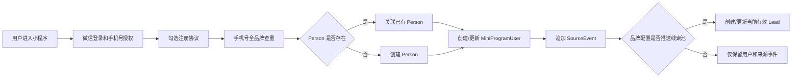
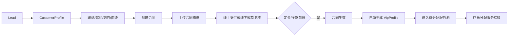
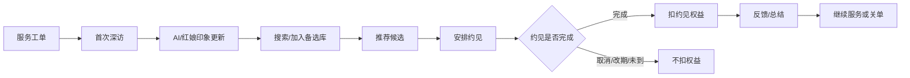
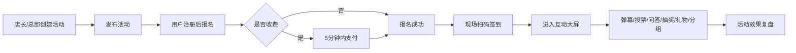

### 1) 问题定义（Problem framing）
#### **背景**
当前目标是在既有 `FastapiAdmin` 架构之上，落地一套「单品牌多门店」婚恋 CRM 的 **C 端触达与转化**能力：通过微信小程序完成注册/展示/活动/资料认证（收费）/相亲名片转发等动作，将用户行为沉淀为 CRM 来源事件，并按品牌策略推送进入线索池；同时在门店侧提供「智慧门店大屏」用于门店获客与运营展示。

#### **问题陈述**
- **获客链路割裂**：小程序侧产生的线索、报名、认证与门店 CRM 的线索/客户未形成闭环，导致转化追踪困难、归因困难、重复跟进。
- **门店现场体验不足**：缺少标准化的门店大屏内容与轮播机制，无法持续展示活动与用户信息、无法承接到店客流。
- **隐私与合规压力**：婚恋场景涉及强隐私数据（照片、手机号、证件等），需要严格权限、脱敏与审计。

#### **目标用户 / 角色**
- **游客**：未注册用户，浏览展示、活动，产生注册/报名意愿
- **会员（小程序用户）**：注册后完善资料、参与活动、提交认证/支付、转发名片
- **门店员工（销售/红娘）**：在 CRM 中接收线索、跟进转化、维护活动与宣传内容
- **门店店长**：审核/管理门店内容、大屏投放、门店线索分配
- **总部运营**：配置全局活动模板、品牌宣传素材、数据看板口径
- **财务/管理员**：对账、退款、风控、权限与审计

#### **系统角色与职责（v1 基准）**
- **老板（系统管理员）**
  - 拥有最高级别权限
  - 可对系统进行设置配置
- **店长**
  - 门店业务管理人员，负责整体业务的管理分配工作
  - 分配销售线索给销售人员
  - 分配服务会员给服务红娘
  - 线下处理推广员分成
- **销售人员**
  - 将线索转化为付费会员
  - 跟踪联系资源、邀约到店、销售产品
  - 签约合同、收款
- **服务人员（红娘）**
  - 开发备选资源（添加到自己的备选库）
  - 对已付费会员进行邀约面谈，形成更高维度的会员资料
  - 针对服务合同进度进行人员筛选、推送、约见、约见反馈

#### **目标（Goal）**
v1 达成：
- 小程序具备：**注册登录、展示页、活动页/报名、资料认证（微信支付）、相亲名片生成与转发、来源事件入 CRM、线索按配置推送**
- CRM 侧具备：**线索接入、来源追踪、门店隔离、分配/转交留痕、线索转客户**
- 智慧门店大屏具备：**用户信息轮播屏** 与 **门店宣传轮播屏** 两个核心大屏，并支持扩展更多大屏类型
- 全链路具备：**最小可用的数据闭环与审计**（可追溯从小程序到 CRM 的来源与处理状态）

#### **非目标（首版不做或不承诺）**
- 不做公开陌生人社交/即时聊天（避免监管与高风险）
- 不做无人审核的 AI 自动撮合/自动推送；AI 只作为红娘推荐辅助
- 不做完整 OA 审批引擎替代（合同/退款/转交可先用轻量审批）
- 不做跨门店共享客户池（已明确 v1 **严格门店隔离，只能转交**）


### 2) 方案（Proposed solution v1）
#### **总体架构（概念）**
- **小程序（C 端）**：注册/展示/活动/认证/名片转发 → 产生事件与线索
- **后端（FastAPI / FastapiAdmin）**：统一鉴权、业务 API、支付回调、素材管理、线索入库、审计日志
- **CRM（B 端 Web）**：线索池、分配/跟进、活动运营、内容投放、大屏管理
- **大屏（门店侧）**：按门店配置的「屏幕类型」渲染轮播/看板内容（可用 Web 大屏页面 + 门店电视/大屏浏览器打开）

#### **用户流程（User workflow）**
##### A. 小程序：获客与线索入库
- 游客进入小程序 → 浏览品牌展示/门店活动
- 触发注册（手机号/微信授权）→ 成为小程序用户
- 用户报名活动 / 提交资料认证 → 生成线索并入 CRM
- 用户生成“相亲名片”并转发给朋友/群 → 形成裂变访问与二次线索

##### A0. 用户生命周期（业务主链路，v1 基准）
线索 → 邀约 → 到店 → 面谈销售 → 合同 → 付款 → 转服务 → 推荐人员 → 约见 → 服务完成

说明：
- “客户”指 **未付费但有意愿、需要销售经营转化的人（建档客户）**
- “VIP”指 **已成交进入服务交付的人**（v1 口径：定金或全款到账即视为成交；VIP 级别通常绑定合同）。

##### B. 资料认证（收费）
- 用户选择认证类型（示例：基础认证 / 高级认证）→ 微信支付
- 支付成功 → 状态变更为“已支付待审核/自动通过（按策略）”
- 审核通过 → 解锁更多资料展示能力（例如：更高清头像/更多字段可见/优先推荐权益等，具体由你们运营策略决定）

##### B1. 认证套餐与权益细则（已确认）
认证拆分为认证项 CertificationItem 与认证套餐 CertificationPackage。认证项是单个能力/证明，认证套餐是多个认证项的打包定价与权益组合。

**认证项**
- 首版认证项：手机认证、实名认证、真人照片认证、学历认证、收入认证、婚况认证、房产认证、车辆认证、到店认证、职业认证。
- 手机认证：注册时通过微信手机号完成。
- 实名认证：采用身份证号 + 手机号 + 姓名三要素实名核验（已确认）。
- 真人照片认证：照片至少包含人脸。
- 学历/收入/婚况/房产/车辆/职业认证：上传证明材料或线下核验。
- 到店认证：店长及以上权限确认即可，总部可查看（已确认）。
- 每个认证项可配置：认证项名称、认证材料要求、是否收费、是否需要人工审核、审核权限、是否展示认证标识、心动值奖励、有效期。
- 每个认证项可单独配置心动值奖励（已确认）。
- 认证默认长期有效；后台可配置部分认证项有效期，例如收入认证 1 年（已确认）。

**认证套餐**
- 首版按 3 档设计：基础认证 / 高级认证 / 尊享认证；后台可自定义名称和价格（已确认）。
- 高档套餐包含低档套餐权益。
- 支持权益叠加；已认证项不重复奖励心动值（已确认）。

**示例套餐**
- 基础认证：手机认证、实名认证、真人照片认证。
  - 权益：基础认证标识、心动值奖励、提升资料可信度、可参与部分实名活动。
- 高级认证：基础认证项 + 学历认证、收入认证、婚况认证。
  - 权益：高级认证标识、更丰富认证标签、心动值奖励、详情页可信度增强、今日缘分推荐排序加权。
- 尊享认证：高级认证项 + 房产认证、车辆认证、到店认证/职业认证。
  - 权益：尊享认证标识、高信任展示、心动值奖励、用户墙排序加权、红娘/顾问入口强化、部分活动资格。

**认证状态**
- 状态：未认证、待支付、已支付待提交、待审核、已通过、已驳回、已过期、已作废。
- 支付成功不等于认证通过。
- 需审核认证：认证通过后发放心动值（已确认）。
- 无需审核认证：支付成功后发放心动值（已确认）。
- 认证失败允许重新提交（已确认）。
- 认证通过后追加 SourceEvent，并更新 Person 认证标签。
- 认证支付不支持退款，除非系统异常由后台处理。

**展示规则**
- 展示认证徽章、认证等级、认证标签、已认证项数量（如已认证 3/8 项）。
- 不展示身份证号、证明材料原件、收入证明图片、学历证明图片、婚况证明图片等敏感材料。
- 用户墙不强制要求基础认证；用户上墙由“是否上墙 + 隐身”控制，认证只影响展示可信度和排序（已确认）。

##### C. CRM：线索处理闭环
- CRM 线索列表按门店隔离展示（只看到本门店线索）
- 线索分配（店长/系统规则）→ 归属销售/红娘
- 跟进记录、状态推进（未联系/已联系/预约到店/到店/签约/无效）
- 线索转客户（建立客户档案/合同/服务期与权益）
- 跨门店只能走“转交流程”，并留痕

##### C0.1 销售经营闭环：线索池、分配、跟进与回收（已确认）
销售经营主链路：来源事件 → 线索生成 → 线索池/公海 → 分配销售 → 销售跟进 → 邀约到店 → 面谈 → 签约/收款/转 VIP。

**线索生成规则**
- 线索来源包括：小程序注册（按品牌配置决定是否推送）、活动报名、认证支付、名片分享注册/报名、解锁联系方式、联系红娘、后台手工新增、导入线索等。
- 命中已有 Person 时，不重复建人，只追加 SourceEvent。
- 当前有效 LeadProfile 只保留一条，重复触达追加来源事件，并更新意向等级、最近触达时间等线索信息。
- 线索必须有 store_id；若来源无法明确门店，则进入品牌公海/品牌待分配池。
- 线索首版必填字段：手机号、姓名、性别。
- 线索扩展字段：微信号、出生日期、身高、民族、职业、年收入、婚况、学历、籍贯、常驻地、房产信息、购车信息、照片相册。
- 民族、职业、年收入、婚况、学历、房产信息、购车信息等枚举字段使用系统字典维护。

**线索池规则（已确认）**
- 线索池分为三层：品牌公海、门店公海、销售私海。
- 品牌公海：没有明确门店，或总部/品牌投放产生的待分配线索。
- 门店公海：已有明确门店，但尚未分配给销售。
- 销售私海：已分配到销售名下。
- 销售默认不允许自由领取门店公海线索，需由店长分配；首版支持门店级配置“是否允许销售自行领取”，默认关闭。
- 门店开启销售自行领取后，销售可查看门店公海脱敏列表，并将线索领取到自己的销售私海。

**状态维度（已确认）**
- 线索采用“双维度”管理：归属池 + 线索类型。
- 归属池：品牌公海 / 门店公海 / 销售私海。
- 线索类型：待分配 / 新线索 / 二手线索 / 无效线索 / 已转建档客户。
- 待分配：还在品牌公海或门店公海，尚未进入销售私海。
- 新线索：第一次分配或领取到销售私海的线索。
- 二手线索：从一个销售转给另一个销售，或回公海后再次领取/分配的线索。
- 无效线索：销售在过程记录中标记无效，必须填写原因。
- 已转建档客户：线索阶段终态之一，建档客户字段与流程在后续客户模块单独细化。

**分配、回收与改派**
- 总部/老板可将品牌公海线索分配给门店。
- 店长可将门店公海线索分配给销售。
- 店长可将销售私海线索回收到门店公海，也可改派给其他销售。
- 所有分配、回收、改派、跨店转交必须写入生命周期流转记录。
- 回收、改派、跨店转交需填写原因。
- 自动回收规则（已确认）：领取/分配后 7 天没有跟进，自动落回门店公海；后续可作为门店级配置。
- 释放规则：释放表示销售无条件放弃资源，销售私海释放后回到门店公海，归属人清空，归属门店保留。

**提醒规则（已确认）**
- 新分配线索 24 小时未首次跟进时，提醒销售与店长。
- 跟进中线索 7 天无跟进时，提醒销售与店长。

**跟进记录**
- 跟进记录升级为线索过程记录，动作类型包括：普通跟进、标记无效、释放线索、转建档客户。
- 普通跟进方式包括：电话、微信、面谈、其他。
- 跟进记录字段：动作类型、跟进方式、跟进时间、跟进内容/原因、下次跟进时间、关联线索/客户、提交人。
- 跟进内容支持手工输入与门店级常用语快捷输入。
- 销售只能给自己名下线索/客户新增跟进。
- 店长可查看本门店全部跟进。
- 跟进记录不允许物理删除，可作废并留痕。
- 标记无效、释放线索、转建档客户都必须通过过程记录完成，并同步写入生命周期与审计。

**无效、释放与重新分配（已确认）**
- 无效线索留在当前销售私海，保留归属与历史。
- 当前业务不设置“重新激活”概念；后续继续经营通过释放/回收回上级库，再重新分配实现。
- 重新分配后的线索标记为二手线索。

**列表、详情与导入（已确认）**
- 列表字段：ID、姓名、联系电话、类型、来源、最后跟进时间、归属人、归属门店。
- 列表筛选：姓名/手机号、类型、来源、归属门店、归属人、最后跟进时间范围。
- 联系电话包括手机号与微信号；未在自己线索库中时不可查看完整联系方式，只展示脱敏信息。
- 来源列展示 CRM 渠道管理中的渠道名称。
- 详情页展示个人信息与系统信息；编辑在详情页直接完成并写审计。
- 详情系统信息包括：ID、类型、来源渠道、归属池、归属门店、归属人、创建人、创建时间、更新时间、最后跟进时间。
- 生命周期以时间轴展示：操作时间、操作类型、执行人、变更详情。
- 所有角色均可新增线索；品牌管理员可选择归属门店/归属人，门店管理员默认本门店并可选择本店销售，销售默认归属本人和本门店。
- 品牌管理员、门店管理员支持按模板批量导入；重复手机号跳过并返回失败行号与失败原因。

##### C0. 角色拆分与转交规则（v1 基准）
- 销售与服务红娘（服务老师）为不同角色：
  - 销售负责：线索/建档客户阶段的邀约、到店、面谈、推进签约与付款前经营
  - 服务红娘负责：VIP 阶段的交付（推荐、约见、服务过程、结案）
- 会员（VIP）需从销售 **转交** 给服务红娘；转交分配权在店长。
- 付款后关键资料权限边界：关键资料仅允许 **服务红娘/店长** 编辑，销售为只读。
- 店长在服务段的干预权：可强制改红娘、回收 VIP 到服务公海、查看红娘名下所有服务详情。

##### C1. 推荐 / 约见 / 关单规则（v1 基准）
- 候选人范围：候选人为 **本品牌所有客户**（候选生成来自系统推荐或服务红娘人工筛选）。
- 推荐业务口径（已确认）：婚恋服务中的“推荐”有两种业务形态：
  - A. 推荐人选本身是一种服务权益：合同中可约定“推荐 X 位异性”，红娘按合同向 VIP 推送/介绍候选人资料，推荐次数按合同权益记录。
  - B. 约会服务前的候选确认：红娘通常先推荐 1-3 位候选嘉宾，由 VIP 选择其中一位或多位进入约见安排。
- 推荐次数与约见次数分开核算：推荐可作为独立权益记录；约见仅在实际完成线下约见后扣减约见权益。
- 约见前推荐 1-3 位候选时，若只是约见服务前置确认，不消耗推荐权益；仅在约见完成后扣减约见权益（已确认）。
- 约见次数定义：按“**见面人数（候选人数）**”扣减（口径 A）。VIP 每与 1 位候选人完成一次线下约见 = 消耗 1 人。
- 多人活动式约见计次规则（已确认）：若属于合同约见服务安排，按实际见面候选人数计入约见权益消耗；若属于公开活动报名，不计入合同约见权益。
- 约见记录：线下约见完成后，服务红娘需新增约会记录，并对约会质量进行描述与评估。
- 扣减触发：服务红娘提交约见记录并标记“**已完成**”后，才计入见面人数消耗。
- 重复推荐：同一 VIP 与同一候选人，推荐一次后允许再次推荐（不设置冷却期）。
- VIP 作为候选人的规则（已确认）：一个 Person 可以同时是 VIP 和候选资源；已成交 VIP 可以作为其他 VIP 的服务推荐候选人，无需额外授权。展示资料仍需按系统隐私规则脱敏，联系方式不得直接外泄，必须通过红娘撮合与审计。
- 关单：由服务红娘执行“关单”操作才算服务结束；关单候选列表为“服务到期且约见人数足够”的 VIP。

##### C1.1 推荐、约见、反馈与权益扣减规则（已确认）
推荐与约见是服务红娘日常交付的核心对象，需拆分为 Recommendation（推荐记录）、Meeting（约见记录）、ServiceFeedback（服务反馈）管理。

**1. 推荐记录 Recommendation**
- 字段：vip_id、contract_id、matchmaker_id、candidate_person_id、candidate_id、backup_item_id、recommendation_type、recommendation_status、recommended_at、vip_feedback、matchmaker_remark、created_at。
- 推荐类型：合同推荐服务、约见前候选推荐、人工补充推荐。
- 推荐状态：已推荐、已查看、感兴趣、不感兴趣、进入约见、已撤回、已过期。
- 推荐必须绑定 VIP、合同、红娘、候选人。
- 推荐候选必须来自该红娘自己的备选库。
- 一次约见前可以推荐 1-3 位候选。
- 合同推荐服务消耗推荐权益；约见前候选推荐不消耗推荐权益，只在完成约见后扣约见权益。
- 重复推荐同一候选允许，但每次都记录历史。
- 推荐记录需要过期时间，默认 7 天，可配置（已确认）。
- 推荐撤回必须填写原因（已确认）。
- 推荐记录不允许物理删除，只能撤回/过期并留痕（已确认）。

**2. 约见记录 Meeting**
- 字段：vip_id、contract_id、matchmaker_id、candidate_person_id、recommendation_id、scheduled_at、meeting_place、meeting_type、meeting_status、completed_at、quality_score、vip_feedback、candidate_feedback、matchmaker_summary、consume_entitlement_quantity、created_at。
- 约见类型：线下一对一、线下多人、线上视频、活动约见、其他。
- 约见状态：待安排、已安排、已改期、已取消、已完成、VIP爽约、候选人爽约、双方爽约。
- 约见必须绑定 VIP、合同、候选人、红娘。
- 约见可以从推荐记录进入，也可以由红娘直接从备选库发起；直接发起时系统自动生成推荐记录。
- 只有标记“已完成”后才扣约见权益。
- 取消、改期、爽约不扣权益。
- 已完成约见允许补录，但必须填写实际发生时间。
- 约见完成后红娘总结必填（已确认）。
- 约见质量评分必填（已确认）。
- VIP/候选人的反馈不必填，可选（已确认）。
- 线上视频约见是否计入权益：若合同服务约定支持线上约见，则计入；否则不计入（已确认）。
- 约见记录不允许物理删除，只能取消/作废并留痕（已确认）。

**3. 服务反馈 ServiceFeedback**
- 反馈来源：VIP 反馈、候选人反馈、红娘总结、店长复盘。
- 字段：meeting_id、person_id、feedback_type、feedback_content、quality_score、next_action、created_by、created_at。
- 每次完成约见后，至少需要红娘总结。
- VIP 与候选人反馈可选。
- 反馈可作为后续推荐策略依据。
- 反馈不对小程序公开展示，除非生成脱敏评价。

**4. 权益扣减与回滚**
- 推荐权益：仅“合同推荐服务”消耗。
- 约见权益：Meeting 标记已完成时消耗。
- 多人约见：按实际见面候选人数消耗。
- 超额消耗：允许，但必须填写超额原因。
- 已完成约见作废/撤销时，必须回滚权益消耗，填写原因并审计（已确认）。
- 权益消耗记录不可物理删除，只能作废/冲正并留痕。

##### C2. 备选库机制（核心设计，v1 基准）
**备选库定义**
- 每个服务红娘拥有自己的备选库。
- 备选库中的资源才能查看联系方式（手机号）；需配合审计与水印。
- 推送与约见的备选资源只能来自服务红娘自己的备选库。
- VIP 联系方式例外：服务红娘可直接查看**自己名下** VIP 的联系方式。

**资源范围**
- “资源”指本品牌系统内的**所有人**（不限于线索/建档客户/VIP）。

**资源添加方式**
1. 系统推荐候选人后，红娘添加到备选库
2. 红娘手动搜索资源后添加到备选库
3. 红娘直接新增资源并加入备选库（新增后自动归属到对应备选库）

**红娘新增候选人归属规则（已确认）**
- 服务红娘新增候选人时，系统创建/关联统一资源主体（Person），并加入该红娘备选库。
- 红娘新增候选人 **不自动进入销售客户池**，不生成销售目的的建档客户。
- 后续该候选人发生报名、咨询、成交等销售行为时，再按线索/客户规则进入销售经营链路，并追加来源事件。

**备选库规则**
- 多个服务红娘可以将同一资源添加为自己的备选（非排他）。
- 添加备选不需要任何人确认。
- 备选库资源默认永久有效（不做自动过期）。
- 门店边界（已确认）：服务红娘默认可以搜索并添加本门店任意 Person 到备选库。
- 跨门店候选默认关闭，由店长/总部配置开启；开启后可按跨门店借调候选规则加入备选库。

**设计目的**
1. 防止服务红娘接触所有人的联系方式
2. 备选客户需要服务老师线下了解详细信息（家庭情况、性格爱好、证件等）
3. KPI 设计：服务红娘有开发服务资源的任务

##### C3. 产品与合同管理规则（v1 基准）
##### C3.1 产品管理（首版字段规范）
产品管理用于配置可售卖的服务产品，并在合同生效后生成对应的服务期与权益台账。

**产品字段**
- 产品名称
- 服务时长：X（月）
- 服务内容（多选）：
  - 推荐服务：x/人（按推荐人选数量记录，可作为独立合同权益）
  - 约见服务：x/人（见面人数，按候选人次消耗）
  - 课程服务：x/课时（按课时核销）
- 产品价格：x（元）
- 产品描述

**产品规则（已确认）**
- 产品是可售卖服务包的标准配置。
- 合同选择产品后，必须将产品名称、价格、服务时长、推荐人数、约见人数、课程课时等权益快照写入合同明细。
- 产品后续变更不影响已签合同，已签合同以合同产品快照为准。
- 产品可停用，不建议物理删除。

##### C3.2 合同管理（首版字段规范）
合同用于承载成交与服务交付的核心约定，可绑定一个或多个产品，并授予 VIP 等级。

**合同字段**
- 合同编号
- 合同名称
- 绑定产品：可选择 1 个或多个产品
- 合同总金额：根据绑定产品价格汇总（允许销售手动调整用于打折；首版不做审批，仅强审计）
  - 审计字段（必做）：原始总金额（按产品汇总）、折后总金额、折扣差额/折扣率（系统计算）、折扣原因（必填）、操作人/操作时间
- 合同有效期：开始/结束日期（到期前 30 日提醒）
- 合同签署人：实际签署纸质合同的人姓名
- 授予等级：绑定 1 个 VIP 等级
- 备注

**合同影像**
- 需要上传纸质合同拍照/扫描件（合同影像附件）

**合同规则（已确认）**
- 合同允许绑定 1 个或多个产品。
- 合同必须包含合同产品明细（ContractItem），并锁定产品快照；产品后续调整不影响已签合同。
- 合同折扣不需要审批，但必须填写折扣原因，并记录强审计。
- 合同状态保留“生效”状态；定金到账或全款到账后，合同自动生效并生成 VIP。
- 续购必须新增合同，不修改原合同。
- 合同编号按“品牌缩写 + 门店编码 + 年月日 + 4 位流水”生成，如 ML-GZ01-20260503-0001（已确认）。
- 合同编号创建时自动生成，不可修改；作废合同编号不回收；续购合同生成新编号（已确认）。
- 合同模板由总部维护并支持版本（已确认）。
- 已使用模板不能直接覆盖旧版本，只能生成新版本。
- 合同创建时锁定模板版本快照（已确认）。
- 合同影像必须上传后才能标记“已签”（已确认）。
- 已签合同关键字段禁止直接修改，只能作废重签或生成合同变更记录（已确认）。

**合同模板 ContractTemplate（首版必做）**
- 字段：template_id、template_name、applicable_product_ids、vip_level_id、template_content、attachment_requirements、required_fields、status、version、created_by、created_at。
- 模板内容：服务周期、推荐人数、约见人数、课程课时、费用条款、定金/尾款规则、退款/作废说明、双方权利义务、隐私说明、附件要求。
- 合同模板可按产品推荐。

**合同产品明细 ContractItem（首版必做）**
- contract_id
- product_id
- 产品名称快照
- 价格快照
- 服务时长快照
- 推荐人数快照
- 约见人数快照
- 课程课时快照

**合同创建与签署流程**
- 选择客户 → 选择产品 → 选择合同模板 → 生成合同草稿 → 填写金额/折扣/原因 → 填写合同开始/结束日期 → 填写签署人 → 上传合同影像 → 提交/保存。
- 销售可创建合同草稿。
- 合同折扣必须填写原因。

**合同影像上传规范**
- 支持图片/PDF、多页上传。
- 至少 1 个合同影像附件。
- 文件大小限制后台配置。
- 影像需清晰可读。
- 字段：attachment_id、contract_id、file_type、page_count、uploaded_by、uploaded_at、status。
- 合同影像不审核，只归档。
- 合同影像默认高敏感附件。
- 销售可预览自己合同的合同影像，但不能下载。
- 店长及以上可查看合同影像原件。
- 合同影像不可物理删除，只能作废/重新上传并留痕。

**合同附件要求**
- 合同模板可配置附件要求，如身份证复印件、签字页、收据、补充协议、其他材料。
- 首版仅强制合同影像必传，其他附件可选；后续再做模板附件强校验。

##### C3.3 收款单（基于合同，首版字段规范）
收款单用于记录合同收款与支付信息，可由合同生成；收款单可用于触发在线收银台完成扫码/条码支付。

**收款单关联**
- 必须关联合同（contract_id）

**支付方式（枚举）**
- 现金 / 支付宝 / 微信 / 银行转账 / 刷卡 / 其他

**支付场景（枚举）**
- 线下确认：销售可提交线下收款，店长复核后生效
- 扫码支付：打开在线收银台进行在线支付
- 条码支付：打开在线收银台进行在线支付

**对账与留存（首版要求）**
- 所有收款必须有记录并可列表展示（按合同/按时间/按支付方式筛选），用于对账与追溯。
- 在线支付需留存原始记录（首版字段）：
  - 渠道订单号/商户订单号
  - 支付状态流转与时间戳（创建/支付成功/失败/关闭等）
  - 回调原始报文（或关键字段 JSON）
  - 支付渠道返回的签名校验结果/回调验签结果（用于审计）
- 状态联动：
  - 收款单支付成功自动驱动合同状态推进（定金/尾款对应状态）。
  - 支持人工回滚（仅店长/老板），且需全程审计留痕。
- 线下确认收款规则（已确认）：销售可提交，店长复核后生效。
- 收款记录不可物理删除，可作废/冲正，且必须留痕。
- 定金或全款到账后：合同自动生效，系统生成 VipProfile，并进入“待分配服务”池，由店长分配服务红娘。
- 尾款到账后：更新合同尾款状态；VIP 等级是否升级由合同/VIP 等级配置决定。

**收款类型（枚举）**
- 定金 / 尾款 / 全款 / 补款 / 退款 / 其他

##### C3.3.1 统一订单、支付、回调与退款规则（已确认）
系统统一订单与支付底座，用于承接认证支付、活动报名支付、合同/收款单支付、活动收费礼物支付、订阅订单、联系方式解锁订单等。

**订单 Order**
- 字段：order_id、order_no、biz_type、biz_id、person_id、mini_user_id、store_id、amount、payable_amount、paid_amount、order_status、pay_status、expire_at、created_by、created_at。
- 业务类型：认证订单、活动报名订单、合同收款订单、活动礼物订单、订阅订单、联系方式解锁订单。
- 订单状态：待支付、已支付、已关闭、已取消、支付失败。
- 所有在线支付均先创建 Order。
- 不同业务通过 biz_type + biz_id 关联。
- 认证、礼物、订阅、联系方式解锁订单支付超时默认 5 分钟（已确认）。
- 活动报名订单支付超时 5 分钟关闭。
- 合同收款在线支付超时单独配置，默认 30 分钟（已确认）。

**支付流水 Payment**
- 字段：payment_id、order_id、payment_no、channel、pay_method、amount、payment_status、channel_trade_no、merchant_trade_no、paid_at、raw_response、verify_result、created_at。
- 所有在线支付统一走聚合支付平台；聚合支付需支持微信支付（已确认）。
- 同一个 Order 允许多次支付尝试，但只能有一个成功支付（已确认）。
- 支付回调必须验签、幂等处理，并保存原始响应。
- 支付成功后触发对应业务状态变更。

**退款 Refund**
- Refund 模型保留，用于系统异常、合同退款/作废等需要留痕的场景；是否允许发起退款由业务规则控制。
- 活动报名不支持退款。
- 活动收费礼物不支持退款（已确认）。
- 认证支付不支持退款，除非系统异常由后台处理（已确认）。
- 合同退款/作废由店长处理并审计。

**回调日志 PaymentCallbackLog**
- 字段：callback_id、channel、merchant_trade_no、channel_trade_no、payload、signature、verify_result、process_status、error_message、received_at、processed_at。
- 所有支付回调原始报文必须保存。
- 验签结果必须保存。
- 处理失败可重试。
- 重复回调不重复执行业务变更。

**对账规则**
- 首版不做日对账功能（已确认）。
- 支付与收款仍需保留订单、支付流水、渠道订单号、商户订单号、回调日志与验签结果，用于追溯和人工核查。

**业务联动**
- 认证订单：支付成功后更新认证状态/认证订单状态，并追加 SourceEvent。
- 活动报名订单：支付成功后报名状态变为已报名并占用名额。
- 合同收款订单：支付成功后收款单生效，驱动合同生效/VIP 生成/尾款状态更新。
- 活动礼物订单：支付成功后礼物上屏，并生成活动礼物记录。
- 订阅订单：支付成功后订阅权益生效。
- 联系方式解锁订单：支付成功后立即加满心动值；心动值满后按增强玩法规则解锁手机号（已确认）。

**产品结构**
- **时长**：如 2 个月、6 个月、1 年
- **见面人数**：如 4 人、10 人、20 人（口径用于约见次数/人数消耗）
- **服务内容**
  - 推荐：向 VIP 推荐/介绍候选人资料，可作为独立服务权益按人数记录
  - 约见：除推荐外，还负责安排线下约见；约见完成后计入见面人数消耗
  - 课程：如形象指导，按课时计算，每次服务消耗课时

**合同结束条件**
- 见面人数消耗完 **或** 时间截止（双重约定，任一满足即可进入关单候选）
- 按进度执行：如 2 个月见面 4 人 = 半个月安排一次（用于服务进度参考，不做强硬限制）
- 系统不严格控制推送次数；服务进度允许出现 7/6（超额）等状态。超额服务允许，但需记录超额原因（已确认）。

**付款模式**
- 先付款制度
- 支持全款支付
- 支持定金 + 尾款模式
  - VIP 成交口径：定金到账即视为 VIP；尾款到账后可升级为更高 VIP 级别（由合同配置决定）

**产品购买**
- 会员可购买多个产品
- 支持续购产品；续购必须新增合同，不修改原合同（已确认）
- 不存在产品升级概念

##### C3.4 服务权益台账 ServiceEntitlement（首版必做）
服务权益台账用于承接合同生效后的推荐、约见、课时与服务期权益，避免只在 VIP 表中维护剩余次数导致追溯困难。

**首版字段**
- entitlement_id
- contract_id
- vip_id
- entitlement_type（推荐人数 / 约见人数 / 课程课时 / 服务时长）
- total_quantity
- used_quantity
- remaining_quantity
- unit
- source_contract_item_id
- status
- created_at

**规则**
- 合同生效时，根据合同产品明细生成服务权益台账。
- 推荐服务消耗推荐人数权益。
- 约见完成后消耗约见人数权益。
- 课时核销消耗课程课时权益。
- 服务时长由合同开始/结束日期控制。
- 允许超额服务，但必须记录超额原因。
- VipProfile 可冗余展示剩余权益快照，但权益真实口径以 ServiceEntitlement 及其消耗记录为准。

**第三方集成**
- 在线支付：聚合支付接口（用户扫码或销售扫用户）

##### C4. 资源（客户）数据与审核规则（v1 基准）
- 建档必填：身份证号（建档时必须录入）。
- 证件/照片审核：人工审核；审核人权限为**店长及以上**。
- 非结构化字段编辑权：仅 **服务红娘/店长** 可编辑（销售不可编辑）。
- 新增资源防重（已确认）：手机号按 **全品牌唯一** 口径查重；新增线索/资源/客户前必须先输入手机号进行全局查重。若手机号已存在任一阶段记录（Lead/建档客户/VIP/候选资源/小程序用户），则禁止重复创建 Person，只允许关联已有主体并追加“来源事件”。
- 补全权限（已确认）：手机号已存在但不归属当前操作者时，不允许直接覆盖核心敏感字段；核心敏感字段进入“资料补充记录/待审核”，由具备权限的审核人确认后生效。普通字段可按权限补全/更新，并必须保留操作审计。
- Lead → 建档客户：在“客户管理”新增建档客户时，先输入手机号全局查重；若存在 Lead，则自动关联该 Lead；Lead 不存在则创建新 Lead 并同步创建建档客户。
- 直转 VIP（已确认）：Lead 与建档客户均可直接转为 VIP；迁移规则以“成交”为准（付款触发：定金或全款到账）。Lead 业务上直转 VIP 时，系统内部必须自动补齐 CustomerProfile，保证 Person → Lead → Customer → VIP 链路完整。
- 联系方式规则：
  - 首个手机号为全局唯一标识；后续补充联系方式视为“其他联系方式”（不要求全局唯一）。
- 客户管理补全限制：在“客户管理”新增/补全建档客户时，不允许将 VIP 添加为建档客户；仅 Lead 可补全生成建档客户。
- 命中关联规则：手机号命中已有主体时，命中即关联，不重复创建新主体。
- Lead 首版字段：手机号 + 姓名 + 性别。
- 销售补全结构化字段范围：销售可补全所有结构化字段（身份证号建档必填仍适用；非结构化字段仍仅服务红娘/店长可编辑）。
- 择偶要求（结构化偏好，进入画像并用于匹配推荐）：
  - 任何阶段均可填写择偶要求；成为 VIP 后，仅服务红娘与店长及以上可编辑。
  - 择偶要求均为非必填；字段为空表示“不限制”。
  - 典型字段：年龄/身高/体重/学历/收入/婚史/子女/职业/住房/购车/地区/其他要求等（多选项使用字典维护）。

##### C4.1 统一人员主体与业务身份模型（已确认）
核心原则：系统以统一人员主体 **Person** 为中心，线索、建档客户、VIP、小程序用户、候选资源、备选库关系均为 Person 之上的业务身份或业务关系，避免同一个人被重复创建。

**对象关系**
- Person：全品牌唯一的人，以首个手机号作为主唯一标识。
- MiniProgramUser：小程序用户身份；注册小程序后创建/关联 Person。
- LeadProfile：线索身份；用于销售前置经营。
- CustomerProfile：建档客户身份；用于销售转化、邀约、到店、面谈、签约前管理。
- VipProfile：VIP 服务身份；由合同/收款触发生成，用于服务交付。
- CandidateProfile：候选资源身份；用于红娘推荐、推送、约见。
- BackupPoolItem：红娘备选库关系；多个红娘可将同一个候选资源加入各自备选库。
- SourceEvent：来源事件/行为事件；记录注册、报名、认证、名片、分配、转化、推荐、约见等关键动作。

**已确认规则**
- 同一个 Person 同一时间只允许一个当前有效销售归属，避免抢客和重复经营。
- 作为 VIP 服务对象时，一个合同/服务期只允许一个当前主服务红娘；但作为候选资源时，可以同时存在于多个红娘备选库。
- 一个 Person 可以同时是 VIP 和候选资源；VIP 成为其他 VIP 的候选人无需额外授权，但展示与联系方式仍按隐私和审计规则控制。
- LeadProfile 当前有效线索只保留一条；历史来源全部进入 SourceEvent。多次活动、认证、分享等触达不新建 Lead，只追加事件并更新意向信息。
- CustomerProfile 不允许跨门店重复存在；Person 全品牌唯一，当前客户归属只能有一个门店，跨门店必须走转交流程。

##### C4.2 Person 主档案字段分层、权限与展示规则（已确认）
Person 主档案字段按“基础识别、敏感实名、展示画像、服务深访”分层管理，不同角色拥有不同查看、编辑与审计规则。

**1. 基础识别字段**
- 字段：姓名、性别、首个手机号、其他联系方式、出生年月、年龄、所在地、归属门店、当前销售、当前服务红娘。
- 销售可填写/修改自己名下线索/客户的姓名、性别、出生年月、所在地、其他联系方式等基础字段。
- 首个手机号为全品牌唯一标识；创建后不可随意修改，修改需店长及以上审批并留痕。
- 年龄由出生年月自动计算，不手填。
- 归属门店、当前销售、当前服务红娘不能普通编辑，必须通过分配、转交、回收、改归属等流程变更并记录生命周期流转。
- 手机号查看规则（已确认）：销售可查看自己名下线索/客户的完整手机号；非自己名下不可查看完整手机号。

**2. 敏感实名字段**
- 字段：身份证号、证件照片、真人照片/人脸校验结果、学历证明、收入证明、婚况证明、房产/车辆证明、认证状态、审核记录。
- 销售可录入身份证号用于建档，但录入后默认脱敏展示。
- 身份证号查看规则（已确认）：销售不能查看完整身份证号；完整查看需店长及以上权限，并记录查看审计。
- 证件照片、证明材料原图、人脸校验结果等敏感材料查看需按权限控制并审计。
- 店长及以上可审核实名、证件、照片、证明材料。
- 所有敏感字段修改必须留痕；非归属人员提交敏感资料补充时进入“资料补充记录/待审核”，不直接覆盖主档案。

**3. 展示画像字段**
- 字段：头像/照片、昵称、身高、体重、民族、学历、职业、收入/年收入、婚况、籍贯、所在地、购房信息、购车信息、兴趣爱好、个人标签、自我介绍、择偶要求。
- 销售可补全结构化字段，如身高、体重、民族、学历、职业、收入、婚况、所在地、购房购车等。
- 服务红娘/店长可编辑展示文案、个人标签、红娘印象、择偶要求等偏服务与画像的内容。
- 小程序用户可提交/修改自己的展示资料；资料修改不需要审核即可生效（已确认）。
- 展示前按渠道执行脱敏规则，例如收入使用区间、姓名不展示全名、所在地不展示精确地址。

**4. 服务深访字段**
- 字段：家庭情况、性格特点、情感经历、婚恋观、择偶偏好、沟通禁忌、服务备注、红娘评价、AI 深访总结、AI 量表维度、推荐策略备注、约见反馈。
- 销售只读或不可见服务深访字段，避免销售阶段滥用深度隐私。
- 服务红娘可编辑自己名下 VIP 的服务深访字段。
- 店长可查看/修改本门店服务深访字段。
- 老板/管理员按权限全局可见。
- AI 深访总结生成后可人工修订，但需保留原始 AI 输出和人工修改记录。
- 深访字段不进入小程序公开展示；如需对外展示，必须生成“红娘印象”等脱敏展示文案。
- 红娘印象/AI 生成介绍审核规则（已确认）：不需要审核即可对外展示。

**5. 展示渠道默认规则**
- CRM 内部详情：按角色、归属、门店与敏感字段权限控制。
- 小程序广场：展示头像/昵称/年龄/城市/身高/职业/收入区间/认证状态等摘要信息，不展示手机号、身份证、证明材料、精确地址。
- 小程序详情页：可展示更多画像字段，但不展示手机号、身份证、证明材料、精确地址。
- 相亲名片：默认脱敏，不展示联系方式。
- 门店大屏：只展示允许上墙字段，头像是否模糊按大屏配置控制。
- 红娘推送给 VIP 的候选资料：可展示较完整画像，但联系方式不直接给 VIP。
- 候选手机号查看规则（已确认）：服务红娘只有将候选人加入自己备选库后，才能查看该候选人的完整手机号，且每次查看必须审计。

##### C5. 智能引擎：AI 匹配推荐（v1 基准）
**两层推荐架构**
1. **结构化数据筛选**（一票否决 / 硬性条件匹配）
   - 字段示例：年龄、身高、学历、收入、婚姻状况等（包含择偶要求的范围/集合过滤）
   - 扩展硬门槛字段：是否接受离异/带娃/异地等
2. **向量相似度计算**
   - 基于 AI 访谈量表四大维度（含子项）进行向量化存储（pgvector）
   - 用于“灵魂契合度”计算与候选人排序

**AI 访谈量表数据来源与存储**
- 量表分数来源：由 AI 自动确定（不做人工调分）。
- 深访记录存储：支持文本填写，也支持录音；需同时包含“关键词 + 总结”两部分。
- 触发要求：VIP 分配给服务红娘后，必须完成一次深度访谈并生成量表/画像。
- 向量化范围：深访内容（关键词、总结、量表/画像等）统一向量化存储，用于画像维度与推荐深度提升。

**AI 深访量表维度（已确认）**
- 量表采用 4 大维度 + 子项评分 + 文本画像 + 向量检索。
- 维度 1：性格与相处模式。子项：外向/内向、情绪稳定性、沟通主动性、冲突处理方式、边界感、责任感、安全感表达。
- 维度 2：情感需求与亲密关系。子项：陪伴需求、被理解需求、仪式感需求、安全感需求、表达爱意方式、依赖/独立倾向、亲密关系节奏。
- 维度 3：生活方式与价值观。子项：作息习惯、消费观、家庭观、事业观、社交偏好、城市/居住规划、育儿观、兴趣爱好。
- 维度 4：婚恋目标与现实匹配。子项：结婚意愿、时间规划、择偶硬性条件、可妥协项、婚史/子女接受度、异地接受度、家庭参与程度、经济现实匹配。
- 子项先按上述列表配置，后续可后台调整（已确认）。
- 评分采用 1-5 分（已确认）。
- AI 自动评分，不允许人工改分；红娘只能补充备注（已确认）。
- 允许重新生成量表，并保留历史版本（已确认）。
- 录音先转文字，再进入 AI 分析（已确认）。

**AI 输出**
- 四维评分、子项评分、关键词、服务画像摘要、推荐策略建议、候选适配偏好、风险提醒、红娘沟通建议、红娘印象。
- AI 直接生成红娘印象，不只是草稿（已确认）。
- 每次深访新增、修改或补充后，触发红娘印象更新（已确认）。
- 风险提醒仅内部可见。
- 红娘印象需脱敏，可用于小程序/用户详情展示。

**向量化字段**
- 向量化：深访总结、关键词、服务画像摘要、择偶偏好、推荐策略、约见反馈摘要。
- 不向量化：身份证号、手机号、证明材料、合同信息、支付信息。

**AI 推荐解释**
- 给红娘看的推荐理由需包含匹配原因与风险提示，如生活节奏相近、城市规划一致、关系稳定性需求相近、硬性条件匹配、沟通主动性差异等。
- 给用户看的推荐理由需更柔和、脱敏，如生活节奏接近、性格关键词契合、红娘建议从轻松话题开始了解。
- AI 推荐理由需要留存，方便复盘和解释。

**权限与审计**
- AI 量表只对服务红娘、店长、老板/管理员可见。
- 销售不可见 AI 量表，最多可看极简摘要（已确认）。
- AI 生成、重新生成、查看都需要记录。
- AI 输出不作为自动决策，只作为辅助。

**推荐流程**
- 系统自动推荐候选人列表（系统推荐 + 人工筛选两种入口均需支持）。
- 红娘将候选人加入自己的备选库后，方可选择 1-2 位推送给 VIP（遵循备选库机制）。

##### C5.1 深访、服务画像、择偶偏好、服务计划与 AI 辅助规则（已确认）
目标：红娘接手 VIP 后，形成可用于推荐、服务跟进和复盘的结构化服务画像。AI 作为辅助层，不替代红娘判断。

**1. 深访记录 DeepInterview**
- 字段：interview_id、vip_id、person_id、contract_id、matchmaker_id、interview_type、interview_time、interview_method、raw_text、audio_file、keywords、summary、ai_summary、ai_dimension_scores、manual_notes、status、created_at。
- 深访方式：线下面谈、电话、微信语音、视频、历史补录。
- VIP 分配给红娘后，必须完成一次首次深访（已确认）。
- 首次深访不设置强制超时时限，但需要“未完成深访”提醒（已确认）。
- 深访允许多次记录，分首次深访、阶段深访、结案深访等类型（已确认）。
- 深访原始内容、录音、AI 总结、人工备注都要留存。
- 深访内容属于服务深度隐私，销售不可见或只读摘要，店长可见。
- 深访记录不允许物理删除，可作废留痕。

**2. 服务画像 ServiceProfile**
- 字段：service_profile_id、vip_id、person_id、personality_tags、family_background、relationship_history、marriage_view、communication_style、emotional_needs、risk_notes、recommendation_strategy、matchmaker_comment、ai_profile_summary、updated_by、updated_at。
- 服务画像由深访沉淀，可由红娘手动编辑。
- AI 可以生成画像建议，红娘可修改（已确认）。
- 原始 AI 输出和人工修改结果都要留存（已确认）。
- 服务画像不直接公开展示。
- AI 直接生成脱敏“红娘印象”；每次深访新增、修改或补充后触发红娘印象更新。
- 红娘印象可用于小程序/用户详情展示，不需要审核。

**3. 择偶偏好 MatchPreference**
- 结构化字段：年龄范围、身高范围、学历要求、收入要求、婚史要求、子女要求、地区要求、住房要求、购车要求、职业偏好等。
- 非结构化字段：性格偏好、硬性拒绝项、软性偏好、自由文本描述。
- 结构化字段用于硬筛选；非结构化描述用于红娘判断和 AI 排序。
- 字段为空表示“不限制”。
- 小程序用户可填写基础择偶要求；成为 VIP 后，保留用户原始偏好，但服务推荐以红娘维护版为准（已确认）。

**4. 服务计划 ServicePlan**
- 字段：plan_id、vip_id、contract_id、matchmaker_id、service_start_at、service_end_at、total_recommend_count、total_meeting_count、total_course_hours、planned_recommend_frequency、planned_meeting_frequency、milestones、risk_level、status、created_at。
- VIP 分配红娘后，应生成服务计划。
- 服务计划基于合同权益自动生成初稿，红娘可调整（已确认）。
- 服务计划用于提醒推荐、约见、课时、到期等事项。
- 服务计划不是强约束，允许提前、滞后、超额，但执行偏差应可见。

**5. AI 推荐策略**
- 推荐策略采用：结构化硬筛选 + AI 相似度排序 + 红娘人工确认。
- 系统先按硬性条件过滤，如性别、年龄、身高、学历、婚史、地区、是否接受离异/带娃/异地等。
- 再按服务画像、深访内容、择偶偏好进行相似度/契合度排序。
- AI 只给候选排序和推荐理由，不自动推送给 VIP（已确认）。
- 红娘必须人工确认后，才生成推荐记录并推送给 VIP（已确认）。
- AI 推荐理由需要留存，方便复盘和解释（已确认）。
- AI 推荐不直接暴露给 C 端用户，除非生成脱敏文案。

##### C6. 业绩小计（归因口径，v1 基准）
- 小计不按资源阶段划分，按“业务记录归因规则”统一统计。
- **合同/收款归因**：按合同归属销售归因（谁的合同算谁的）。
  - 收款记录若关联合同，则继承该合同的归属销售计入销售小计；录入人仅用于审计，不影响归因。
- **过程记录归因**：除合同/收款外，其余过程记录（如跟进记录、深访、推送、约见记录、关单等）默认按提交人/操作者归因计入个人小计。
- **线下收款统计**：线下收款未经过店长复核前，不计入实收（已确认）。
- **作废/退款冲减**：合同作废/退款需冲减对应销售业绩（已确认）。

##### C6.1 报表与统计口径（已确认）
报表分为销售报表、红娘服务报表、门店经营报表、活动报表、小程序转化报表、大屏/互动报表六类。

**1. 销售报表**
- 指标：新增线索数、分配线索数、首次跟进数、24小时内跟进率、邀约数、到店数、面谈数、签约数、合同金额、实收金额、定金金额、尾款金额、无效线索数、线索转客户数、客户转 VIP 数。
- 归因：合同/收款按合同归属销售统计。
- 跟进、邀约、面谈等过程小计按提交人统计（已确认）。
- 线索分配按当前归属销售统计。
- 资源转交后，历史过程记录仍归原提交人，当前资源归属归新销售。
- 合同作废/退款冲减对应销售业绩。

**2. 红娘服务报表**
- 指标：名下 VIP 数、待深访 VIP 数、已深访数、备选库新增数、推荐人数、约见安排数、约见完成数、约见爽约数、课时核销数、关单数、超额服务数、服务到期未关单数。
- 归因：推荐、约见、深访、课时、关单按操作红娘统计。
- VIP 当前归属按当前服务红娘统计。
- 红娘改派后，历史服务记录归原红娘，当前 VIP 归新红娘（已确认）。

**3. 门店经营报表**
- 指标：门店线索数、门店到店数、门店签约数、门店实收金额、门店 VIP 数、门店服务中 VIP 数、门店活动数、门店活动报名/签到数、门店房间使用情况。
- 店长看本门店；总部看全品牌/分门店对比。
- 小程序总部线索未分配门店前，不计入门店报表（已确认）。

**4. 活动报表**
- 指标：活动发布数、报名人数、支付人数、签到人数、男女比例、活动收入、活动互动参与人数、投票参与人数、抽奖参与人数、礼物数/热度、活动效果富文本。
- 活动互动数据不回流 CRM，但可在活动报表查看。
- 活动报名不退款，不存在退款冲减。
- 现场临时签到不单独统计，统一并入签到人数（已确认）。
- 活动礼物收入进入活动报表，不进入销售业绩（已确认）。

**5. 小程序转化报表**
- 指标：注册数、资料完善数、实名数、认证支付数、活动报名数、联系方式解锁数、订阅数、名片分享数、分享带来注册数、心动值完成数、用户上墙人数、隐身人数。
- 小程序是品牌级，默认进入总部报表。
- 后续分配到门店后，从线索分配时点开始计入门店经营。

**6. 大屏/互动报表**
- 指标：设备在线数、播放场次、素材播放次数、用户墙曝光次数、活动互动次数、礼物热度、弹幕数量、投票次数、抽奖次数。
- 大屏互动数据只做运营复盘，不进入 CRM 线索/客户服务报表。
- 用户墙曝光不统计到个人，仅统计屏幕播放记录（已确认）。

##### C7. 到店管理（邀约与到店状态驱动，v1 基准）
- 邀约作为过程记录（小计）沉淀，集中在“到店管理”页面进行运营与查看。
- 状态驱动：基于预约到店时间与人工标记到店形成到店状态（如已预约/已到店/改期/取消/爽约等）。
- 爽约自动判定宽限：预约当日 **24:00** 前未标记“已到店”，系统自动转为“爽约”。
- 邀约小计必填字段（首版）：
  - 预约日期
  - 预约时段（09:00–21:00，每小时一个时间段）
  - 到访目的
  - 承诺礼品
- 面谈小计（首版）：需新增“面谈小计”类型，必填字段：
  - 面谈结论
  - 意向产品
  - 异议

##### C7.1 邀约、到店、面谈与销售待办规则（已确认）
销售到店转化链路拆分为：Appointment（邀约/预约）→ Visit（到店记录）→ Consultation（面谈记录）→ SalesTask（销售待办）。

**1. 邀约 Appointment**
- 邀约类型：到店面谈、活动到场、资料补全、线上咨询、签约沟通、其他。
- 邀约字段：关联 Person、关联 Lead/Customer、门店、销售、邀约类型、预约日期、预约时段、到访目的、承诺礼品、状态、改期来源、备注、创建人、创建时间。
- 邀约状态：已预约、已到店、已改期、已取消、已爽约。
- 销售只能给自己名下线索/客户创建邀约；店长可给本门店任意线索/客户创建或调整邀约。
- 同一客户同一时间只允许一个未来有效到店邀约（已确认）。
- 改期必须保留原预约历史，不覆盖旧记录（已确认）。
- 取消需填写原因。
- 爽约按预约当日 24:00 自动判定（已确认）。
- 预约前需要提醒销售，默认预约前 2 小时提醒，并在日程中显示（已确认）。

**2. 到店 Visit**
- 到店字段：关联预约、Person、门店、销售、到店时间、到店类型、接待人、到店结果、备注、创建人、创建时间。
- 到店必须人工标记，不自动标记（已确认）。
- 可从邀约标记到店并生成 Visit。
- 无预约到店允许登记，但必须先手机号查重并关联 Person（已确认）。
- 同一天多次到店允许分别记录。
- 到店后可发起面谈。

**3. 面谈 Consultation**
- 面谈字段：Person、Lead/Customer、Visit、门店、销售、面谈时间、面谈类型、客户需求、意向产品、预算范围、主要异议、面谈结果、下一步动作、下次跟进时间、备注、创建人、创建时间。
- 面谈结果：高意向、考虑中、需二次邀约、价格异议、资料不足、无效、准备签约。
- 面谈可从到店记录发起，也允许未到店直接补录，用于补历史或线上面谈，但必须标记来源（已确认）。
- 面谈完成后更新销售阶段为“已面谈”，并可转建档客户或进入合同创建。
- 若面谈结果不是“准备签约/无效”，必须填写下一步动作或下次跟进时间（已确认）。
- 面谈记录计入销售过程小计。
- 面谈记录不允许物理删除，可作废并留痕。

**4. 销售待办 SalesTask**
- 触发来源：新线索分配、24 小时未跟进、7 天无跟进、邀约即将到店、预约爽约、面谈后下次跟进、合同待签、尾款待收。
- 跟进记录中的“下次跟进时间”自动生成销售待办。
- 预约前 2 小时默认生成到店提醒，并进入日程视图。
- 爽约后自动生成“爽约回访”待办。

##### C8. 事件模型（来源事件与外部ID，v1 基准）
- 所有关键动作/触达都沉淀为“事件”（用于追踪来源、重复触达、统计归因）：报名、认证、名片分享、分配/回收、转 VIP、约见完成、关单等。
- 事件允许写入 **外部来源ID**（external_source_id），用于对接外部渠道/投放系统。

##### C9. 任务与提醒（首版基准）
- 新分配提醒：线索/客户分配到销售、VIP 分配到服务红娘时提醒。
- 深访提醒：VIP 分配到服务红娘后必须深访；首版不设置超时时限，但应支持“未完成深访”提醒与列表。
- 约见记录未补提醒：当约见已发生但未提交“已完成约见记录”时提醒。

##### C10. 合同状态机 / VIP 级别 / 课时核销（v1 基准）
**合同状态机**
- 草稿 / 已签 / 待付款 / 定金已付 / 尾款已付 / 生效 / 已完成 / 作废 / 退款中 / 已退款
  - 生效规则：定金或全款到账后自动生效，并生成 VIP。
  - 付款方式：线下付款 / 支付宝微信 / 银行转账
**VIP 级别**
- VIP 有级别，级别需要可配置维护，通常绑定合同（例如：定金VIP、全款VIP等）。
  - 等级首版字段：等级 code + 等级名称
- VIP 生成后进入“待分配服务”池，由店长分配服务红娘。
**课时核销**
- v1 需要课时核销记录功能（课程按课时消耗）。
- 核销能力：一次性可核销多个课时；允许撤销/修改/作废（需审计与原因）。
- 核销归属：核销必须绑定某 VIP 合同。
- 核销权限：服务红娘与店长及以上可操作；店长权限也用于审核/审计场景。
  - 核销记录首版字段：日期、课时数、课程类型、备注；核销需生成小计。
- 课时允许超额核销，但必须记录超额原因（已确认）。

**合同流转责任**
- 合同从“草稿→已签→待付款→定金/全款收款→生效→尾款/完成”由销售人员推进维护；成为 VIP 后销售仍需持续关注回款与合同事项。

**服务关单与重开规则（已确认）**
- 关单不强制店长审核，服务红娘可关单；店长可重开/抽查。
- 关单后禁止继续新增推荐、约见、课时核销，除非先重开服务。
- 关单后仅店长/老板可重开（需审计与原因）。
- 续购不自动重开原服务；续购新增合同后进入待分配服务池。

##### C11. 双入口新增（销售建档 vs 红娘备选，v1 基准）
- 销售可新增“建档客户”（用于销售转化与签约）。
- 服务红娘可新增“资源”并直接进入自己的备选库（用于服务候选/备选开发），不进入销售目的的建档客户池。

**红娘新增候选人档案（最小必填）**
- 手机号（查重）+ 姓名 + 性别 + 婚姻状况 + 学历 + 出生年月 + 居住地
- 新增后以“候选人档案”身份进入备选库，用于服务推荐，不进入销售建档客户池。

##### C12. 生命周期流转记录（首版必做）
目的：支持线索/建档客户/VIP 在“公海/私海/服务公海/红娘私海”等池子之间释放、回收、改归属、重新分配时，形成可追溯审计链；流转记录跟随资源整个生命周期。

**覆盖场景**
- 线索/建档客户释放回品牌公海或门店公海
- 店长将资源调配给其他销售（改归属）
- VIP 回收到服务公海、重新分配服务红娘（改红娘）
- 跨门店借调候选（门店对门店开放）与借调撤销
- 关单/重开等关键状态变更（可作为流转事件记录）

**流转记录首版字段**
- resource_id/person_id（资源主体标识）+ object_type（Lead/建档客户/VIP）
- transfer_type（分配/回收/释放/改归属/跨店借调/关单/重开…）
- from → to：
  - from_pool → to_pool（品牌公海/门店公海/销售私海/服务公海/红娘私海）
  - from_owner → to_owner（销售/红娘）
  - from_store → to_store（跨门店时）
- operator_user_id（操作者）
- reason_code + remark（原因与备注）
- created_at（发生时间）
- 可选关联：contract_id / payment_id / appointment_id / event_id（用于追溯“因何流转”）

**原因必填规则**
- 回收/释放、改归属（换销售/换红娘）、跨门店借调/撤销、关单重开：必须填写原因（reason_code + remark）。

**展示方式（首版）**
- 资源详情页提供“生命周期/流转记录”时间线：展示每次 from→to、操作者、原因、时间。

##### C12.1 审核中心、附件中心与素材库（已确认）
系统需要统一附件、运营素材、审核任务与访问审计能力，覆盖认证材料、合同影像、用户照片、活动素材、大屏素材、员工墙头像、深访录音等。

**1. 附件中心 Attachment**
- 用途：保存业务附件，偏资料、证据、合同、证明。
- 附件类型：用户照片、身份证/证件照、学历证明、收入证明、婚况证明、房产/车辆证明、合同影像、深访录音、活动照片、其他证明材料。
- 字段：attachment_id、biz_type、biz_id、person_id、file_type、file_url、file_hash、file_size、mime_type、storage_scope、sensitive_level、review_status、uploaded_by、created_at。
- 所有附件统一入附件中心。
- 所有附件/媒体资源统一对接阿里云 OSS，本地不做存储（已确认）。
- 敏感附件必须标记敏感等级。
- 合同影像、身份证、证明材料、深访录音属于高敏感。
- 用户照片属于展示类附件，但受隐身、上墙、展示规则影响。
- 附件默认不物理删除，只做作废/隐藏；合规要求除外（已确认）。
- 查看、下载高敏感附件必须审计。
- 高敏感附件不强制使用临时签名 URL（已确认）。

**2. 素材库 Material**
- 用途：保存运营素材，偏可展示、可复用。
- 素材类型：活动封面、活动富文本图片、大屏图片、大屏视频、大屏背景、背景音乐、员工墙头像、小程序 Banner、品牌宣传图、小程序码/二维码。
- 字段：material_id、material_type、file_url、file_hash、file_size、duration、scope_type、store_id、usage_type、status、created_by、created_at。
- 素材库和附件中心可底层共用文件能力，但后台表现为两个菜单（已确认）。
- 总部素材、本店素材免审核。
- 素材可停用，不建议物理删除。
- 大屏素材需支持本地缓存和版本校验。
- 视频需记录时长和大小。

**3. 审核中心 ReviewTask**
- 小程序用户修改展示资料不需要审核。
- 红娘印象/AI 介绍不需要审核。
- 小程序认证审核：总部运营及以上权限（已确认）。
- CRM 建档证件/照片审核：店长及以上权限（已确认）。
- 合同影像不审核，只归档，查看受权限控制（已确认）。
- 用户照片不审核；违规内容可由后台手动隐藏/作废（已确认）。
- 字段：review_id、review_type、biz_type、biz_id、person_id、submitter_id、review_status、reviewer_id、reviewed_at、reject_reason、created_at。
- 审核状态：待审核、通过、驳回、作废。

**4. 访问审计 AccessLog**
- 必须审计：查看完整身份证、查看证件/证明材料、下载附件、查看深访录音、查看完整手机号、导出资料。
- 字段：access_id、operator_user_id、action_type、biz_type、biz_id、attachment_id、person_id、ip、device、created_at。
- 店长可查看本门店访问审计。
- 老板/管理员可查看全局访问审计。
- 普通销售/红娘不可查看审计日志。

**5. 关键查看权限**
- 销售不能下载合同影像，但可以预览（已确认）。
- 店长及以上可查看合同影像原件。
- 深访录音可听范围：服务红娘本人、店长、老板/管理员；销售不可听（已确认）。

**6. 文件存储与安全**
- 使用阿里云 OSS 统一存储附件与媒体资源。
- 文件 URL 不直接作为业务权限依据，业务访问必须经过系统权限校验。
- 图片展示生成缩略图，原图按权限查看。
- 视频/音频支持格式限制；必要时支持转码。
- 文件 hash 用于去重、大屏缓存校验、素材版本校验。

##### C12.2 系统配置与字典中心（已确认）
系统配置与字典中心用于承载基础枚举、业务规则、小程序运营、服务产品、大屏/活动互动等配置，避免业务口径写死。

**1. 基础字典**
- 字典项：性别、婚况、学历、收入区间、职业、民族、地区/城市、住房情况、购车情况、身高范围、体重范围、子女情况、活动类型、跟进方式、线索来源、线索无效原因、邀约目的、面谈结果、异议类型、约见状态、课程类型、房间类型、员工岗位等。
- 字典由总部统一维护（已确认）。
- 字典支持启用/停用与排序。
- 已被使用的字典项不能物理删除，只能停用（已确认）。

**2. 业务规则配置**
- 小程序注册是否推送总部线索池。
- 新分配线索未跟进提醒时间：默认 24 小时。
- 跟进中线索无跟进提醒时间：默认 7 天。
- 活动报名支付超时：默认 5 分钟。
- 认证/礼物/订阅/解锁支付超时：默认 5 分钟。
- 合同在线收款支付超时：默认 30 分钟。
- 推荐记录过期时间：默认 7 天。
- 预约前提醒时间：默认 2 小时。
- 线索领取/分配后无跟进自动回门店公海：默认 7 天。
- 是否允许跨门店候选借调：默认关闭。
- 规则配置有系统默认值，由总部统一维护；大部分业务规则不允许门店覆盖（已确认）。
- 门店可维护大屏播放计划、房间状态、门店本地素材等门店现场配置。

**3. 小程序运营配置**
- 认证套餐、认证价格、认证权益、实名费用。
- 订阅套餐、订阅价格。
- 解锁联系方式规则、心动值任务、今日推荐人数、缘分签文案。
- 用户上墙默认开关、隐身规则。
- 小程序 Banner、关于我们、客服入口。
- 小程序运营配置全部由总部运营及以上权限维护（已确认）。

**4. 服务产品配置**
- 产品、合同模板、VIP 等级、推荐权益、约见权益、课程课时、课时类型、服务周期、关单原因、重开原因、超额服务原因。
- VIP 等级由总部维护（已确认）。
- 合同模板需要配置，至少包含模板名称、适用产品、合同说明、附件要求（已确认）。

**5. 大屏/活动互动配置**
- 大屏主题、播放计划、素材分类、礼物配置、红包雨配置、抽奖奖品、互动任务模板、敏感词库、活动背景音乐、活动大屏背景、房间类型。
- 敏感词库放在系统配置中，由总部维护（已确认）。

**6. 配置审计**
- 系统配置修改必须审计（已确认）。
- 审计内容：配置项、修改前、修改后、操作人、操作时间、备注。

##### C13. 日程管理（日历视图，首版必做）
目标：提供“普通 CRM”风格的日程与任务管理，支持按日历查看对应日期事项，并可新建日程，覆盖销售与服务红娘日常跟进场景。
- 数据模型：task/schedule 统一模型（避免任务与日程双系统）。

**核心能力**
- 日历视图：支持月/周/日视图查看任务与事项。
- 日程创建：可新增日程（任务/事项），支持时间段与提醒设置。
- 关联业务对象：日程可关联 Lead/建档客户/VIP/合同/约见记录等对象。
- 状态管理：未开始 / 进行中 / 已完成 / 已取消 / 已过期（可按状态筛选）。

**日程首版字段**
- 标题
- 类型（任务/事项）
- 开始时间、结束时间
- 关联对象（可选：Lead/建档客户/VIP/合同/约见）
- 负责人（默认当前创建人，可转派给同门店人员，按权限控制）
- 优先级（低/中/高，可选）
- 提醒时间（可多个）
- 备注
- 创建人、创建时间、更新时间（审计字段）

**权限与可见范围**
- 销售：查看/维护自己日程；可查看与自己资源关联的公共日程（如店长指派）。
- 服务红娘：查看/维护自己日程；可查看与自己 VIP/备选相关日程。
- 店长：查看本门店所有日程；可创建并指派门店成员日程。
- 老板（系统管理员）：全局可见与配置（按实际权限模型）。

**与现有提醒联动（首版）**
- 新分配提醒、深访未完成提醒、约见记录未补提醒，可在日程中生成对应待办项。
- 到店管理中的预约事项可同步到日程日历（用于当天排班与跟进）。
- 预约前 2 小时默认生成销售提醒，并在日程中显示。
- 跟进记录中的“下次跟进时间”、面谈后的“下一步动作/下次跟进时间”、爽约回访均可生成待办并进入日程。

##### C14. 活动管理（首版必做）
目标：支持门店/品牌活动的配置、发布、报名与收款，承接小程序活动获客入口并沉淀到 CRM。

**访问权限**
- 活动管理后台访问权限：店长及以上。
- 店长可以直接创建并发布本门店活动（已确认）。
- 总部运营可创建/发布全品牌或指定门店活动。

**活动首版字段**
- 活动名称
- 活动地点
- 活动类型（如：剧本杀 / 户外 / 速配 等，字典维护）
- 活动时间（开始/结束）
- 封面图
- 活动内容（富文本）
- 活动效果（富文本，活动结束后可编辑填写）
- 活动人数：
  - 男性名额 X 人
  - 女性名额 X 人
- 活动费用：
  - 男性费用 X 元
  - 女性费用 X 元
- VIP 是否免费（布尔）
- 报名要求：
  - 是否实名用户
  - 年龄要求（区间，不填=不限）
  - 报名截止时间

**小程序侧能力（首版）**
- 展示活动列表（按时间/状态展示）。
- 活动详情展示（封面、富文本内容、地点、时间、费用、剩余名额、报名要求）。
- 注册用户报名；未注册用户不可报名。
- 在线付款（按性别费用/VIP免费策略计算应付金额）。

**业务规则补充（首版）**
- 名额控制：按男女名额分别控制，报满后不可继续报名。
- 报名时间控制：超过报名截止时间不可报名。
- 费用计算：
  - 非 VIP 按性别费用收取；
  - VIP 是否免费按活动配置判断，免费时可直接完成报名。
- 报名与线索联动：活动报名需沉淀来源事件，并按品牌级小程序线索规则进入/更新总部线索池。
- 命中已有主体时：不新建主体，仅追加活动事件与报名记录。
- 同一用户同一活动只允许一条有效报名（已确认）。
- 支付超时时间为 5 分钟；超时未支付则关闭报名订单（已确认）。
- 活动报名不支持退款（已确认）。
- 现场支持临时参加直接扫码签到；临时参加可超出报名名额限制（已确认）。
- 现场临时签到同样通过小程序完成，若用户未注册则先注册后签到。
- 活动结束后需要生成/沉淀复盘信息，并允许编辑“活动效果”富文本（已确认）。

**活动报名状态机（首版）**
- 待支付 / 已报名 / 已取消 / 已关闭
- 典型流转：
  - 提交报名 → 待支付
  - 支付成功（或 VIP 免费）→ 已报名
  - 报名取消（满足取消条件）→ 已取消
  - 支付超时（5 分钟）→ 已关闭

**名额与状态联动（首版）**
- 仅“已报名”占用名额。
- “已取消/已关闭”释放对应性别名额（可再次报名）。
- “待支付”不占用名额（已确认）。
- 现场临时签到不受报名名额限制，可形成超员签到数据。

**活动签到与现场参与（首版）**
- 签到方式：小程序扫码签到、后台/前台辅助签到。
- 已报名用户可签到；未报名用户允许现场临时扫码签到，临时签到前必须先注册。
- 签到后生成 EventParticipant，用于活动互动大屏。
- 活动嘉宾资料墙展示所有已签到用户。

**活动复盘（首版）**
- 活动结束后可沉淀报名人数、签到人数、男女比例、互动参与人数、投票数据、礼物数据、中奖数据、分组数据、活动照片/素材、运营备注。
- 活动后可编辑“活动效果”富文本，用于复盘、展示或内部总结。

##### C15. 多端规划与职责边界（首版基准）
目标：明确各端职责，避免重复建设与权限混乱；确保接口与数据模型以统一后端为中心。

**端与定位**
- PC 系统后台：
  - 主要角色：老板/管理员/店长/运营
  - 核心能力：组织权限、产品与合同管理、活动管理、分配调度、审计与报表、全局配置
- 移动端 APP（安卓，含平板适配）：
  - 主要角色：销售、服务红娘
  - 核心能力：一线作业（跟进、邀约、到店、面谈、合同收款、深访、备选库、推送约见、课时核销、关单）
  - 适配要求：销售/红娘 APP 需适配安卓平板竖屏界面
- 微信小程序（用户端）：
  - 主要用户：C 端用户/会员
  - 核心能力：注册、活动浏览与报名、认证、在线支付、名片分享
- 安卓 TV 大屏端：
  - 主要场景：门店展示
  - 核心能力：用户墙轮播、宣传轮播、员工墙、房间状态、活动展示、门店公开运营看板（弱交互，重稳定）

**跨端共用能力（统一后端提供）**
- 统一身份与权限体系
- 统一支付与收款记录（含在线支付原始流水）
- 统一事件模型与生命周期流转记录
- 统一素材/附件能力（合同影像、活动素材、图片等）
- 统一审计与日志追溯

**禁止重叠项（边界约束）**
- TV 端仅做展示，不承载经营/编辑能力
- 销售与红娘一线作业优先在 APP 完成，不在小程序承载
- 小程序仅面向用户侧触达与报名/支付，不承载后台管理能力
- PC 后台作为唯一完整系统配置入口；APP 不承载复杂系统配置
- 主持人控制台独立于 PC 后台，通过主持码进入指定活动，仅操作该活动现场互动
- 所有敏感配置和资金相关管理能力以 PC 后台为主

**首版各端上线范围**
- PC 后台：完整运营管理与配置能力（本 PRD 主体）
- APP：销售与红娘核心作业闭环（含合同收款、深访、约见、核销）
- 小程序：活动列表/详情、报名、在线支付、基础用户触达
- TV：宣传轮播、用户墙轮播、员工墙、房间状态、活动展示、门店公开运营看板（设备绑定与稳定播放）

##### C15.1 后台菜单与端侧功能边界总表（已确认）
**PC 后台**
- 面向角色：老板、总部运营、店长、财务/复核、管理员。
- 菜单：工作台、组织与权限、门店管理、员工管理、用户/资源中心、线索管理、客户管理、VIP 服务管理、备选库管理、产品管理、合同管理、收款管理、活动管理、小程序运营、大屏管理、报表中心、审核中心、素材/附件库、系统配置、审计日志。
- 职责：配置、管理、审核、分配、报表、大屏与小程序运营、合同/收款复核、组织权限。
- PC 后台是唯一完整系统配置入口。

**销售/红娘 APP**
- 面向角色：销售、服务红娘、店长轻量管理。
- 销售侧模块：我的线索、我的客户、今日待办、跟进记录、邀约到店、面谈记录、合同/收款提交、我的业绩、日程。
- 红娘侧模块：我的 VIP、待深访、深访记录、服务画像、备选库、候选搜索、推荐候选、约见管理、课时核销、关单、服务待办、我的服务小计、日程。
- 店长轻量能力：线索/客户分配、收款复核、查看门店数据等；复杂配置仍在 PC 后台。
- 合同/收款提交允许在 APP 完成；店长复核可在 PC 后台或 APP 完成。
- APP 需适配安卓平板竖屏界面。
- APP 只承载一线作业与轻量管理，不承载复杂系统配置。

**微信小程序用户端**
- 面向角色：C 端用户/VIP。
- 模块：缘分、广场、活动、详情页、认证中心、解锁联系方式、订阅、我的、我的服务（仅 VIP）、名片分享、设置/隐身。
- 职责：注册、资料完善、展示浏览、认证/支付、活动报名/签到/互动、联系方式解锁、VIP 服务查看、约见反馈、名片分享。
- 小程序活动互动与用户端小程序合并，不单独做第二个小程序。
- 小程序不承载后台管理。

**安卓 TV 大屏**
- 面向场景：门店现场展示。
- 屏幕类型：用户墙、品牌宣传/员工墙、门店公开运营看板、房间状态、活动互动大屏。
- TV 端只展示，不允许编辑。
- 设备通过设备码绑定，不需要员工登录。

**主持人控制台**
- 面向角色：活动主持人/现场运营。
- 能力：输入主持码进入活动、切换大屏页面、启动/暂停互动、签到墙、弹幕/留言控制、心动投票、默契问答、抽奖、配对投票、红包雨/礼物雨、速配分组、男女嘉宾互动任务、背景音乐、大屏背景、清屏/禁言/隐藏消息。
- 形态：独立于 PC 后台，移动端 H5 优先适配，也可 PC 使用。
- 权限：只能操作主持码对应的指定活动。

**报表边界**
- 报表中心主要在 PC 后台。
- APP 只展示个人小计、待办与必要的门店轻量数据。

##### C15.2 销售/红娘 APP 端交互细节（已确认）
APP 面向销售、服务红娘和店长轻量管理，适配安卓手机与安卓平板竖屏界面。一线作业优先，复杂配置不进入 APP。

**通用适配原则**
- 安卓手机 + 安卓平板竖屏适配。
- 一线作业优先，大按钮，少层级，列表快速筛选。
- 表单可分段保存，支持拍照/上传/录音。
- 上传失败可重试，关键提交后给明确反馈。
- 草稿采用本地暂存 + 服务端草稿箱同步（已确认）。
- APP 需要推送通知（已确认）。

**销售端底部 Tab**
- 今日 / 线索 / 客户 / 日程 / 我的（已确认）。

**销售端 - 今日**
- 展示：今日待办、新分配线索、24 小时未跟进提醒、7 天未跟进提醒、今日预约到店、待复访、合同待签、尾款待收。
- 快捷操作：打电话、加微信记录、写跟进、新建邀约、标记到店、写面谈、创建合同、提交收款。

**销售端 - 线索**
- 列表筛选：类型、来源、分配时间、是否超时未跟进、最近跟进时间。
- 详情页：基础资料、系统归属、过程记录、生命周期时间轴，可在过程记录中完成跟进、无效、释放、转建档客户。

**销售端 - 客户**
- 列表筛选：销售阶段、意向产品、最近跟进、是否到店、是否面谈、是否已签约。
- 合同/收款不做独立底部 Tab，从客户详情进入（已确认）。
- 客户详情可进入：创建合同、上传合同影像、提交线下收款、发起在线收款、查看收款状态。

**红娘端底部 Tab**
- 今日 / VIP / 备选库 / 日程 / 我的（已确认）。

**红娘端 - 今日**
- 展示：待分配/新接手 VIP、未深访提醒、今日约见、待补约见反馈、服务到期提醒、待推荐、待课时核销。
- 快捷操作：写深访、录音深访、编辑服务画像、搜索候选、加入备选库、推荐候选、安排约见、写约见反馈、课时核销、关单。

**红娘端 - VIP**
- 列表筛选：服务状态、合同到期、约见进度、推荐进度、是否已深访、风险等级。
- 详情页：基础资料、合同权益、服务计划、深访记录、服务画像、择偶偏好、推荐记录、约见记录、课时核销、关单。

**红娘端 - 备选库**
- 能力：候选列表、搜索本门店 Person、新增候选、查看联系方式、推荐给 VIP、安排约见、备注。
- 查看手机号必须审计。

**店长轻量管理**
- APP 包含线索分配/改派、VIP 分配红娘、线下收款复核、合同作废/退款处理、查看门店今日数据、查看员工待办（已确认）。
- 房间状态需要放进店长/前台 APP 简易操作（已确认）。
- 复杂配置仍在 PC 后台。

**APP 推送通知**
- 新线索分配、VIP 分配、24 小时未跟进、7 天未跟进、预约前 2 小时、爽约回访、未深访、约见未补反馈、尾款待收、收款复核。

**APP 权限**
- 销售只能看自己名下线索/客户。
- 红娘只能看自己名下 VIP/备选库。
- 店长看本门店。
- 敏感字段仍按统一权限控制。
- APP 查看手机号、身份证、附件同样审计。

##### C16. 小程序用户与身份（首版基准）
目标：建立“游客→注册用户→实名用户→VIP展示视图”的引导式身份体系，提升转化并保证实名一致性与数据质量。

**小程序端定位与组织边界（已确认）**
- 小程序是品牌级用户端，面向品牌统一运营，不归属单个门店或店长运营。
- 小程序端配置、审核、内容运营、认证处理等操作仅允许总部运营及以上权限处理。
- 小程序用户在未进入线索前，其行为与门店无关，只记录品牌级用户行为与 SourceEvent。
- 小程序注册是形成可经营用户与可推送线索的唯一用户通道；注册后是否推送进入总部线索池，按品牌管理负责人配置决定。
- 小程序报名、咨询等动作必须以注册为前提；未注册用户不可报名、咨询。

**身份层级**
- 游客：可访问首页等无需登录页面。
- 注册用户：需获取微信手机号与昵称（昵称可手动输入）。
- 实名用户：需补全身份证号，并可按配置开启人脸一致性校验。
- VIP 用户：在小程序可查看服务中状态与推送候选人信息。

**注册协议（已确认）**
- 小程序注册时必须勾选“注册协议”。
- 注册协议内容由后台配置维护。
- 未勾选注册协议不可完成注册。
- 注册记录需保存用户同意协议的版本号、同意时间。

**注册与资料完善（引导式分阶段）**
- 采用引导式注册，分阶段完成字段填写。
- 资料必填（首版）：
  - 照片（可多张，且必须包含人脸）
  - 姓名
  - 婚况
  - 收入/年收入
  - 出生年月
  - 身高
  - 民族
  - 职业
  - 学历
  - 籍贯
  - 所在地
  - 购房信息
  - 购车信息

**实名规则**
- 实名需补全身份证号、手机号、姓名，并通过三要素实名核验。
- 实名收费：实名需付费，费用由后台可配置。

**用户判定规则**
- 小程序用户唯一识别以手机号为主（用于判定是否同一用户）。

##### C17. 小程序内容与展示（Tab 结构，首版基准）
目标：围绕“缘分驱动留存 + 详情页转化 + 我的页沉淀”构建小程序闭环，兼顾审美体验、稀缺感与商业转化。

**Tab 调整（首版）**
- 将原“首页（发现页）”更名为“广场”，保留在 Tab。
- 新增“缘分”作为核心首页 Tab。
- 原“认证页”并入“我的”页面，不再作为独立主入口 Tab。
- 入口规则：
  - 未登录用户默认进入“广场”
  - 已注册用户默认进入“缘分”

**1) 缘分（默认首页）**
- 定位：今日缘分中心（留存与造梦）
- 视觉风格：避免“海量列表菜市场”，采用高级治愈系/深色高级背景风格。

模块 A：今日缘分签（情绪锚点）
- 每日首次打开出现“刮开/翻转”卡片交互。
- 文案支持“算法+宿命感”表达（如结合 MBTI/性格特征生成今日缘分提示）。

模块 B：今日仅推荐 3 位（极限稀缺）
- 展示方式：横向全屏卡片（Banner 式），不提供下拉刷新。
- 第 4 张卡片固定为“明日缘分正在酿造中”占位（含倒计时）。

模块 C：心动任务中心（真诚度体系）
- “积分”统一包装为“真诚度（心动值）”。
- 通过任务提升真诚度（如真人认证、上传视频等），驱动用户完善资料与转化。
- 真诚度不足时，详情页关键动作（如解锁联系方式）受限。

模块 D：当前追求榜（竞争催化）
- 在推荐卡片底部展示“追求人数/契合度排名”等社交证明信息，强化紧迫感与竞争感。

模块 E：专属红娘入口（真人顾问背书）
- 右下角悬浮在线红娘入口（动态在线状态），支持主动气泡建议。

**2) 广场（原发现页）**
- 形态：用户卡片瀑布流，双列展示。
- 展示范围：
  - 未登录：默认显示全部用户（按隐私规则脱敏展示）。
  - 已登录：默认显示异性用户。
- 能力：
  - 支持按 ID 搜索
  - 支持筛选
- 卡片字段：
  - 头像（上传的第一张照片）
  - 昵称（无昵称时显示姓名脱敏：X女士 / X先生）
  - 认证状态
  - 年龄
  - 所在地
  - 身高
  - 职业
  - 收入

**3) 用户详情页**
- 详情页必备内容（首版）：
  - 用户照片（多张，支持滑动查看）
  - 用户编号
  - 个人情况
  - 认证情况
  - 红娘印象（基于个人信息由 AI 生成，内容需脱敏）
- 底部必备操作（首版）：
  - 喜欢
  - 转发（名片方式一键转发）
  - 解锁联系方式
- 游客可查看用户详情页脱敏版；喜欢、转发、解锁联系方式、报名、咨询等关键动作需要登录/注册后使用（已确认）。

**4) 解锁联系方式**
- 作为独立能力入口，控制联系方式可见权限与付费/权益消耗。
- 解锁联系方式结果（已确认）：用户完成增强玩法/真诚度/付费或权益校验后，直接显示对方手机号；该动作需记录解锁记录、权益/支付记录与审计日志。
- 订阅推荐属于独立权益：订阅推荐解锁后可直接查看手机号，不需要走普通解锁联系方式玩法。
- 解锁某个用户后，后续可重复查看该手机号，不重复收费（已确认）。
- 解锁不强制要求实名；实名认证作为心动值任务之一，用于刺激用户提升真诚度（已确认）。
- 支持纯任务免费解锁路径，但任务路径比付费加速路径更长（已确认）。
- 支持付费直接加满心动值（已确认）。
- 每日解锁次数限制：默认每天 5 次，后台可配置（已确认）。
- 解锁成功不通知被解锁方；收藏/喜欢行为需要通知被操作用户（已确认）。
- 解锁价格首版统一后台配置；后续可按认证等级/用户热度浮动（已确认）。
- 一键隐身用户不可被解锁（已确认）。
- 兜底免费机制：系统需保证用户通过非付费任务路径，至少每 2 天可获得 1 次免费解锁机会（已确认）。

**心动值任务体系（已确认）**
- 后台区分“全局真诚度”和“目标心动值”；前端可统一包装为“心动值”。
- 全局真诚度：用户长期资料质量、认证、活跃度。
- 目标心动值：某个发起用户对某个目标用户的联系方式解锁进度。

**目标心动值 UnlockProgress**
- 每个“发起用户 A → 目标用户 B”生成一条 UnlockProgress。
- 字段：unlock_progress_id、viewer_person_id、target_person_id、current_score、target_score=100、status、free_unlock_eligible、paid_boost_used、created_at、updated_at。
- 状态：进行中、可解锁、已解锁、已过期、被禁止。
- 初始心动值采用 35-55 浮动，可按匹配度/随机规则生成（已确认）。
- 达到 100 后可解锁手机号；已解锁永久有效。
- 隐身/下架/禁用目标用户时，状态变为不可解锁。

**任务类型**
- 一次性信任任务：完善基础资料、上传真人照片、完成实名认证、完成择偶要求、完成认证套餐等；提升全局真诚度，也可对当前目标补心动值。
- 目标互动任务：查看完整资料、喜欢/收藏对方、完成默契度挑战、分享该名片、观看红娘印象/介绍等；只给当前目标加心动值（已确认）。
- 每日活跃任务：每日登录、浏览资料、完成今日缘分签、参与活动报名/签到等；用于累计免费解锁券进度。
- 付费加速：付费加满当前目标心动值。

**默契度挑战任务**
- 题目数量可以多一些，不限制为 1-3 道；用户不一定每题答对，可通过多题逐步获得心动值（已确认）。
- 题目后台配置（已确认）。
- 答错也给少量心动值，建议 +3 或 +5，后台可配置（已确认）。
- 默契题结果不回流 CRM，仅用于小程序推荐/画像（已确认）。
- 题目围绕约会偏好、相处观念、生活方式、红娘印象关键词等“默契猜测”展开，避免暗示用户应当知道陌生人的真实隐私。

**最后一步触发规则**
- 最后一步页面不按固定 90 分触发；应根据用户已完成的心动值获取项目数量、任务完成度、距离解锁的接近程度综合判断（已确认）。
- 当用户完成了若干关键任务、心动值接近解锁、或仅剩少量任务/差额时，即可提示“最后一步”。
- 最后一步页面必须明确说明：解锁后可查看该用户手机号（已确认）。
- 免费解锁券优先于付费补足展示（已确认）。
- 手机号每次查看都需要记录查看日志（已确认）。

**数值建议**
- 查看完整资料 +5。
- 喜欢/收藏 +5。
- 默契度挑战完成 +10。
- 分享名片 +10。
- 完善资料 +10。
- 上传真人照片 +15。
- 实名认证 +20。
- 完成认证套餐 +20~60（按套餐配置）。

**免费解锁券 FreeUnlockCoupon**
- 免费解锁兜底采用“免费解锁券”（已确认）。
- 连续 2 天完成每日任务可获得 1 张免费解锁券（已确认）。
- 免费解锁券可直接将某个目标心动值补满。
- 免费券最多持有 1 张（已确认）。
- 免费券有效期 7 天（已确认）。
- 免费券使用计入每日 5 次解锁上限（已确认）。

**通知与风控**
- 解锁不通知对方。
- 喜欢/收藏需要通知对方；取消收藏不通知。
- 每日最多解锁 5 个手机号。
- 同一目标已解锁不重复扣费/扣券。
- 异常点击/批量任务需限制；新号频繁解锁可触发验证码/冷却。
- 被投诉/封禁用户不可解锁他人。

**用户端解锁流程（已确认）**
- 流程：用户详情页 → 点击“解锁联系方式” → 心动值进度页 → 完成任务/默契题/免费券/付费补足 → 最后一步页 → 手机号展示页 → 我解锁的。
- 心动值进度页展示：目标用户头像/昵称/编号、当前心动值进度、已完成任务、推荐任务、免费解锁券状态、付费补足入口。
- 任务列表分组：快速靠近、提升真诚度、默契度挑战、每日任务。
- 最后一步页展示：已完成任务数量、当前心动值、手机号解锁说明、免费券或付费补足按钮。
- 最后一步页必须明确：解锁后可查看该用户手机号；本次解锁后可重复查看，不重复收费。
- 手机号展示页支持：手机号展示、复制、拨打、温馨提示、“我已联系/暂不联系”按钮（已确认）。
- “我解锁的”列表需要支持（已确认）：头像、昵称/编号、手机号、解锁时间、来源方式、再次查看。
- 手机号展示提示文案后台可配置（已确认），示例：请真诚沟通，尊重对方意愿；若对方明确拒绝，请停止打扰。

**解锁规则后台配置（已确认）**
- 目标分数：默认 100。
- 初始分数范围：默认 35-55。
- 每日解锁上限：默认 5。
- 免费券周期：连续 2 天。
- 免费券有效期：7 天。
- 免费券持有上限：1。
- 付费补足价格：统一后台配置。
- 是否允许付费补足。
- 是否允许任务免费解锁。
- 隐身用户是否可解锁：否。

**任务配置（已确认）**
- 字段：任务名称、任务类型、加分值、是否全局任务、是否目标任务、每日次数限制、是否启用、排序。
- 任务与默契题均支持后台启停与分值配置。

**默契题配置（已确认）**
- 字段：题目、选项、推荐答案/匹配标签、答题加分、答错加分、题目分类、是否启用。

**文案配置（已确认）**
- 进度页文案、最后一步文案、支付说明文案、手机号展示提示、风控提示均支持后台配置。

**解锁记录 UnlockRecord（已确认）**
- 解锁来源：task_free、free_coupon、paid_boost、subscription、admin_grant。
- 每次手机号查看都记录查看日志。
- 后台支持手动撤销/屏蔽某个解锁记录，用于投诉/违规处理；不默认承诺退款（已确认）。

**5) 订阅页面**
- 功能：精准匹配订阅。
- 定位：C 端精准推荐权益，不等于 VIP 服务，不承诺线下约见，不进入红娘服务交付（已确认）。
- 规则：
  - 每月推荐 4 位与用户资料匹配度高的异性资料
  - 每 7 天解锁 1 位
  - 需要付费订阅，价格由后台设置
- 订阅权益（已确认）：订阅推荐解锁后直接展示对方手机号，不需要再走心动值/隐藏测试/解锁联系方式玩法。
- 订阅套餐首版支持月度/季度/年度，后台可配置名称、周期、价格、每周期推荐人数、解锁间隔天数、权益说明（已确认）。
- 首版不支持自动续费（已确认）。
- 订阅推荐受一键隐身影响：隐身用户不进入订阅推荐（已确认）。
- 订阅推荐不受“是否上墙”影响；是否上墙只控制大屏用户墙（已确认）。
- 订阅不直接赠送/加满心动值（已确认）。
- 订阅到期后，已解锁资料可继续查看历史，不能继续解锁新推荐（已确认）。

**订阅推荐记录 SubscriptionRecommendation**
- 字段：subscription_id、person_id、candidate_person_id、recommend_index、unlock_at、status、viewed_at、source、match_score。
- 状态：待解锁、已解锁、已查看、已过期。
- 用户订阅后，系统按当期规则生成推荐候选；默认每月 4 位，每 7 天解锁 1 位。
- 解锁后展示候选资料与手机号，并记录查看/解锁日志。

**6) 活动报名页面**
- 展示活动并实现报名（与 C14 活动管理、活动报名状态机一致）。

**7) 我的（个人中心）**
- 个人资料修改
- 转发个人名片
- 认证中心（由原“认证页”并入）：
  - 用户可选择不同档位认证级别进行认证
  - 认证内容：实名认证、手机认证、真人照片、学历认证、收入认证、婚况认证、到店认证
  - 规则：每个认证级别支持权益叠加；认证级别、权益、价格与展示内容均由后台配置
- 我的功能：
  - 我收藏的
  - 看过我的
  - 我的订阅
  - 我的报名
  - 我的服务进度（仅 VIP 可见）
    - 合同有效期进度
    - 约见人数进度（已完成/总配额）
    - 课程课时进度（已核销/总课时）
  - 我的服务（仅 VIP 可见；非 VIP 不显示入口 ICON）
    - 查看红娘推送的候选资料
    - 查看约见安排
    - 填写约见反馈（可选）
- 其他入口：
  - 联系红娘
  - 关于我们
- 设置：
  - 一键隐身

**产品规则（已确认）**
- 未登录展示口径：除本身已脱敏字段外，无需额外定义特殊展示规则。
- 缘分增强玩法需要包含在小程序上线范围内。
- 一键隐身范围：只影响用户端可见范围（广场、缘分、详情、名片等公开展示），不影响 CRM、服务链路与合规留档。

##### C17.1 用户详情页游戏化转化专题（首版增强）
目标：将“用户详情页”打造为高价值转化页，通过沉浸式叙事与任务推进，提升喜欢/转发/解锁联系方式转化。

**页面定位**
- 详情页定位为“幻想与拉扯”的核心转化页（最值钱页面）。
- 视觉基调：高质量封面图 + 沉浸式深色/治愈系风格 + 强动效反馈。

**信息结构（详情页必备）**
- 顶部：
  - 高清封面（大图占屏幕上半部分，底部渐变遮罩）
  - 标签系统（个人信息标签 + 红娘印象标签）
- 中部：
  - 心动值进度区（显示关系进度、剩余目标）
  - 隐藏测试区（互动答题/心思解锁）
- 底部：
  - 喜欢
  - 转发（名片一键转发）
  - 解锁联系方式

**核心机制 A：心动值进度条（沉没成本引擎）**
- 用户进入详情页时可给定初始进度（例如 45%）以形成“已投入”感。
- 进度可由任务行为驱动增长（认证、补全资料、互动行为、红娘建议任务等）。
- 强反馈：进度增长需有动画/音效反馈，强调“接近成功”。

**核心机制 B：隐藏测试（互动门槛）**
- 命名调整为“默契度挑战/缘分默契题”，避免暗示用户应当知道陌生人的真实隐私。
- 形式：带锁信封/问答交互，题目围绕约会偏好、相处观念、生活方式、红娘印象关键词等“默契猜测”展开。
- 答题反馈强调“默契正在靠近”，答错也可获得少量心动值，允许再次尝试。
- 二次尝试可引导消耗真诚度或完成额外任务（如完善资料/认证/观看引导内容）。
- 题目数量可以多一些，由后台题库配置；用户可通过多题逐步积累心动值。
- 默契题结果不回流 CRM，仅用于小程序推荐/画像。

**核心机制 C：最后一步仪式化页面**
- 最后一步不按固定 90 分触发，而是按心动值获取项目数量、任务完成度与距离解锁的接近程度综合触发。
- 目标：通过仪式感（动效+文案）强化临门一脚转化。
- 按钮文案采用“真诚表达/继续靠近”等表达，降低交易感。
- 页面必须明确说明“解锁后可查看该用户手机号”。

**触发弹层策略（转化拦截）**
- 差一点成功弹层：提示已投入成本，鼓励继续完成。
- 稀缺提醒弹层：展示名额/时效提醒，强化决策速度。
- 红娘背书弹层：在退出/放弃时由红娘建议继续推进。

**红娘触达 SOP（站内信/消息）**
- 投入期：达到中段进度时，发送鼓励消息。
- 冷静期：停留后未继续时，发送唤回消息。
- 竞争期：接近完成但犹豫时，发送紧迫感消息。
- 收口期：临门阶段发送背书消息推动完成。

**运营与风控边界（首版）**
- 任何付费行为需明示价格、权益与生效条件。
- 进度、名额、触达文案应可追溯配置与审计。
- AI 文案与“红娘印象”按当前业务策略不设审核流程。

**首版实施范围**
- 先实现：心动值进度、隐藏测试一次重试、最后一步页面、红娘SOP基础触发。
- 后续增强：多弹层策略、个性化文案引擎、复杂竞争榜实时策略。

##### D. 智慧门店大屏：门店现场展示
- 门店选择屏幕类型并绑定显示设备（一个门店可多个屏）
- 大屏按配置自动轮播/自动刷新
- 大屏终端为安卓 TV 应用，以门店展示与现场辅助为主；TV 端仅展示，不承载经营编辑能力。

**设备绑定与登录规则（已确认）**
- 安卓 TV 首次打开生成设备码（device_code）与二维码。
- 后台由总部运营/店长在 PC 端输入设备码或扫码完成设备绑定，绑定门店、屏幕类型与播放配置。
- 设备绑定成功后，TV 端使用设备授权令牌自动拉取配置，不需要员工账号登录。
- 设备令牌需支持后台解绑、重置、禁用；设备离线需在后台显示离线状态。
- 一个门店可绑定多个屏；一个设备同一时间只运行一个当前屏幕类型，可由后台切换。

**统一大屏配置模型（已确认）**
- 大屏统一采用“设备 + 场景 + 播放计划 + 素材 + 主题”的配置模型。
- ScreenDevice：安卓 TV 设备，负责绑定门店、设备码、授权令牌、在线状态。
- ScreenScene：屏幕场景，如用户墙、宣传/员工墙、房间状态、活动互动等。
- ScreenPlaylist：播放计划，支持分时段轮播、活动插播、总部覆盖。
- ScreenMaterial：图片、视频、二维码、音频、背景等素材。
- ScreenTheme：大屏主题配置，含背景图/视频、主色、字体风格、动效、背景音乐等。
- 宣传屏、员工墙、用户墙、活动屏均复用同一套“场景 + 播放计划 + 主题配置”能力。

**素材缓存与播放稳定性（已确认）**
- 品牌宣传屏支持图片与视频。
- 视频必须下载到安卓 TV 本地缓存后播放，不能长期依赖在线播放。
- 图片、视频、活动海报、小程序码等素材均需支持本地缓存、版本号/文件 hash 校验、断点续传或失败重试。
- 后台更新播放列表后，TV 端增量同步素材；新素材未缓存完成前继续播放旧列表，避免黑屏。
- 需要支持缓存容量管理、过期素材清理、下载状态与失败告警。
- 网络规则：默认断网不可使用，不做离线兜底；本地缓存主要用于减少流量消耗和提升播放流畅度。

**屏幕类型（已确认）**
- 用户信息轮播屏：展示用户资料大屏，可支持单人详情模板与多卡片轮播模板。
- 品牌宣传轮播屏：展示品牌、门店、活动、服务理念、图片/视频/二维码等宣传素材。
- 员工墙/老师墙：展示销售、服务红娘、资深老师、团队介绍与专业背书。
- 活动现场大屏：展示交友活动信息、报名/签到/分组/流程/现场二维码等。
- 门店公开运营看板：展示适合用户可见的门店服务氛围与经营数据。
- 约会间/房间状态屏：动态展示约会间、咨询室、面谈室等房间占用、预约与空闲状态。

**用户信息轮播屏**
- 用户轮播页面采用“单人资料大屏详情卡”模板：左侧大图，右侧展示姓名脱敏/称呼、编号、认证状态、年龄、身高、民族、职业、收入区间、婚况、学历、籍贯、常驻地、住房/购车、红娘印象、扫码获取联系方式等。
- 用户墙不做多卡轮播模板（已确认）。
- 不展示手机号、微信号、身份证、证明材料、精确地址。
- “扫码获取联系方式”跳转小程序用户详情或解锁联系方式流程；是否能看到手机号由小程序解锁规则决定。
- 一键隐身用户不进入用户墙轮播。
- 用户墙展示范围（已确认）：展示品牌全量注册用户信息，跟门店资源归属无关。
- 小程序用户管理端需提供“是否上墙”开关，默认开启；关闭后不进入用户墙轮播（已确认）。

**员工墙/老师墙**
- 展示对象：销售、服务红娘、资深老师、店长/顾问等。
- 展示字段：头像、姓名/花名、岗位、从业年限、擅长方向、服务宣言、成功案例数量/服务人数等可公开指标。
- 不展示员工手机号、私人微信、身份证等敏感信息；联系入口统一使用门店二维码/小程序客服/企业微信等品牌级入口。
- 员工展示内容由总部运营或店长维护，按权限发布。

**大屏内容权限与发布规则（已确认）**
- 店长可管理本门店大屏设备和本地内容；总部可统一下发、覆盖、禁用。
- 总部素材与本店素材免审核；通过角色权限控制内容发布责任。
- 用户墙独立一个屏幕类型；活动可临时插播。
- 品牌宣传与员工墙可共用一个屏幕，按时段轮播。

**门店公开运营看板**
- 适合用户可见区域展示，目标是增强品牌信任与门店氛围，不展示敏感经营明细。
- 建议展示：今日到店预约数、今日活动报名数、本月活动场次、累计服务会员数、累计成功牵线/约见数、认证会员数、红娘团队人数、当前活动热度、今日可预约时段等。
- 不建议在用户可见区域展示：销售额、收款金额、个人业绩排行、客户姓名/手机号、具体合同金额、内部转化率、员工绩效等。
- 金额与敏感运营明细仅在 PC 后台或内部权限看板展示。

**约会间/房间状态屏**
- 展示对象：约会间、咨询室、面谈室、活动房间等门店空间。
- 展示状态：空闲、已预约、使用中、清洁/维护、不可用。
- 展示字段：房间名称、当前状态、当前预约时间段、下一场预约时间、预约类型（约见/面谈/咨询/活动）、负责人（红娘/销售）。
- 用户可见区域展示时，应隐藏客户姓名与手机号，仅显示房间状态与时段。
- 内部区域或员工端可按权限查看关联客户/候选人信息。
- 房间状态由前台维护，不与预约/日程自动联动（已确认）；原因是房间临时变化多，需人工快速调整。
- 红娘/销售预约客户时，可通过房间状态快速判断可用房间。

**素材缓存与网络规则（已确认）**
- 默认断网不可使用，不做离线可用兜底。
- 用户照片、宣传图片、视频等素材仍需本地缓存，以减少流量消耗并提升播放流畅度。

**活动现场大屏**
- 展示交友活动名称、时间、地点、流程安排、报名/签到二维码、男女报名/到场人数、分组/桌号/环节提示、主持提示等。
- 用户可见版本不展示手机号、身份证、精确个人资料。
- 活动现场屏可与活动报名、签到、分组数据联动。

**活动互动大屏（已确认）**
- 活动互动大屏由三端组成：安卓 TV 大屏展示端 + 主持人控制台 + 用户端小程序参与端。
- 用户通过用户端小程序参与互动；用户必须注册后才能参与活动和现场互动。
- 需要主持人控制台，用于切换大屏页面、开始/暂停互动环节、发起投票/答题/抽奖/红包雨/礼物雨、控制背景音乐、设置大屏背景等。
- 主持人控制台需要主持码（已确认）：活动可生成一次性或指定有效期主持码，主持人凭主持码进入控制台，仅能操作指定活动。
- 因用户均为注册用户，弹幕/留言/霸屏等互动内容默认无需人工审核。
- 弹幕/留言风控：常见敏感词硬过滤；主持人可一键清屏、禁言用户、隐藏单条消息（已确认）。
- 互动数据不回流 CRM，不作为线索、客户或服务事件；仅作为活动互动记录用于现场展示、活动复盘和必要审计。
- 互动数据保存 180 天（已确认），包括签到、投票、答题、抽奖中奖、礼物、弹幕、分组等记录。
- 大屏支持播放背景音乐；活动大屏背景可配置（图片/视频/主题背景）。

**活动互动模块（首版范围）**
- 签到墙：用户扫码/小程序进入活动后签到，大屏展示签到人数、男女比例、头像/昵称飞入或滚动。
- 弹幕/留言：注册用户发送现场留言、心动宣言、活动感受，大屏实时展示。
- 心动投票：用户对心动嘉宾/编号投票，大屏展示票数与排行榜。
- 默契问答：主持人发起问题，用户小程序答题，大屏展示统计结果/正确率/排名。
- 抽奖：从签到用户或指定参与用户中抽取中奖者。
- 配对投票：用户对候选 CP/分组组合进行投票，大屏展示配对热度。
- 红包雨/礼物雨：主持人发起限时互动，用户端参与抢红包/礼物，大屏展示氛围动画与结果。
- 速配分组：按活动规则生成或展示男女嘉宾分组、桌号、轮换提示。
- 男女嘉宾互动任务：主持人发布互动任务，用户端领取/确认，大屏展示任务进度或完成情况。
- 送礼物：支持免费礼物和收费礼物；大屏展示礼物动画、送礼人/收礼人、礼物榜或热度。

**活动互动玩法参数（已确认）**
1. 签到墙
   - 参数：是否开启、签到二维码、头像飞入动效、是否显示男女比例、是否显示签到人数、是否显示昵称/编号、背景音乐。
   - 规则：所有签到用户进入嘉宾资料墙；未报名用户也可现场注册后签到；签到不单独回流 CRM。

2. 弹幕/留言
   - 参数：是否开启、单条字数限制、发送频率限制、敏感词过滤、弹幕样式、是否显示头像/昵称。
   - 默认：单条最多 50 字；每人每 10 秒最多 1 条；后台可配置（已确认）。
   - 主持人可清屏、禁言、隐藏消息。

3. 心动投票
   - 参数：投票对象范围、每人可投票数、是否允许重复投同一人、是否显示实时榜单、榜单展示数量、投票截止时间。
   - 默认：投票对象为已签到嘉宾；每人 3 票；不允许重复投同一人；大屏展示 Top 10；后台可配置（已确认）。
   - 榜单区分男榜/女榜（已确认）。

4. 默契问答
   - 参数：题目、选项、正确答案/推荐答案、答题时间、是否显示正确率、是否显示排名。
   - 支持单选题；每题 15-30 秒可配置。
   - 允许没有标准正确答案，按多数选择/默契选择展示（已确认）。
   - 大屏可展示参与人数、选项分布、正确率/默契结果。

5. 抽奖
   - 参数：奖品名称、奖品数量、抽奖范围、是否允许重复中奖、中奖名单展示。
   - 抽奖范围默认为已签到用户。
   - 默认不允许重复中奖，后台可配置（已确认）。
   - 支持按性别抽、按分组抽、全场抽。
   - 中奖记录保存 180 天。

6. 礼物 / 礼物雨
   - 免费礼物参数：礼物名称、图标/动画、热度值、每日次数限制。
   - 收费礼物参数：礼物名称、图标/动画、价格、热度值、是否启用。
   - 免费礼物默认每人每场限制 5 次，后台可配置（已确认）。
   - 礼物可送给某位嘉宾。
   - 支付成功后收费礼物上屏。
   - 礼物榜展示热度/礼物数，不展示金额。
   - 不支持退款。
   - 礼物雨由主持人发起，是限时氛围互动。

7. 红包雨
   - 首版不做现金红包，只做虚拟奖励（已确认）。
   - 参数：红包雨名称、开始时间、持续时间、红包数量、奖励类型、奖励内容。
   - 奖励类型：虚拟红包、优惠券、心动值、免费礼物、活动权益。

8. 速配分组/换桌
   - 参数：分组人数、男女比例、轮次数、每轮时长、是否随机、主持人是否可手动调整、是否显示桌号。
   - 首版支持随机分组、主持人手动调整、多轮换桌。
   - 每轮时长后台配置，并在大屏显示倒计时（已确认）。
   - 大屏显示当前轮次、倒计时、下一轮提示。
   - 支持导出分组记录。

9. 男女嘉宾互动任务
   - 任务类型：破冰问答、共同完成拍照、交换关键词、互选心动卡、小游戏挑战。
   - 参数：任务名称、任务说明、完成方式、是否需要用户确认、是否显示完成进度。
   - 主持人发布任务，用户端确认完成，大屏展示完成进度或优秀任务展示。

**收费礼物与支付规则（已确认）**
- 收费礼物通过聚合支付平台完成支付，聚合支付需支持微信支付。
- 支付成功后礼物上屏；支付失败不展示。
- 收费礼物不支持退款。
- 礼物榜展示“热度值/礼物数”，不直接展示金额。

**速配分组规则（已确认）**
- 首版支持随机分组 + 主持人手动调整 + 多轮换桌。
- 支持生成桌号/轮次，并在大屏展示当前轮次、分组与换桌提示。
- 复杂匹配算法后置。

**活动嘉宾资料墙**
- 展示范围：所有已签到用户（已确认）。
- 展示字段需脱敏，不展示手机号、微信号、身份证、精确地址。
- 可展示头像、昵称/编号、性别、年龄、城市、身高、职业、认证标识、活动分组/桌号等。

**大屏公开展示红线（已确认）**
- 不展示手机号、微信号、身份证、证件/证明材料、精确住址。
- 不展示合同、收款、销售额、签约金额、个人业绩排行等内部经营信息。
- 礼物不展示真实支付金额，仅展示热度值/礼物数。
- 心动投票、配对投票等展示编号/昵称/脱敏资料，不展示敏感身份信息。
- 房间状态用户可见版不展示客户姓名和手机号。

**大屏视觉模板规范（已确认）**
- 通用规范：适配 16:9 横屏，主设计分辨率 1920x1080；安卓 TV 端按 1080p 优先设计，可兼容 4K 放大。
- 字体大、对比强，保证 3-5 米外可读；避免小字堆叠；每屏突出一个核心信息。
- 背景支持图片/视频/纯色主题；支持品牌主色、辅助色、Logo、水印。
- 二维码区域不低于 160x160（已确认）。
- 轮播切换动效控制在 300-800ms。
- 所有大屏必须有空状态/异常状态页面，如暂无内容、加载中、设备未绑定、素材同步中、网络异常、活动未开始、活动已结束（已确认）。

**用户墙：单人详情卡**
- 用户墙仅做单人详情卡，不做多卡轮播（已确认）。
- 布局：左侧用户大图，右侧用户信息，底部标签/二维码/行动引导。
- 大图占 35%-45% 宽度。
- 右侧信息 2-3 列排布。
- 字段：昵称/称呼、用户编号、认证状态、年龄、身高、民族、职业、收入区间、婚况、学历、籍贯、常驻地、住房/购车、红娘印象、扫码获取联系方式二维码。
- 红娘印象最多 2-3 行或一段短文。
- 二维码固定右下角。
- 不展示手机号。

**品牌宣传 / 员工墙**
- 品牌宣传：图片/视频全屏，底部可放小程序码，支持活动海报、品牌理念、门店环境、服务流程。
- 员工墙支持多人卡片和单人详情两种模板（已确认）。
- 员工墙字段：头像、姓名/花名、岗位、从业年限、擅长方向、服务宣言、公开成果指标。
- 员工墙一屏建议 3-5 位员工，或单个老师详情页。
- 不展示私人联系方式。

**公开运营看板**
- 只展示 4-8 个大数字模块（已确认）。
- 建议模块：今日预约、今日活动报名、本月活动、累计服务会员、累计约见/牵线、认证会员、红娘团队、今日可预约时段。
- 中间可展示“今日门店动态”。
- 不展示金额、转化率、个人排名。

**房间状态屏**
- 结构：顶部门店房间状态，中部房间卡片网格，右侧/底部显示当前时间与提示。
- 房间卡片字段：房间名、状态、当前时段、下一时段、负责人。
- 状态颜色：空闲=绿色/蓝绿色，已预约=蓝色，使用中=橙色，清洁/维护=灰色，不可用=红色/深灰（已确认）。
- 用户可见版不显示客户姓名手机号。

**活动互动大屏视觉**
- 页面模板：活动首页、签到墙、嘉宾资料墙、弹幕墙、心动投票榜、默契问答结果、抽奖页、红包雨/礼物雨、速配分组/换桌、互动任务页。
- 视觉氛围比普通大屏更活跃，适合现场互动。
- 每个互动页面需要有主持人控制状态。
- 背景音乐和背景主题可配置。
- 投票榜、抽奖、红包雨/礼物雨需要强反馈动画。

**大屏后台管理页面与数据对象（已确认）**
1. 设备管理（ScreenDevice）
   - 能力：设备列表、新增/绑定设备码、绑定门店、设置屏幕类型/场景、查看在线状态、禁用/解绑/重置授权、查看最后同步时间、查看素材缓存状态。
   - 字段：device_id、device_name、device_code、store_id、current_scene_id、bind_status、online_status、last_online_at、last_sync_at、app_version、auth_token_status、remark。

2. 场景管理（ScreenScene）
   - 能力：创建用户墙、宣传/员工墙、房间状态、活动互动等场景；配置所属门店/全品牌、可用设备、默认场景、启用/停用。
   - 字段：scene_id、scene_name、scene_type、scope_type、store_id、status、theme_id、playlist_id、created_by。

3. 播放计划（ScreenPlaylist）
   - 能力：配置分时段轮播、播放顺序、停留时长、插播/紧急插播、总部覆盖门店播放计划。
   - 字段：playlist_id、scene_id、schedule_type、start_time、end_time、priority、items、loop_mode、status。

4. 素材库（ScreenMaterial）
   - 能力：上传图片/视频/音频/二维码背景，查看素材大小、时长、格式，设置用途，查看同步/缓存状态，停用素材。
   - 字段：material_id、material_type、file_url、file_hash、file_size、duration、scope_type、store_id、usage_type、status、created_by。

5. 主题管理（ScreenTheme）
   - 能力：设置背景图/背景视频、主色、字体风格、动效、背景音乐，并应用到场景/活动。
   - 字段：theme_id、theme_name、background_material_id、music_material_id、primary_color、font_style、animation_style、status。

6. 用户墙配置（UserWallConfig）
   - 能力：配置展示字段、筛选规则、排序/随机/置顶、管理用户是否上墙、查看用户墙预览。
   - 字段：config_id、scope_type、filters、display_fields、sort_rule、pinned_user_ids、exclude_user_ids、template_type、refresh_interval。
   - 规则：允许后台手动置顶/排除用户；模板首版仅支持“单人详情卡”（已确认）。

7. 员工墙配置（StaffWallProfile）
   - 能力：单独维护员工展示资料，配置头像、岗位、简介、擅长方向、展示顺序、启用/隐藏、预览员工墙。
   - 字段：staff_wall_id、user_id、display_name、avatar、role_title、years_experience、specialties、service_slogan、public_metrics、sort_order、status。
   - 规则：员工墙使用单独展示资料，不直接公开员工账号资料。

8. 房间状态管理（RoomStatus）
   - 能力：维护房间列表、设置房间状态、设置当前/下一时段、设置是否可用；提供前台简易模式，用大按钮快速切换状态。
   - 字段：room_id、store_id、room_name、room_type、current_status、current_time_slot、next_time_slot、owner_user_id、remark、updated_by、updated_at。
   - 状态：空闲、已预约、使用中、清洁/维护、不可用。

9. 活动互动配置
   - 对象：EventInteractionConfig、EventCheckin、EventMessage、EventVote、EventQuiz、EventLottery、EventGift、EventGroup。
   - 能力：开启/关闭互动模块，配置签到墙、弹幕/留言、心动投票/配对投票、默契问答题目、抽奖奖品、红包雨/礼物雨、免费/收费礼物、速配分组规则、背景音乐/大屏背景，查看互动数据。
   - 收费礼物需提供礼物配置页：礼物名称、图标/动画、价格、热度值、是否启用。
   - 活动互动记录支持导出：签到、投票、中奖、礼物记录等。

10. 主持人控制台
   - 能力：输入主持码进入指定活动，切换大屏页面，开始/暂停互动，发起签到墙/投票/答题/抽奖/红包雨/礼物雨，切换背景音乐，一键清屏，禁言用户，隐藏消息，查看实时参与人数，查看投票/答题/礼物结果。
   - 形态：PC 页面与移动端 H5 均需适配，至少移动端 H5 需便于主持人现场操作。

11. 大屏预览
   - 后台配置后需要支持预览不同屏幕场景，便于运营发布前检查用户墙、宣传屏、员工墙、房间状态、活动互动页效果。


#### **功能需求（Functional requirements，FR）**
##### FR-1 小程序：账号与注册
- 游客可浏览无需登录页面；注册需微信手机号 + 昵称（昵称可手动输入）。
- 注册必须勾选注册协议；注册协议内容后台可配置，需记录协议版本与同意时间。
- 引导式分阶段完善资料；必填字段见“C16. 小程序用户与身份”。
- 风控：同手机号/同 openid 去重；频率限制；黑名单。
- 实名能力：身份证号 +（可配置）人脸一致性校验 + 实名收费（金额后台配置）。
- VIP 视图：VIP 用户可查看服务状态与推送候选人信息。

##### FR-2 小程序：展示页（品牌/门店）
- 品牌介绍、门店列表（按定位或选择城市）
- 门店详情：地址、电话、营业时间、活动入口
- 内容来自 CRM/后台可配置（素材管理）

##### FR-3 小程序：活动（列表/详情/报名）
- 活动列表、活动详情
- 报名表单（字段可配置：姓名、手机号、性别、年龄段、备注等）
- 报名前必须先注册；未注册用户不可报名。
- 报名成功后：追加活动报名 SourceEvent，并按品牌线索策略进入/更新总部线索池。
- 支持活动报名支付（可选，若活动收费）
- 支付超时 5 分钟自动关闭报名订单；待支付不占名额。
- 活动报名不支持退款。
- 现场支持临时扫码签到，临时签到允许超出报名名额，但必须先注册。

##### FR-4 小程序：资料认证（收费）
- 认证套餐配置（基础/高级/尊享等，名称、价格、权益说明、认证项、心动值奖励、有效期、是否需要人工审核）
- 微信支付下单、支付回调、对账流水
- 认证资料上传（证件照/生活照/其他材料）：存储、脱敏展示、审核状态
- 实名认证采用身份证号 + 手机号 + 姓名三要素实名核验。
- 审核流程：仅总部运营及以上权限可审核（已确认）
- 审核通过后：用户侧展示“认证标识”，并触发 CRM 线索状态更新（或写入线索标签）

##### FR-5 小程序：相亲名片生成与转发
- 基于用户资料生成可分享的“名片页”（可配置模板）
- 分享到好友/群：落地页可引导注册；报名/咨询必须先注册
- 分享链路可追踪（share_id、来源人、渠道、落地转化）
- 隐私保护：名片页默认脱敏，不直接暴露手机号/微信号；用户完成解锁联系方式流程后可直接查看手机号。

##### FR-6 小程序 → CRM：线索对接
线索触发源（v1）：
- 注册成功：小程序注册是形成可经营用户与可推送线索的唯一用户通道；注册后按品牌管理负责人配置决定是否推送进入总部线索池。
- 活动报名：必须先注册；报名动作追加活动来源事件并更新线索意向。
- 资料认证支付成功：必须先注册；支付成功追加认证来源事件并更新线索意向/高意向标记。
- 名片分享带来的新用户注册：记录 share_id 与来源用户 ID，并按品牌策略进入/更新总部线索池。
- 名片仅访问不生成线索（已确认）。

线索首版字段：
- 线索基础：姓名/手机号/性别/年龄段/城市
- 来源：source_type（小程序注册/活动报名/认证/名片分享）、source_id（活动id/认证单id/share_id）
- 渠道：scene（扫码/分享/广告投放参数等）、utm（可选）
- 状态：new/assigned/contacted/visited/signed/invalid
- 归属：小程序线索初始归属总部线索池；进入门店经营后再产生 store_id 与 owner_user_id
- 审计：created_time、created_by（系统）、原始 payload（可选）

##### FR-7 CRM：线索管理（v1）
- 线索列表字段：ID、姓名、联系电话、类型、来源、最后跟进时间、归属人、归属门店，并支持姓名/手机号、类型、来源、归属门店、归属人、最后跟进时间筛选。
- 线索详情展示个人信息与系统信息，详情页内直接编辑资料；手机号、姓名、性别必填，扩展字段包含微信号、出生日期、身高、民族、职业、年收入、婚况、学历、籍贯、常驻地、房产信息、购车信息、照片相册。
- 菜单入口：总部-线索管理-全量线索，门店-线索管理-门店公海，销售-线索管理-销售私海；销售是否可见门店公海并自行领取由门店级配置控制，默认关闭。
- 线索类型：待分配、新线索、二手线索、无效线索、已转建档客户；移除“重新激活”概念，释放回上级库后可重新分配为二手线索。
- 跟进过程：跟进方式为电话/微信/面谈/其他，跟进内容支持手工输入与常用语快捷输入，可填写下次跟进时间；无效、释放、转建档客户均在过程记录中完成，并同步写生命周期与审计。
- 分配/领取后 7 天没有跟进，自动回门店公海；门店可配置销售自领开关和无跟进回收天数，首版默认 7 天。
- 联系方式保护：未在自己线索库中只能看到脱敏手机号/微信号；总部和门店管理员按数据范围查看完整联系方式并记录审计。
- 品牌管理员和门店管理员支持按模板批量导入；重复手机号跳过并返回失败行号与失败原因。
- 线索转建档客户只作为线索阶段终态与过程动作，建档客户字段、合同与服务期流程在下一开发阶段单独确定。

##### FR-8 智慧门店大屏（安卓 TV）
**设备绑定**
- 安卓 TV 首次启动生成设备码/二维码。
- 后台绑定设备码到门店、屏幕类型、播放配置；绑定成功后 TV 端无需员工账号登录。
- 支持设备解绑、禁用、重置授权、离线状态查看。

**大屏类型 1：用户信息轮播屏（“用户墙”）**
- 展示内容：品牌全量注册用户（按上墙开关、隐身状态、筛选规则展示），与门店资源归属无关。
- 展示模板：支持单人资料大屏详情卡与多卡片轮播模板。
- 展示字段：头像、昵称/称呼、编号、年龄、城市、身高、职业、收入区间、婚况、学历、认证标识、红娘印象、扫码获取联系方式等。
- 隐私：不展示手机号/微信号/身份证/精确地址；一键隐身用户不上墙；小程序用户管理端“是否上墙”默认开启，关闭后不上墙。
- 轮播机制：时间间隔、顺序、置顶、动态刷新。

**大屏类型 2：品牌宣传轮播屏**
- 展示内容：图片、视频、海报、活动宣传、门店介绍、二维码引流（小程序码/活动报名码）。
- 支持播放列表、定时投放、紧急插播。
- 视频与图片需支持安卓 TV 本地缓存后播放；素材更新采用增量同步，避免依赖实时在线播放。
- 可与员工墙/老师墙共用一个屏幕，按时段轮播。

**大屏类型 3：员工墙/老师墙**
- 展示销售、服务红娘、资深老师、顾问团队等品牌专业背书。
- 展示字段：头像、姓名/花名、岗位、从业年限、擅长方向、服务宣言、可公开服务成果。
- 不展示员工私人联系方式。

**大屏类型 4：门店公开运营看板**
- 展示适合客户可见的数据：今日预约、今日活动报名、本月活动场次、累计服务会员、累计约见/牵线、认证会员、团队人数、今日可预约时段等。
- 不展示销售额、收款金额、个人业绩排行、客户敏感信息、合同金额等内部数据。

**大屏类型 5：约会间/房间状态屏**
- 展示约会间、咨询室、面谈室、活动房间等空间状态。
- 状态包括：空闲、已预约、使用中、清洁/维护、不可用。
- 用户可见区域隐藏客户姓名和手机号；内部权限视图可查看关联业务对象。
- 房间状态由前台人工维护，不与预约/日程自动联动。

**大屏类型 6：活动现场大屏**
- 活动现场大屏升级为活动互动大屏，由 TV 大屏展示端、主持人控制台、用户端小程序参与端组成。
- 展示活动名称、时间、地点、流程、报名/签到二维码、男女报名/到场人数、分组/桌号、环节提示等。
- 支持签到墙、弹幕/留言、心动投票、默契问答、抽奖、配对投票、红包雨/礼物雨、速配分组、男女嘉宾互动任务、免费/收费礼物。
- 支持播放背景音乐和配置大屏背景。
- 主持人控制台支持主持码进入、切换页面、发起互动、控制背景音乐、设置背景、一键清屏、禁言、隐藏消息。
- 收费礼物通过聚合支付完成微信支付，不支持退款；礼物榜展示热度值/礼物数，不展示金额。
- 互动数据保存 180 天，不回流 CRM。
- 速配分组首版支持随机分组、主持人手动调整、多轮换桌。
- 活动嘉宾资料墙展示所有已签到用户，字段脱敏。
- 互动数据不回流 CRM，仅作为活动互动记录。


#### **非功能需求（NFR）**
- **隐私与合规**：
  - PII 字段分级（手机号/证件/照片等）
  - 默认脱敏展示；导出与查看必须审计
  - 用户授权：是否允许“上墙展示/名片公开范围”
- **安全**：
  - 小程序接口鉴权、签名/防重放（对支付回调尤其关键）
  - 频率限制、防刷、防撞库
  - 附件与媒体资源统一使用阿里云 OSS；本地不做文件存储，业务访问必须经过系统权限校验
- **可用性与性能**：
  - 大屏轮播页需稳定（长时间运行、断网重连、自动刷新）
  - 素材 CDN/缓存策略
- **可观测性**：
  - 关键事件埋点：注册、报名、支付、分享、落地转化、线索分配与状态推进
  - 失败告警：支付回调失败、线索写入失败
- **支付追溯**：
  - 首版不做日对账；但所有在线支付必须保存订单、支付流水、渠道订单号、商户订单号、回调原始报文与验签结果。


#### **权限与数据模型（高层）**
单品牌多门店、严格隔离：
- **store_id（门店）**：所有 CRM 业务数据强归属门店
- **跨门店访问**：总部/区域角色可配置（若需要），普通门店人员不可跨门店
- **转交**：唯一跨门店流转方式，必须留痕（申请/审批/交接）

##### 权限、组织、门店隔离与审计规则（已确认）
权限体系按“组织层级 + 角色权限 + 数据范围 + 敏感操作审计”设计。

**1. 组织层级**
- 当前系统按单品牌多门店设计：品牌/总部 → 门店 → 员工。
- 未来可扩展区域层级：品牌/总部 → 区域 → 门店 → 员工。
- 所有业务数据必须有 store_id 或明确的品牌级归属。
- 总部可做全局配置、跨店管理、品牌公海分配。
- 门店只能经营本门店数据。
- 跨门店流转必须走转交/借调流程，不允许直接改归属。

**2. 角色**
- 老板/系统管理员：最高权限，全品牌可见与配置。
- 总部运营：全品牌运营配置与运营数据管理。
- 财务/收款复核：查看合同、收款、退款、对账；敏感个人资料按权限限制。
- 店长：本门店经营管理，含分配、回收、审核、合同/收款处理、服务管理。
- 销售：线索、客户、跟进、邀约、到店、面谈、合同、收款提交。
- 服务红娘：VIP 服务、深访、备选库、推荐、约见、课时核销、关单。
- 审核员/大屏管理员可作为可选细分角色，按业务需要启用。

**3. 数据范围**
- 老板/系统管理员：全品牌可见。
- 总部运营：全品牌运营数据可见，可配置活动、素材、大屏、认证规则；默认不能查看完整手机号/身份证，除非额外授权（已确认）。
- 财务/收款复核：可查看合同、收款、退款、对账；不默认查看完整个人隐私。
- 店长：本门店全量经营数据可见，含线索、客户、VIP、合同、服务、员工日程；可查看本门店完整手机号，但敏感查看需审计（已确认）。
- 销售：自己名下线索/客户/合同可见。
- 服务红娘：自己名下 VIP、自己备选库、自己推荐/约见/服务记录可见。
- 大屏管理员：只管理大屏素材和播放配置，不看敏感客户详情。

**4. 关键权限默认规则**
- 查看完整手机号：销售可看自己名下；红娘可看自己名下 VIP 和自己备选库；店长可看本门店；老板全局。
- 查看完整身份证号：店长及以上可查看，必须审计。
- 查看证件/证明材料：店长及以上可查看/审核，必须审计。
- 导出数据：默认脱敏；完整导出需老板权限并审计（已确认）。
- 分配/回收线索：店长及以上。
- 合同折扣：销售可编辑折扣，但必须填写原因并审计。
- 线下收款：销售提交，店长复核后生效。
- 退款/合同作废：店长有权限处理，必须审计（已确认）。
- 查看审计日志：店长可看本门店，老板全局。
- 重开关单：店长/老板。
- 修改首个手机号：店长及以上审批并审计。

**5. 跨门店转交与借调**
- 线索/客户跨店转交：源店长发起，目标店长确认（已确认）。
- VIP 跨店转交：源店长发起，目标店长确认；老板可强制处理（已确认）。
- 候选跨店借调：默认关闭；开启后只建立借调授权关系，不改变 Person 主归属（已确认）。
- 跨店转交后，源门店不能继续查看完整资料，只保留历史事件和必要审计摘要。
- 所有跨店转交/借调必须填写原因并记录生命周期流转。

**6. 审计日志**
- 必须审计：查看完整手机号、查看身份证号、查看证明材料、导出数据、修改敏感字段、分配/回收/转交、合同折扣、收款复核、退款/作废、关单/重开、权益作废/回滚。
- 审计字段：operator_user_id、action_type、object_type、object_id、before_value、after_value、reason、ip/device、created_at。

##### FastapiAdmin 权限落地方案（已确认）
当前后端基于 FastapiAdmin 开发。框架自带的用户、角色、菜单、按钮权限、部门数据范围可以作为基础权限层，但婚恋业务存在“门店归属、销售归属、红娘归属、备选库关系、总部线索池、敏感字段查看、设备码/主持码”等复杂规则，因此必须在框架权限之上增加业务权限层。

**1. 框架基础权限层**
- 使用 FastapiAdmin 的 `sys_user / sys_role / sys_menu / sys_dept` 作为后台账号、角色、菜单与组织基础。
- `sys_dept` 用于承载组织层级：品牌总部 → 门店；未来可扩展区域 → 门店。
- 门店本身建议建业务扩展表 `store_profile`，与 `sys_dept.id` 关联，用于保存门店地址、电话、营业时间、大屏配置默认值等业务字段。
- 后台菜单、按钮和 API 使用 `menu.permission` 字符串控制，例如：
  - `crm:lead:list`
  - `crm:lead:assign`
  - `crm:customer:transfer`
  - `crm:contract:void`
  - `crm:payment:review`
  - `service:vip:assign`
  - `service:candidate:view_phone`
  - `operation:miniprogram:config`
  - `screen:device:bind`
- FastapiAdmin 的 `data_scope` 只用于基础组织范围过滤：
  - 老板/系统管理员：全部数据。
  - 总部运营：品牌级运营数据与配置；是否能看敏感个人信息另行授权。
  - 店长：本门店数据。
  - 财务/复核：合同、订单、支付、退款等财务数据范围。
  - 销售/红娘：不能只依赖 `created_id`，必须叠加业务归属过滤。

**2. 业务权限层**
所有核心业务列表、详情、敏感字段接口必须调用业务权限服务，不能只依赖框架 `data_scope`。

建议新增统一服务：
- `BusinessPermissionService`
- `SensitiveAccessService`
- `DataScopeQueryBuilder`

业务权限判断维度：
- `brand_id`：首版单品牌可预留字段，便于未来多品牌扩展。
- `store_id`：门店业务归属，对应 `sys_dept.id` 或门店扩展表。
- `owner_sales_id`：当前销售归属。
- `owner_matchmaker_id`：当前服务红娘归属。
- `pool_type`：总部线索池、门店公海、销售私海、待分配服务池、服务公海、红娘私海。
- `candidate_relation`：是否在红娘自己的备选库、是否存在跨店借调授权。
- `sensitive_level`：普通字段、完整手机号、身份证号、证明材料、深访录音、合同影像等。
- `source_context`：小程序、CRM、APP、大屏、主持人控制台、设备端。

**3. 不同对象的默认查询规则**
- `Person`：全品牌唯一主档案，不直接按 `created_id` 授权；所有访问必须通过业务身份或关系进入。
- `LeadProfile`：总部线索池由总部运营可见；门店公海由店长可见；销售私海仅归属销售、店长及以上可见。
- `CustomerProfile`：当前客户归属只能一个门店；销售看自己名下，店长看本店。
- `VipProfile / ServiceCase`：待分配服务池店长可见；分配后归属服务红娘可见，店长可管理本店。
- `CandidateProfile / BackupPoolItem`：候选资源可被多个红娘加入备选库；红娘只能看自己备选库及允许范围内的脱敏资料，查看完整手机号必须满足备选库关系并审计。
- `Contract / Order / Payment`：按门店、归属销售、财务角色与店长权限过滤；金额、退款、作废等操作必须保留审计。
- `MiniProgramUser`：总部运营管理；不按门店隔离；进入线索后才形成 CRM 业务归属。
- `ScreenDevice / ScreenPlaylist / ScreenMaterial`：总部可全局下发、覆盖、禁用；店长可管理本店设备和本地内容。
- `EventInteraction`：按活动归属门店和主持码控制；互动数据不进入 CRM 客户/服务权限体系。

**4. 敏感字段独立授权**
手机号、身份证、证件材料、合同影像、深访录音、附件原图、完整导出不能通过列表接口直接返回完整值，必须通过单独接口按动作授权。

默认规则：
- 列表接口默认返回脱敏字段。
- 详情接口按角色与归属返回可见字段。
- 查看完整手机号、身份证、证明材料、深访录音、附件原图、完整导出必须调用敏感访问接口。
- 敏感访问接口必须记录 `AccessLog`，包含对象、字段/附件、操作者、角色、归属关系、IP/设备、查看原因（如需要）。
- 前端不得根据是否返回完整字段自行推断权限；后端必须显式返回 `can_view_phone / can_view_id_card / can_view_attachment / can_export_full` 等权限标记。

**5. 端侧权限边界**
- PC 后台：使用 FastapiAdmin 菜单/按钮/API 权限 + 业务权限服务。
- 销售/红娘 APP：复用后台账号与角色，但只开放移动端允许的 API；敏感字段同样走审计。
- 微信小程序用户端：不使用后台角色体系，使用 C 端用户身份、订阅权益、心动值、隐身/上墙开关控制。
- 安卓 TV 大屏：不使用员工登录，使用设备码绑定后签发设备 token；设备只能拉取绑定门店/场景/播放列表。
- 活动主持人控制台：不使用后台完整账号权限，使用活动主持码进入；只能控制对应活动的互动模块。

**6. 开发约束**
- 所有业务表必须明确是否属于品牌级、门店级、人员归属级或关系授权级数据。
- 新增业务接口时必须同时定义：菜单/按钮权限、数据范围、敏感字段返回规则、审计规则。
- 禁止在业务接口中只按 `created_id` 判断销售/红娘可见范围。
- 禁止将完整手机号、身份证号、证明材料 URL、录音 URL 作为普通字段直接返回。
- 禁止大屏端、主持人端、小程序端调用 CRM 内部敏感详情接口。
- 权限失败需要返回明确错误码：无菜单权限、无数据范围权限、无敏感字段查看权限、资源不存在或已转交。

**7. 权限矩阵开发优先级**
- P0：组织部门、角色菜单、按钮权限、登录鉴权、门店数据隔离。
- P0：线索/客户/VIP/合同/服务核心对象的业务数据范围。
- P0：手机号/身份证/附件/录音/合同影像的敏感访问接口与审计。
- P0：小程序用户端、TV 设备端、主持人控制台与后台账号体系隔离。
- P1：跨店转交、候选借调、完整导出、审计日志查询。
- P1：更细的字段级编辑权限与配置化权限模板。

**8. 角色权限矩阵（开发基准）**

| 角色 | 数据范围 | 核心可操作模块 | 完整手机号 | 身份证/证明材料 | 导出 | 审计日志 |
| --- | --- | --- | --- | --- | --- | --- |
| 老板/系统管理员 | 全品牌 | 全部后台模块、强制转交、全局配置、完整导出 | 可看，审计 | 可看，审计 | 可完整导出，审计 | 全局可看 |
| 总部运营 | 品牌级运营数据、小程序、大屏、活动、素材 | 小程序配置、认证审核、活动运营、大屏内容、素材库、品牌公海管理 | 默认不可看，需额外授权并审计 | 默认不可看，认证审核场景可看并审计 | 默认脱敏 | 可看运营相关审计 |
| 财务/收款复核 | 合同、订单、支付、退款相关数据 | 收款复核、订单查询、退款/异常处理辅助、支付追溯 | 默认不可看 | 默认不可看 | 财务报表脱敏导出 | 可看支付/收款审计 |
| 店长 | 本门店 | 线索分配/回收、客户管理、VIP 分配、合同/收款复核、退款作废、员工日程、房间状态 | 本店可看，审计 | 可看，审计 | 本店脱敏导出；完整需老板 | 本店可看 |
| 销售 | 自己名下线索/客户/合同 | 跟进、邀约、到店、面谈、签约、收款提交 | 自己名下可看，审计 | 不可看完整 | 不可完整导出 | 不可看 |
| 服务红娘 | 自己名下 VIP、自己备选库、自己服务记录 | 深访、备选库、推荐、约见、课时、反馈、关单 | 名下 VIP/自己备选库可看，审计 | 默认不可看完整 | 不可完整导出 | 不可看 |
| 前台/接待 | 本门店接待类数据 | 到店登记、房间状态维护、现场签到辅助 | 默认不可看完整 | 不可看 | 不可导出 | 不可看 |
| 大屏管理员 | 大屏设备、素材、播放配置 | 设备绑定、播放列表、素材发布、主题配置 | 不可看 | 不可看 | 不可导出客户资料 | 仅看大屏操作记录 |
| 审核员（可选） | 被分配的审核任务 | 资料审核、认证审核、违规内容处理 | 按审核任务最小可见 | 审核任务内可看，审计 | 不可完整导出 | 可看自己审核记录 |

**9. 模块权限矩阵（开发基准）**

| 模块 | 主要权限点 | 数据范围规则 | 敏感字段规则 | 必须审计动作 |
| --- | --- | --- | --- | --- |
| 组织与员工 | 部门、门店、员工、角色、菜单、按钮权限 | 老板/管理员全局；店长仅本店员工查看 | 不涉及客户敏感字段 | 角色授权、禁用账号、调整部门 |
| 线索管理 | 全量线索、门店公海、销售私海、详情编辑、分配、领取、释放、标记无效、转建档客户、批量导入 | 总部全量；门店看本店；销售看本人私海，门店公海可见性取决于门店自领开关 | 非自己线索库只返回脱敏手机号/微信号；完整联系方式按归属和角色查看 | 新增、编辑、导入、分配、领取、跟进、标记无效、释放、转建档客户、自动回公海 |
| 客户管理 | 详情、资料补全、跟进、邀约、到店、面谈 | 当前门店唯一归属；销售仅自己名下 | 核心敏感字段补充进入待审核；身份证不可给销售完整看 | 查看完整手机号/身份证、修改敏感字段、跨店转交 |
| VIP 服务 | 待分配、分配红娘、服务详情、深访、推荐、约见、关单 | 店长本店；红娘自己名下 | 深访录音、服务画像按角色限制 | 分配红娘、查看录音、关单/重开、权益回滚 |
| 备选库/候选资源 | 加入备选库、候选详情、跨店借调、查看电话 | 红娘自己备选库；店长本店；跨店需授权 | 加入自己备选库后才可看手机号 | 加入/移出备选库、查看手机号、跨店借调 |
| 产品/合同 | 产品配置、合同创建、折扣、签约、作废、续费 | 销售自己合同；店长本店；老板全局 | 合同影像按权限预览；销售可预览不可下载 | 折扣、合同签署、作废、续费、查看合同影像 |
| 订单/收款/支付 | 订单查询、线下收款提交、复核、支付回调、异常处理 | 财务/店长/归属销售按对象过滤 | 不直接暴露用户敏感资料 | 线下收款复核、退款/异常处理、回调失败处理 |
| 活动管理 | 活动创建、发布、报名、签到、活动效果 | 店长可管理本店活动；总部可全局 | 报名用户手机号默认脱敏，必要查看审计 | 发布、取消、签到、现场临时参加、活动效果编辑 |
| 活动互动大屏 | 主持码、签到墙、弹幕、投票、抽奖、礼物雨、分组 | 主持码仅控制指定活动；不进入 CRM 数据范围 | 大屏不展示手机号/身份证 | 清屏、禁言、隐藏、抽奖结果、礼物支付 |
| 小程序运营 | 注册协议、认证项、订阅权益、解锁规则、用户墙开关 | 总部运营及以上；不按门店隔离 | 用户端展示按隐身/上墙/解锁规则控制 | 配置修改、认证审核、手机号解锁 |
| 大屏管理 | 设备绑定、素材、播放列表、用户墙、员工墙、房间状态 | 总部全局；店长本店 | 用户墙只展示用户端允许上墙信息；公开看板不展示敏感经营数据 | 设备绑定/解绑、发布素材、修改播放策略 |
| 素材/附件库 | OSS 上传、预览、归档、隐藏、作废 | 按业务对象归属和素材归属过滤 | 原图、证明材料、录音、合同影像走敏感访问接口 | 查看/下载高敏感附件、隐藏/作废 |
| 报表中心 | 销售、服务、门店、活动、小程序、大屏报表 | 老板全局；店长本店；岗位看相关报表 | 默认汇总和脱敏，不返回个人完整隐私 | 完整导出、敏感明细查看 |
| 审计日志 | 访问日志、操作日志、支付日志、配置日志 | 店长本店；老板全局；普通员工不可看 | 审计详情中敏感值需脱敏展示 | 查询导出审计日志 |

**10. 建议的 FastapiAdmin 菜单权限命名**

| 模块 | 权限前缀 | 示例 |
| --- | --- | --- |
| 线索 | `crm:lead` | `crm:lead:list`、`crm:lead:assign`、`crm:lead:transfer`、`crm:lead:view_phone` |
| 客户 | `crm:customer` | `crm:customer:list`、`crm:customer:update`、`crm:customer:transfer`、`crm:customer:view_id_card` |
| VIP 服务 | `service:vip` | `service:vip:list`、`service:vip:assign`、`service:vip:close`、`service:vip:reopen` |
| 备选库 | `service:candidate` | `service:candidate:list`、`service:candidate:add_backup`、`service:candidate:view_phone` |
| 合同 | `crm:contract` | `crm:contract:create`、`crm:contract:discount`、`crm:contract:void`、`crm:contract:view_file` |
| 收款支付 | `finance:payment` | `finance:payment:list`、`finance:payment:review`、`finance:payment:refund_exception` |
| 小程序运营 | `operation:miniprogram` | `operation:miniprogram:config`、`operation:miniprogram:cert_review`、`operation:miniprogram:unlock_config` |
| 活动 | `operation:event` | `operation:event:create`、`operation:event:publish`、`operation:event:checkin`、`operation:event:report` |
| 大屏 | `screen` | `screen:device:bind`、`screen:playlist:publish`、`screen:room:update`、`screen:material:publish` |
| 附件素材 | `resource` | `resource:attachment:view`、`resource:attachment:download`、`resource:material:publish` |
| 报表 | `report` | `report:sales:view`、`report:service:view`、`report:store:view`、`report:export` |
| 审计 | `audit` | `audit:access:list`、`audit:operation:list`、`audit:payment:list` |

##### 核心数据模型总览（开发基准）
本节用于指导后续数据库设计、ORM 模型拆分与接口边界。字段细节可在表结构设计阶段继续展开，但首版必须先保证“主体唯一、归属清晰、流程可追溯、敏感访问可审计”。

**1. 数据模型分层**

| 层级 | 说明 | 代表表 |
| --- | --- | --- |
| 系统组织层 | 后台账号、部门、角色、菜单、门店扩展 | `sys_user`、`sys_role`、`sys_menu`、`sys_dept`、`store_profile` |
| 统一人员主体层 | 全品牌唯一人员与手机号去重 | `person`、`person_phone`、`person_profile_ext` |
| C 端用户层 | 微信小程序身份、隐身、上墙、协议同意 | `mini_program_user`、`user_agreement_acceptance` |
| 来源与线索层 | 注册、活动、认证、分享、咨询等来源事件与线索池 | `source_event`、`lead_profile`、`lead_follow_record`、`resource_flow_log` |
| 客户转化层 | 建档客户、预约、到店、面谈、销售跟进 | `customer_profile`、`appointment`、`visit_record`、`consultation_record`、`follow_record` |
| 合同与财务层 | 产品、合同、订单、支付、退款/异常、线下收款复核 | `product`、`contract`、`contract_item`、`order`、`payment_attempt`、`offline_payment_review` |
| VIP 服务层 | VIP 身份、服务工单、权益账本、深访、推荐、约见、反馈、关单 | `vip_profile`、`service_case`、`service_entitlement`、`deep_interview`、`match_recommendation`、`match_meeting` |
| 候选与备选库层 | 候选身份、红娘备选库、跨店借调 | `candidate_profile`、`backup_pool_item`、`candidate_borrow_auth` |
| 小程序玩法层 | 认证、订阅、心动值、解锁、默契题、优惠券 | `certification_item`、`user_certification`、`subscription_plan`、`user_subscription`、`unlock_progress`、`contact_unlock_record`、`free_unlock_coupon` |
| 活动与互动层 | 活动报名、签到、主持码、互动玩法、礼物 | `event`、`event_registration`、`event_participant`、`event_host_session`、`event_interaction`、`event_gift_order` |
| 大屏层 | 设备码、屏幕场景、播放列表、素材、房间状态 | `screen_device`、`screen_scene`、`screen_playlist`、`screen_material`、`screen_room_status` |
| 附件与素材层 | OSS 文件、业务附件、营销素材、访问控制 | `attachment`、`material_asset`、`attachment_access_policy` |
| 审计与配置层 | 敏感访问、操作日志、配置变更、支付回调 | `access_log`、`operation_log`、`config_change_log`、`payment_callback_log` |

**2. 统一主体与业务身份关系**

| 表 | 定位 | 关键约束 |
| --- | --- | --- |
| `person` | 全品牌唯一自然人主体 | 以首个手机号建立唯一主体；不因线索、客户、VIP、候选身份重复创建 |
| `person_phone` | 手机号记录 | 手机号全品牌唯一；支持后续新增备用手机号；修改首个手机号需店长及以上审批并审计 |
| `mini_program_user` | C 端微信用户身份 | 注册后关联 `person_id`；不归属门店；隐身与上墙开关在此层控制 |
| `lead_profile` | 当前有效线索身份 | 同一 `person_id` 仅保留一条当前有效 Lead；多来源追加 `source_event` |
| `customer_profile` | 销售建档客户身份 | 同一 `person_id` 当前只能归属一个门店；跨店必须转交 |
| `vip_profile` | VIP 服务身份 | 由有效合同/收款触发生成；可有多个历史服务期，但当前服务需清晰 |
| `candidate_profile` | 候选资源身份 | 可与 VIP 身份并存；作为候选不等于销售客户 |
| `backup_pool_item` | 红娘备选库关系 | 同一候选可同时存在多个红娘备选库；查看手机号依赖此关系并审计 |

**3. 归属与权限关键字段**
核心业务表原则上必须具备以下归属字段中的一个或多个：
- `brand_id`：首版单品牌可默认值，预留多品牌扩展。
- `store_id`：门店业务归属，建议关联 `store_profile` 或 `sys_dept.id`。
- `person_id`：统一人员主体。
- `owner_sales_id`：当前销售归属。
- `owner_matchmaker_id`：当前服务红娘归属。
- `pool_type`：公海/私海/待分配/服务池等状态。
- `status`：业务状态。
- `created_by / created_at / updated_by / updated_at`：基础审计字段。
- `deleted_flag` 或 `is_void`：默认不物理删除，使用隐藏、作废、失效。

禁止用 `created_by` 替代业务归属字段。销售、红娘能否查看数据，应以 `owner_sales_id`、`owner_matchmaker_id`、备选库关系、门店归属、转交流转记录共同判断。

**4. 流转与历史记录**

| 表 | 作用 | 必要性 |
| --- | --- | --- |
| `source_event` | 记录注册、活动、认证、分享、咨询、导入等来源 | 解决同一人多次触达不重复建线索 |
| `resource_flow_log` | 记录线索/客户/VIP 在池子、人员、门店之间流转 | 支撑公海、私海、分配、领取、释放、自动回公海、转建档客户 |
| `follow_record` | 销售跟进记录 | 支撑提醒、逾期、销售过程追溯 |
| `service_record` 或具体服务子表 | 红娘服务过程记录 | 支撑服务交付复盘 |
| `access_log` | 敏感字段与高敏附件访问记录 | 支撑隐私合规与投诉追溯 |
| `operation_log` | 操作行为日志 | 可复用 FastapiAdmin 操作日志，但业务关键动作需增强字段 |

**5. 合同、订单与权益关系**

| 对象 | 关系规则 |
| --- | --- |
| `product` | 后台配置的产品；合同创建时锁定产品快照 |
| `contract` | 合同主表，关联客户、销售、门店；合同编号不可变、作废不复用 |
| `contract_item` | 合同产品明细，保存产品快照、权益配置、价格快照 |
| `order` | 所有在线支付先建订单，包含认证、活动、礼物、订阅、解锁、合同收款 |
| `payment_attempt` | 同一订单允许多次支付尝试，只允许一个成功 |
| `offline_payment_review` | 线下收款由销售提交、店长复核后生效 |
| `service_entitlement` | VIP 合同权益账本，真实扣减依据 |
| `entitlement_usage_log` | 推荐、约见、课时等权益消耗与回滚记录 |

**6. 小程序玩法模型边界**
- `user_certification` 只影响用户可信度、排序、心动值奖励，不强制决定是否可上墙。
- `user_subscription` 是 C 端订阅权益，不等于 VIP 服务合同。
- `unlock_progress` 按“查看方 user_id + 目标 person_id”记录目标心动值。
- `contact_unlock_record` 记录永久解锁结果；解锁后重复查看手机号不重复收费，但每次查看可记录访问行为。
- `free_unlock_coupon` 支持两天至少一个免费解锁兜底玩法，需限制持有数量、有效期和每日解锁上限。
- 小程序互动画像、默契问答数据不回流 CRM，不作为销售/红娘服务事实。

**7. 大屏与活动互动模型边界**
- `screen_device` 使用设备码绑定与设备 token，不使用员工账号登录。
- `screen_playlist`、`screen_scene`、`screen_material` 支持总部统一下发与门店本地内容。
- `screen_room_status` 由前台手动维护，不强依赖预约日程。
- `event_host_session` 使用主持码控制指定活动，不等于后台登录账号。
- `event_interaction` 只保存现场互动数据，默认 180 天，不回流 CRM。
- 付费礼物走 `order/payment_attempt`，榜单展示热度值/礼物数，不直接展示金额。

**8. 附件与 OSS 模型边界**
- 所有附件、认证材料、合同影像、深访录音、活动素材、大屏素材、员工墙头像均进入 OSS。
- 本地服务器不保存业务文件原件。
- 业务表只保存附件业务关系，不直接暴露永久 OSS 原始 URL。
- 高敏附件访问必须经过后端鉴权与 `access_log`。
- 素材库与附件库共用底层文件能力，但菜单、权限、业务语义分开。

**9. 表结构设计优先级**
- P0：`person`、`person_phone`、`mini_program_user`、`source_event`。
- P0：`lead_profile`、`customer_profile`、`follow_record`、`appointment`、`visit_record`、`consultation_record`。
- P0：`product`、`contract`、`contract_item`、`order`、`payment_attempt`、`offline_payment_review`。
- P0：`vip_profile`、`service_case`、`service_entitlement`、`deep_interview`、`match_recommendation`、`match_meeting`。
- P0：`access_log`、`resource_flow_log`、`attachment`。
- P1：`candidate_profile`、`backup_pool_item`、`candidate_borrow_auth`。
- P1：小程序认证、订阅、心动值、解锁相关表。
- P1：活动、大屏、互动、素材、房间状态相关表。

##### P0 表字段设计：统一人员、来源、线索与客户（开发基准）
本节先定义首批最核心表字段。字段命名以开发可读性为准，后续可按项目 ORM 命名规范统一转换为驼峰或下划线。

**1. `person` 统一人员主体**

| 字段 | 类型建议 | 必填 | 说明 |
| --- | --- | --- | --- |
| `id` | bigint/uuid | 是 | 主键 |
| `brand_id` | bigint | 是 | 品牌 ID；首版单品牌可默认 |
| `primary_phone` | varchar(32) | 是 | 首个手机号，脱敏展示；全品牌唯一 |
| `name` | varchar(64) | 否 | 真实姓名或用户填写姓名 |
| `nickname` | varchar(64) | 否 | 小程序昵称/展示名 |
| `gender` | tinyint/enum | 否 | 性别 |
| `birthday` | date | 否 | 出生日期 |
| `age` | int | 否 | 可冗余，也可运行时计算 |
| `height_cm` | int | 否 | 身高 |
| `marital_status` | enum | 否 | 婚况 |
| `education` | enum/varchar | 否 | 学历 |
| `occupation` | varchar(128) | 否 | 职业 |
| `income_range` | varchar(64) | 否 | 收入区间/展示收入 |
| `native_place` | varchar(128) | 否 | 籍贯 |
| `current_city` | varchar(128) | 否 | 常驻地 |
| `id_card_no_encrypted` | varchar(255) | 否 | 身份证号加密存储，不直接明文返回 |
| `realname_verified` | bool | 是 | 是否三要素实名通过 |
| `profile_completeness` | int | 否 | 资料完整度 |
| `avatar_attachment_id` | bigint | 否 | 头像附件 |
| `status` | enum | 是 | normal/disabled/merged/void |
| `created_by` | bigint | 否 | 创建人，系统创建可为空或系统账号 |
| `created_at` | datetime | 是 | 创建时间 |
| `updated_by` | bigint | 否 | 更新人 |
| `updated_at` | datetime | 是 | 更新时间 |

约束：
- `brand_id + primary_phone` 唯一。
- `primary_phone` 不允许普通员工直接修改；修改需店长及以上审批并审计。
- 身份证号必须加密存储，列表与普通详情不返回完整值。
- `person` 不承担销售/门店/红娘归属，归属放到业务身份表中。

**2. `person_phone` 手机号记录**

| 字段 | 类型建议 | 必填 | 说明 |
| --- | --- | --- | --- |
| `id` | bigint/uuid | 是 | 主键 |
| `brand_id` | bigint | 是 | 品牌 ID |
| `person_id` | bigint | 是 | 关联 Person |
| `phone` | varchar(32) | 是 | 手机号，建议加密或可检索加密方案 |
| `phone_hash` | varchar(128) | 是 | 用于唯一校验与搜索匹配 |
| `is_primary` | bool | 是 | 是否首个手机号 |
| `source_type` | enum | 否 | mini_program/crm_import/manual/event/certification |
| `verified_status` | enum | 是 | unverified/verified/invalid |
| `created_at` | datetime | 是 | 创建时间 |

约束：
- `brand_id + phone_hash` 唯一。
- 同一 `person_id` 只能有一个 `is_primary=true`。
- 后续如支持备用手机号，仍不得与其他 Person 冲突。

**3. `person_profile_ext` 展示与择偶扩展资料**

| 字段 | 类型建议 | 必填 | 说明 |
| --- | --- | --- | --- |
| `id` | bigint/uuid | 是 | 主键 |
| `person_id` | bigint | 是 | 关联 Person，唯一 |
| `self_intro` | text | 否 | 自我介绍 |
| `match_expectation` | text/json | 否 | 择偶要求 |
| `hobbies` | json/text | 否 | 兴趣爱好 |
| `house_status` | enum/varchar | 否 | 房产情况，用于展示标签 |
| `car_status` | enum/varchar | 否 | 车辆情况，用于展示标签 |
| `family_background` | text | 否 | 家庭情况 |
| `emotional_view` | text | 否 | 婚恋观 |
| `red_matchmaker_impression` | text | 否 | 红娘印象/AI 印象展示内容 |
| `ai_impression_version` | int | 否 | AI 印象版本 |
| `display_tags` | json | 否 | 小程序/大屏展示标签 |
| `updated_at` | datetime | 是 | 更新时间 |

说明：
- 展示资料可由小程序用户、销售、红娘按权限补全。
- 核心敏感字段不在此表直接覆盖，补充冲突走资料补充审核。
- 红娘印象每次深访新增或修改后触发更新。

**4. `mini_program_user` 小程序用户**

| 字段 | 类型建议 | 必填 | 说明 |
| --- | --- | --- | --- |
| `id` | bigint/uuid | 是 | 主键 |
| `brand_id` | bigint | 是 | 品牌 ID |
| `person_id` | bigint | 是 | 关联 Person |
| `openid` | varchar(128) | 是 | 微信 openid |
| `unionid` | varchar(128) | 否 | 微信 unionid |
| `phone` | varchar(32) | 是 | 授权手机号，冗余便于查询 |
| `nickname` | varchar(64) | 否 | 微信/用户昵称 |
| `avatar_attachment_id` | bigint | 否 | 头像 |
| `is_invisible` | bool | 是 | 是否隐身，默认 false |
| `allow_wall_display` | bool | 是 | 是否允许上墙，默认 true |
| `register_source` | enum | 否 | natural/share/event/card/consult/certification |
| `register_scene` | varchar(128) | 否 | 微信场景值或业务场景 |
| `last_login_at` | datetime | 否 | 最近登录 |
| `status` | enum | 是 | normal/disabled/cancelled |
| `created_at` | datetime | 是 | 注册时间 |

约束：
- `brand_id + openid` 唯一。
- `person_id` 必须已存在或注册时同步创建。
- 小程序用户不归属门店；进入线索池后才形成 CRM 归属。

**5. `user_agreement_acceptance` 注册协议同意记录**

| 字段 | 类型建议 | 必填 | 说明 |
| --- | --- | --- | --- |
| `id` | bigint/uuid | 是 | 主键 |
| `user_id` | bigint | 是 | 小程序用户 |
| `agreement_type` | enum | 是 | register/privacy/activity/payment 等 |
| `agreement_version` | varchar(32) | 是 | 协议版本 |
| `agreement_title` | varchar(128) | 是 | 协议名称快照 |
| `accepted_at` | datetime | 是 | 同意时间 |
| `ip` | varchar(64) | 否 | IP |
| `device_info` | varchar(255) | 否 | 设备信息 |

说明：
- 注册协议后台可配置。
- 注册必须勾选注册协议，并记录协议版本与同意时间。

**6. `source_event` 来源事件**

| 字段 | 类型建议 | 必填 | 说明 |
| --- | --- | --- | --- |
| `id` | bigint/uuid | 是 | 主键 |
| `brand_id` | bigint | 是 | 品牌 ID |
| `person_id` | bigint | 是 | 关联 Person |
| `user_id` | bigint | 否 | 小程序用户 |
| `event_type` | enum | 是 | register/share/card_view/event_signup/certification/consult/import/manual |
| `source_channel` | varchar(64) | 否 | 渠道 |
| `source_id` | bigint/varchar | 否 | 活动、分享、广告、导入批次等 ID |
| `source_user_id` | bigint | 否 | 分享来源用户 |
| `store_id` | bigint | 否 | 已明确门店时记录；总部来源可为空 |
| `payload` | json | 否 | 原始来源参数 |
| `occurred_at` | datetime | 是 | 事件发生时间 |
| `created_at` | datetime | 是 | 入库时间 |

约束：
- 任何注册、报名、认证、分享、咨询、导入触达都追加 SourceEvent。
- 多次触达不重复创建 Person，也不重复创建当前有效 Lead。

**7. `lead_profile` 线索身份**

| 字段 | 类型建议 | 必填 | 说明 |
| --- | --- | --- | --- |
| `id` | bigint/uuid | 是 | 主键 |
| `brand_id` | bigint | 是 | 品牌 ID |
| `person_id` | bigint | 是 | 关联 Person |
| `store_id` | bigint | 否 | 门店归属；总部线索池阶段可为空 |
| `pool_type` | enum | 是 | hq_pool/store_pool/sales_private |
| `owner_sales_id` | bigint | 否 | 当前销售 |
| `lead_type` | enum | 是 | pending/new/second_hand/invalid/converted_customer，对应待分配/新线索/二手线索/无效线索/已转建档客户 |
| `source_channel_code` | varchar(64) | 否 | 来源渠道编码，展示 CRM 渠道名称 |
| `latest_source_event_id` | bigint | 否 | 最近来源事件 |
| `latest_follow_at` | datetime | 否 | 最近跟进时间 |
| `next_follow_at` | datetime | 否 | 下次跟进时间 |
| `assigned_at` | datetime | 否 | 最近一次分配/领取时间 |
| `last_recycled_at` | datetime | 否 | 最近一次自动回门店公海时间 |
| `converted_customer_at` | datetime | 否 | 转建档客户时间 |
| `created_at` | datetime | 是 | 创建时间 |
| `updated_at` | datetime | 是 | 更新时间 |

约束：
- 同一 `person_id` 当前有效 Lead 只保留一条。
- 小程序注册是否进入线索池由品牌管理负责人配置决定。
- 重复来源只追加 `source_event` 并更新最近触达、意向等字段。
- 过程记录表保存普通跟进、标记无效、释放、转建档客户动作；无效/释放/转建档客户的原因即过程记录内容。
- 生命周期表按时间轴记录操作时间、操作类型、执行人、变更详情，覆盖新增、编辑、分配、领取、跟进、无效、释放、自动回公海、转建档客户。
- 当前无“重新激活”概念；继续经营通过释放/回上级库后重新分配实现。
- 已转建档客户为线索阶段终态；建档客户字段与后续合同/服务期流程在下一阶段细化。

**8. `customer_profile` 建档客户**

| 字段 | 类型建议 | 必填 | 说明 |
| --- | --- | --- | --- |
| `id` | bigint/uuid | 是 | 主键 |
| `brand_id` | bigint | 是 | 品牌 ID |
| `person_id` | bigint | 是 | 关联 Person |
| `lead_id` | bigint | 否 | 来源线索 |
| `store_id` | bigint | 是 | 当前客户归属门店 |
| `owner_sales_id` | bigint | 否 | 当前销售 |
| `customer_stage` | enum | 是 | profiling/appointed/visited/consulted/signing/contracted/inactive |
| `budget_range` | varchar(64) | 否 | 预算 |
| `need_summary` | text | 否 | 需求摘要 |
| `main_objection` | text | 否 | 主要异议 |
| `latest_follow_at` | datetime | 否 | 最近跟进 |
| `next_action` | varchar/text | 否 | 下一步动作 |
| `next_follow_at` | datetime | 否 | 下次跟进 |
| `status` | enum | 是 | active/inactive/converted/void |
| `created_at` | datetime | 是 | 创建时间 |
| `updated_at` | datetime | 是 | 更新时间 |

约束：
- 同一 `person_id` 当前只能有一个有效 `customer_profile`。
- 当前客户归属只能一个门店；跨门店必须走转交。
- 销售只看自己名下客户，店长看本店客户。

**9. `follow_record` 跟进记录**

| 字段 | 类型建议 | 必填 | 说明 |
| --- | --- | --- | --- |
| `id` | bigint/uuid | 是 | 主键 |
| `brand_id` | bigint | 是 | 品牌 ID |
| `person_id` | bigint | 是 | 关联 Person |
| `lead_id` | bigint | 否 | 关联线索 |
| `customer_id` | bigint | 否 | 关联客户 |
| `store_id` | bigint | 是 | 门店 |
| `sales_id` | bigint | 是 | 跟进销售 |
| `follow_type` | enum | 是 | phone/wechat/visit/online/other |
| `content` | text | 是 | 跟进内容 |
| `result` | enum/varchar | 否 | 跟进结果 |
| `next_action` | varchar/text | 否 | 下一步动作 |
| `next_follow_at` | datetime | 否 | 下次跟进 |
| `created_at` | datetime | 是 | 创建时间 |

说明：
- 跟进记录不可物理删除，修改需保留操作日志。
- 用于 24 小时未首跟、7 天未跟进提醒。

**10. `appointment` 邀约/预约**

| 字段 | 类型建议 | 必填 | 说明 |
| --- | --- | --- | --- |
| `id` | bigint/uuid | 是 | 主键 |
| `brand_id` | bigint | 是 | 品牌 ID |
| `person_id` | bigint | 是 | 关联 Person |
| `lead_id` | bigint | 否 | 关联线索 |
| `customer_id` | bigint | 否 | 关联客户 |
| `store_id` | bigint | 是 | 门店 |
| `sales_id` | bigint | 是 | 销售 |
| `appointment_type` | enum | 是 | visit/consult/online |
| `appointment_start` | datetime | 是 | 预约开始 |
| `appointment_end` | datetime | 否 | 预约结束 |
| `purpose` | varchar/text | 否 | 到访目的 |
| `gift_commitment` | varchar/text | 否 | 承诺礼品 |
| `remind_at` | datetime | 否 | 默认预约前 2 小时 |
| `status` | enum | 是 | scheduled/rescheduled/arrived/no_show/cancelled |
| `reschedule_from_id` | bigint | 否 | 改期来源 |
| `created_at` | datetime | 是 | 创建时间 |

约束：
- 同一客户只允许一个未来有效预约。
- 到店必须手动确认；未到店默认预约日 24:00 后可标记 no_show。

**11. `visit_record` 到店记录**

| 字段 | 类型建议 | 必填 | 说明 |
| --- | --- | --- | --- |
| `id` | bigint/uuid | 是 | 主键 |
| `brand_id` | bigint | 是 | 品牌 ID |
| `person_id` | bigint | 是 | 关联 Person |
| `appointment_id` | bigint | 否 | 关联预约 |
| `store_id` | bigint | 是 | 门店 |
| `sales_id` | bigint | 否 | 销售 |
| `receptionist_id` | bigint | 否 | 接待人 |
| `visit_type` | enum | 是 | appointment/walk_in/event/other |
| `arrived_at` | datetime | 是 | 到店时间 |
| `visit_result` | enum/varchar | 否 | 到店结果 |
| `remark` | text | 否 | 备注 |
| `created_at` | datetime | 是 | 创建时间 |

说明：
- 无预约到店允许登记，但必须先手机号查重并关联 Person。
- 到店记录可支撑门店运营看板，但公开大屏不展示个人敏感信息。

**12. `consultation_record` 面谈记录**

| 字段 | 类型建议 | 必填 | 说明 |
| --- | --- | --- | --- |
| `id` | bigint/uuid | 是 | 主键 |
| `brand_id` | bigint | 是 | 品牌 ID |
| `person_id` | bigint | 是 | 关联 Person |
| `lead_id` | bigint | 否 | 关联线索 |
| `customer_id` | bigint | 否 | 关联客户 |
| `visit_id` | bigint | 否 | 关联到店 |
| `store_id` | bigint | 是 | 门店 |
| `sales_id` | bigint | 是 | 销售 |
| `consult_type` | enum | 是 | offline/online/history_backfill |
| `consulted_at` | datetime | 是 | 面谈时间 |
| `needs` | text | 否 | 客户需求 |
| `intended_product_id` | bigint | 否 | 意向产品 |
| `budget_range` | varchar(64) | 否 | 预算 |
| `main_objection` | text | 否 | 主要异议 |
| `consult_result` | enum | 是 | ready_to_sign/invalid/continue_follow |
| `next_action` | text | 条件必填 | 非 ready_to_sign/invalid 时必填 |
| `next_follow_at` | datetime | 否 | 下次跟进 |
| `source_type` | enum | 是 | normal/history_backfill/online |
| `created_at` | datetime | 是 | 创建时间 |

说明：
- 允许补历史或线上面谈，但必须标记来源。
- 面谈结果不是“准备签约/无效”时必须填写下一步动作。

**13. `resource_flow_log` 资源流转日志**

| 字段 | 类型建议 | 必填 | 说明 |
| --- | --- | --- | --- |
| `id` | bigint/uuid | 是 | 主键 |
| `brand_id` | bigint | 是 | 品牌 ID |
| `object_type` | enum | 是 | lead/customer/vip/candidate |
| `object_id` | bigint | 是 | 业务对象 ID |
| `person_id` | bigint | 是 | 关联 Person |
| `from_store_id` | bigint | 否 | 原门店 |
| `to_store_id` | bigint | 否 | 新门店 |
| `from_owner_id` | bigint | 否 | 原归属人 |
| `to_owner_id` | bigint | 否 | 新归属人 |
| `from_pool_type` | enum | 否 | 原池子 |
| `to_pool_type` | enum | 否 | 新池子 |
| `flow_type` | enum | 是 | assign/recycle/transfer/reactivate/close/reopen/borrow |
| `reason` | text | 否 | 原因 |
| `operator_id` | bigint | 是 | 操作人 |
| `created_at` | datetime | 是 | 创建时间 |

说明：
- 线索、客户、VIP、候选跨店借调和归属变化都必须记录。
- 这是后续查投诉、查抢客、查转化归因的重要依据。

##### P0 表字段设计：产品、合同、订单、支付、VIP 服务与权益（开发基准）
本节定义成交与服务交付核心表。首版必须保证合同快照、支付追溯、VIP 自动生成、服务分配、权益消耗与回滚逻辑清晰。

**1. `product` 产品**

| 字段 | 类型建议 | 必填 | 说明 |
| --- | --- | --- | --- |
| `id` | bigint/uuid | 是 | 主键 |
| `brand_id` | bigint | 是 | 品牌 ID |
| `name` | varchar(128) | 是 | 产品名称 |
| `product_type` | enum | 是 | vip_service/course/recommendation/meeting/package |
| `price` | decimal(12,2) | 是 | 标准价 |
| `service_days` | int | 否 | 服务期天数 |
| `recommendation_quota` | int | 否 | 推荐权益数量 |
| `meeting_quota` | int | 否 | 约见权益数量 |
| `course_quota` | int | 否 | 课时权益数量 |
| `supports_online_meeting` | bool | 是 | 是否支持线上约见 |
| `description` | text | 否 | 产品说明 |
| `status` | enum | 是 | enabled/disabled |
| `created_by` | bigint | 是 | 创建人 |
| `created_at` | datetime | 是 | 创建时间 |
| `updated_at` | datetime | 是 | 更新时间 |

约束：
- 已被合同使用的产品不能物理删除，只能禁用。
- 产品修改不影响已签合同，合同必须保存产品快照。

**2. `contract` 合同主表**

| 字段 | 类型建议 | 必填 | 说明 |
| --- | --- | --- | --- |
| `id` | bigint/uuid | 是 | 主键 |
| `brand_id` | bigint | 是 | 品牌 ID |
| `contract_no` | varchar(64) | 是 | 合同编号，格式如 `ML-GZ01-20260503-0001` |
| `person_id` | bigint | 是 | 客户 Person |
| `customer_id` | bigint | 是 | 建档客户 |
| `store_id` | bigint | 是 | 签约门店 |
| `sales_id` | bigint | 是 | 归属销售 |
| `contract_type` | enum | 是 | new/renewal |
| `original_amount` | decimal(12,2) | 是 | 产品汇总原价 |
| `discount_amount` | decimal(12,2) | 是 | 折扣金额 |
| `final_amount` | decimal(12,2) | 是 | 实收应付金额 |
| `discount_reason` | text | 条件必填 | 有折扣时必填 |
| `paid_amount` | decimal(12,2) | 是 | 已收金额 |
| `sign_date` | date | 否 | 签约日期 |
| `effective_at` | datetime | 否 | 合同生效时间 |
| `service_start_date` | date | 否 | 服务开始日期 |
| `service_end_date` | date | 否 | 服务结束日期 |
| `contract_file_attachment_id` | bigint | 条件必填 | 合同影像/扫描件，标记签署前必填 |
| `template_version_id` | bigint | 否 | 合同模板版本 |
| `status` | enum | 是 | draft/signed/pending_payment/deposit_paid/balance_paid/effective/completed/void |
| `void_reason` | text | 否 | 作废原因 |
| `created_by` | bigint | 是 | 创建人 |
| `created_at` | datetime | 是 | 创建时间 |
| `updated_at` | datetime | 是 | 更新时间 |

约束：
- 合同编号不可变，作废不复用。
- 定金或全款到账后合同生效，并自动生成 `vip_profile` 与 `service_case`。
- 合同关键字段签署后不能直接编辑；需要作废重签或变更记录。
- 退款/作废由店长权限处理并审计。

**3. `contract_item` 合同产品明细**

| 字段 | 类型建议 | 必填 | 说明 |
| --- | --- | --- | --- |
| `id` | bigint/uuid | 是 | 主键 |
| `contract_id` | bigint | 是 | 合同 |
| `product_id` | bigint | 是 | 原产品 ID |
| `product_snapshot` | json | 是 | 产品名称、价格、权益、服务期等快照 |
| `quantity` | int | 是 | 数量 |
| `unit_price` | decimal(12,2) | 是 | 单价快照 |
| `line_amount` | decimal(12,2) | 是 | 明细金额 |
| `recommendation_quota` | int | 否 | 推荐权益 |
| `meeting_quota` | int | 否 | 约见权益 |
| `course_quota` | int | 否 | 课时权益 |
| `created_at` | datetime | 是 | 创建时间 |

说明：
- 一个合同可包含多个产品。
- 权益账本根据合同明细生成。

**4. `order` 统一订单**

| 字段 | 类型建议 | 必填 | 说明 |
| --- | --- | --- | --- |
| `id` | bigint/uuid | 是 | 主键 |
| `brand_id` | bigint | 是 | 品牌 ID |
| `order_no` | varchar(64) | 是 | 商户订单号 |
| `order_type` | enum | 是 | certification/event_registration/contract_payment/event_gift/subscription/contact_unlock |
| `person_id` | bigint | 否 | 关联 Person |
| `user_id` | bigint | 否 | 小程序用户 |
| `store_id` | bigint | 否 | 门店，品牌级订单可为空 |
| `business_object_type` | varchar(64) | 是 | contract/event/certification/gift/subscription/unlock |
| `business_object_id` | bigint | 是 | 业务对象 ID |
| `amount` | decimal(12,2) | 是 | 支付金额 |
| `pay_channel` | enum | 是 | aggregate_wechat/offline/other |
| `timeout_at` | datetime | 是 | 支付超时时间 |
| `paid_at` | datetime | 否 | 支付成功时间 |
| `status` | enum | 是 | pending/paid/closed/failed/exception |
| `created_at` | datetime | 是 | 创建时间 |
| `updated_at` | datetime | 是 | 更新时间 |

约束：
- 所有在线支付先创建订单。
- 认证、活动报名、礼物、订阅、解锁默认 5 分钟超时；合同在线收款默认 30 分钟。
- 同一订单允许多次支付尝试，但只能一个成功。

**5. `payment_attempt` 支付尝试**

| 字段 | 类型建议 | 必填 | 说明 |
| --- | --- | --- | --- |
| `id` | bigint/uuid | 是 | 主键 |
| `order_id` | bigint | 是 | 订单 |
| `attempt_no` | int | 是 | 第几次尝试 |
| `channel` | enum | 是 | aggregate_wechat/offline |
| `channel_trade_no` | varchar(128) | 否 | 渠道交易号 |
| `merchant_trade_no` | varchar(128) | 是 | 商户侧交易号 |
| `amount` | decimal(12,2) | 是 | 金额 |
| `request_payload` | json | 否 | 下单请求 |
| `callback_payload` | json | 否 | 回调原文 |
| `verify_result` | bool | 否 | 回调验签结果 |
| `paid_at` | datetime | 否 | 支付成功时间 |
| `status` | enum | 是 | pending/success/failed/closed/exception |
| `created_at` | datetime | 是 | 创建时间 |

约束：
- 同一 `order_id` 只能有一条 `status=success`。
- 支付回调必须幂等处理。
- 首版不做日对账，但保存完整支付追溯字段。

**6. `offline_payment_review` 线下收款复核**

| 字段 | 类型建议 | 必填 | 说明 |
| --- | --- | --- | --- |
| `id` | bigint/uuid | 是 | 主键 |
| `brand_id` | bigint | 是 | 品牌 ID |
| `contract_id` | bigint | 是 | 合同 |
| `store_id` | bigint | 是 | 门店 |
| `submitter_id` | bigint | 是 | 提交销售 |
| `amount` | decimal(12,2) | 是 | 收款金额 |
| `payment_method` | enum | 是 | cash/bank_transfer/pos/other |
| `received_at` | datetime | 是 | 实际收款时间 |
| `proof_attachment_id` | bigint | 否 | 收款凭证 |
| `reviewer_id` | bigint | 否 | 店长/复核人 |
| `reviewed_at` | datetime | 否 | 复核时间 |
| `review_result` | enum | 是 | pending/approved/rejected |
| `reject_reason` | text | 否 | 驳回原因 |
| `created_at` | datetime | 是 | 创建时间 |

说明：
- 销售提交，店长复核后生效。
- 复核通过后更新合同已收金额与状态。

**7. `vip_profile` VIP 身份**

| 字段 | 类型建议 | 必填 | 说明 |
| --- | --- | --- | --- |
| `id` | bigint/uuid | 是 | 主键 |
| `brand_id` | bigint | 是 | 品牌 ID |
| `person_id` | bigint | 是 | 关联 Person |
| `customer_id` | bigint | 是 | 来源客户 |
| `store_id` | bigint | 是 | 服务门店 |
| `current_contract_id` | bigint | 是 | 当前服务合同 |
| `vip_level` | varchar/enum | 否 | VIP 等级 |
| `service_status` | enum | 是 | pending_assign/serving/paused/closed/expired |
| `service_start_date` | date | 否 | 服务开始 |
| `service_end_date` | date | 否 | 服务结束 |
| `owner_matchmaker_id` | bigint | 否 | 当前主服务红娘 |
| `assigned_at` | datetime | 否 | 分配时间 |
| `created_at` | datetime | 是 | 创建时间 |
| `updated_at` | datetime | 是 | 更新时间 |

约束：
- 付款生效后自动生成。
- 新增合同/续费合同生成新的服务期，不修改旧合同。
- 一个合同/服务期只允许一个当前主服务红娘。

**8. `service_case` 服务工单/服务期**

| 字段 | 类型建议 | 必填 | 说明 |
| --- | --- | --- | --- |
| `id` | bigint/uuid | 是 | 主键 |
| `brand_id` | bigint | 是 | 品牌 ID |
| `vip_id` | bigint | 是 | VIP |
| `person_id` | bigint | 是 | Person |
| `contract_id` | bigint | 是 | 合同 |
| `store_id` | bigint | 是 | 门店 |
| `owner_matchmaker_id` | bigint | 否 | 服务红娘 |
| `pool_type` | enum | 是 | pending_assign/matchmaker_private/service_public/closed |
| `case_status` | enum | 是 | pending_assign/serving/closed/reopened/expired |
| `assigned_by` | bigint | 否 | 分配人 |
| `assigned_at` | datetime | 否 | 分配时间 |
| `closed_by` | bigint | 否 | 关单人 |
| `closed_at` | datetime | 否 | 关单时间 |
| `close_reason` | text | 否 | 关单原因 |
| `reopen_reason` | text | 否 | 重开原因 |
| `created_at` | datetime | 是 | 创建时间 |

说明：
- VIP 生成后进入待分配服务池，由店长分配。
- 红娘可关单；店长可重开/抽查。

**9. `service_entitlement` 服务权益账本**

| 字段 | 类型建议 | 必填 | 说明 |
| --- | --- | --- | --- |
| `id` | bigint/uuid | 是 | 主键 |
| `brand_id` | bigint | 是 | 品牌 ID |
| `vip_id` | bigint | 是 | VIP |
| `service_case_id` | bigint | 是 | 服务工单 |
| `contract_id` | bigint | 是 | 合同 |
| `entitlement_type` | enum | 是 | recommendation/meeting/course/other |
| `total_quota` | int | 是 | 总权益 |
| `used_quota` | int | 是 | 已用 |
| `remaining_quota` | int | 是 | 剩余 |
| `allow_overuse` | bool | 是 | 是否允许超额 |
| `status` | enum | 是 | active/exhausted/expired/void |
| `created_at` | datetime | 是 | 创建时间 |
| `updated_at` | datetime | 是 | 更新时间 |

说明：
- 权益真实口径以账本为准，VIP 表只可冗余展示快照。
- 约见完成后扣约见权益；预推荐候选不扣。

**10. `entitlement_usage_log` 权益消耗记录**

| 字段 | 类型建议 | 必填 | 说明 |
| --- | --- | --- | --- |
| `id` | bigint/uuid | 是 | 主键 |
| `entitlement_id` | bigint | 是 | 权益账本 |
| `vip_id` | bigint | 是 | VIP |
| `service_case_id` | bigint | 是 | 服务工单 |
| `usage_type` | enum | 是 | recommendation/meeting/course |
| `business_object_type` | varchar(64) | 是 | recommendation/meeting/course_record |
| `business_object_id` | bigint | 是 | 业务记录 ID |
| `quantity` | int | 是 | 消耗数量 |
| `is_overuse` | bool | 是 | 是否超额 |
| `overuse_reason` | text | 否 | 超额原因 |
| `status` | enum | 是 | active/rolled_back/void |
| `rollback_reason` | text | 否 | 回滚原因 |
| `created_by` | bigint | 是 | 操作人 |
| `created_at` | datetime | 是 | 创建时间 |
| `rolled_back_by` | bigint | 否 | 回滚人 |
| `rolled_back_at` | datetime | 否 | 回滚时间 |

约束：
- 完成约见/推荐等服务消耗权益时生成。
- 已完成约见作废/撤销必须回滚权益并记录原因。
- 允许超额服务，但必须填写超额原因。

**11. `deep_interview` 深访记录**

| 字段 | 类型建议 | 必填 | 说明 |
| --- | --- | --- | --- |
| `id` | bigint/uuid | 是 | 主键 |
| `brand_id` | bigint | 是 | 品牌 ID |
| `vip_id` | bigint | 是 | VIP |
| `service_case_id` | bigint | 是 | 服务工单 |
| `person_id` | bigint | 是 | Person |
| `matchmaker_id` | bigint | 是 | 红娘 |
| `interview_type` | enum | 是 | first/stage/closing |
| `interviewed_at` | datetime | 是 | 深访时间 |
| `content` | text/json | 否 | 深访内容 |
| `audio_attachment_id` | bigint | 否 | 录音 |
| `transcript` | text | 否 | 转写文本 |
| `ai_analysis` | json | 否 | AI 维度分析 |
| `ai_version` | int | 否 | AI 分析版本 |
| `matchmaker_remark` | text | 否 | 红娘备注 |
| `created_at` | datetime | 是 | 创建时间 |
| `updated_at` | datetime | 是 | 更新时间 |

说明：
- VIP 分配后需要首次深访提醒，但首版不强制超时。
- 每次新增或修改深访后触发红娘印象更新。
- 录音和 AI 分析按敏感权限控制，销售不可看完整深访量表。

**12. `match_recommendation` 推荐记录**

| 字段 | 类型建议 | 必填 | 说明 |
| --- | --- | --- | --- |
| `id` | bigint/uuid | 是 | 主键 |
| `brand_id` | bigint | 是 | 品牌 ID |
| `service_case_id` | bigint | 是 | 服务工单 |
| `vip_id` | bigint | 是 | VIP |
| `vip_person_id` | bigint | 是 | VIP Person |
| `candidate_person_id` | bigint | 是 | 候选 Person |
| `matchmaker_id` | bigint | 是 | 红娘 |
| `recommendation_type` | enum | 是 | contract_recommendation/pre_meeting_candidate |
| `ai_score` | decimal(5,2) | 否 | AI 匹配分，仅内部 |
| `reason` | text | 否 | 推荐理由 |
| `status` | enum | 是 | draft/confirmed/pushed/accepted/rejected/cancelled/void |
| `entitlement_usage_id` | bigint | 否 | 合同推荐服务消耗记录 |
| `created_at` | datetime | 是 | 创建时间 |

说明：
- 合同推荐服务可消耗推荐权益。
- 约见前 1-3 位候选确认不消耗推荐权益。
- AI 只做排序和辅助，必须红娘确认。

**13. `match_meeting` 约见记录**

| 字段 | 类型建议 | 必填 | 说明 |
| --- | --- | --- | --- |
| `id` | bigint/uuid | 是 | 主键 |
| `brand_id` | bigint | 是 | 品牌 ID |
| `service_case_id` | bigint | 是 | 服务工单 |
| `vip_id` | bigint | 是 | VIP |
| `vip_person_id` | bigint | 是 | VIP Person |
| `matchmaker_id` | bigint | 是 | 红娘 |
| `meeting_type` | enum | 是 | offline/online/activity_service |
| `scheduled_start` | datetime | 是 | 约见时间 |
| `scheduled_end` | datetime | 否 | 结束时间 |
| `room_id` | bigint | 否 | 约会间/房间 |
| `candidate_count` | int | 是 | 实际见面候选人数 |
| `candidate_person_ids` | json | 是 | 候选 Person 列表 |
| `status` | enum | 是 | scheduled/completed/cancelled/no_show/void |
| `completed_at` | datetime | 否 | 完成时间 |
| `quality_score` | int | 条件必填 | 完成后必填 |
| `matchmaker_summary` | text | 条件必填 | 完成后必填 |
| `vip_feedback` | text | 否 | VIP 反馈 |
| `candidate_feedback` | text | 否 | 候选反馈 |
| `entitlement_usage_id` | bigint | 否 | 约见权益消耗 |
| `overuse_reason` | text | 否 | 超额原因 |
| `void_reason` | text | 否 | 作废原因 |
| `created_at` | datetime | 是 | 创建时间 |

约束：
- 完成约见后扣约见权益。
- 如果是合同约见服务安排，按实际见面候选人数计入；公开活动报名不计入。
- 完成后作废/撤销需回滚权益。

**14. `service_feedback` 服务反馈**

| 字段 | 类型建议 | 必填 | 说明 |
| --- | --- | --- | --- |
| `id` | bigint/uuid | 是 | 主键 |
| `brand_id` | bigint | 是 | 品牌 ID |
| `service_case_id` | bigint | 是 | 服务工单 |
| `meeting_id` | bigint | 否 | 约见 |
| `person_id` | bigint | 是 | 反馈人 |
| `feedback_role` | enum | 是 | vip/candidate/matchmaker |
| `score` | int | 否 | 评分 |
| `content` | text | 否 | 反馈内容 |
| `created_at` | datetime | 是 | 创建时间 |

说明：
- VIP/候选反馈可选。
- 红娘总结在约见完成时必填，也可同步生成反馈记录。

##### P0 表字段设计：附件、审计与系统配置（开发基准）
本节定义隐私合规与后台可追溯能力。首版必须保证高敏资料不裸露、敏感查看可追踪、配置变更可回溯。

**1. `attachment` 业务附件**

| 字段 | 类型建议 | 必填 | 说明 |
| --- | --- | --- | --- |
| `id` | bigint/uuid | 是 | 主键 |
| `brand_id` | bigint | 是 | 品牌 ID |
| `store_id` | bigint | 否 | 门店归属；品牌素材/小程序资料可为空 |
| `person_id` | bigint | 否 | 关联 Person |
| `business_object_type` | varchar(64) | 是 | person/contract/certification/deep_interview/event/screen/staff/material |
| `business_object_id` | bigint | 否 | 业务对象 ID |
| `file_category` | enum | 是 | avatar/photo/id_card/proof/contract_file/audio/video/image/document/material |
| `sensitive_level` | enum | 是 | public/internal/sensitive/high_sensitive |
| `oss_bucket` | varchar(128) | 是 | OSS bucket |
| `oss_object_key` | varchar(512) | 是 | OSS object key |
| `file_name` | varchar(255) | 是 | 原始文件名 |
| `file_ext` | varchar(32) | 否 | 扩展名 |
| `mime_type` | varchar(128) | 否 | MIME |
| `file_size` | bigint | 否 | 文件大小 |
| `sha256` | varchar(128) | 否 | 文件哈希 |
| `thumbnail_object_key` | varchar(512) | 否 | 缩略图 object key |
| `duration_seconds` | int | 否 | 音视频时长 |
| `width` | int | 否 | 图片/视频宽 |
| `height` | int | 否 | 图片/视频高 |
| `status` | enum | 是 | active/hidden/void/deleted |
| `created_by` | bigint | 否 | 上传人 |
| `created_at` | datetime | 是 | 上传时间 |
| `updated_at` | datetime | 是 | 更新时间 |

约束：
- 所有附件、媒体资源统一使用阿里云 OSS，本地不保存业务文件原件。
- 业务接口不得直接返回永久 OSS 原始 URL。
- 高敏附件访问必须通过后端鉴权并记录 `access_log`。
- 默认不物理删除，使用 hidden/void；确需删除需管理员权限和审计。

**2. `material_asset` 运营素材**

| 字段 | 类型建议 | 必填 | 说明 |
| --- | --- | --- | --- |
| `id` | bigint/uuid | 是 | 主键 |
| `brand_id` | bigint | 是 | 品牌 ID |
| `store_id` | bigint | 否 | 门店本地素材；总部素材为空或总部标识 |
| `attachment_id` | bigint | 是 | 关联附件 |
| `material_type` | enum | 是 | image/video/audio/document |
| `usage_scene` | enum/json | 是 | mini_program/screen/event/staff_wall/brand_promotion |
| `title` | varchar(128) | 是 | 素材标题 |
| `description` | text | 否 | 描述 |
| `duration_seconds` | int | 否 | 播放时长，图片可配置展示秒数 |
| `publish_scope` | enum | 是 | brand/store |
| `status` | enum | 是 | draft/published/disabled/hidden |
| `created_by` | bigint | 是 | 创建人 |
| `created_at` | datetime | 是 | 创建时间 |
| `updated_at` | datetime | 是 | 更新时间 |

说明：
- 附件库与素材库共用文件底座，但业务语义分开。
- 总部素材与本店素材免审核，通过权限控制发布责任。

**3. `access_log` 敏感访问日志**

| 字段 | 类型建议 | 必填 | 说明 |
| --- | --- | --- | --- |
| `id` | bigint/uuid | 是 | 主键 |
| `brand_id` | bigint | 是 | 品牌 ID |
| `store_id` | bigint | 否 | 访问对象所属门店 |
| `operator_id` | bigint | 否 | 后台/APP 操作人；C 端或设备可为空 |
| `operator_type` | enum | 是 | admin_user/app_user/mini_user/device/host/system |
| `operator_role` | varchar(64) | 否 | 操作人角色快照 |
| `person_id` | bigint | 否 | 被访问的 Person |
| `object_type` | varchar(64) | 是 | lead/customer/vip/candidate/contract/attachment/payment 等 |
| `object_id` | bigint | 是 | 对象 ID |
| `access_type` | enum | 是 | view_phone/view_id_card/view_attachment/download_attachment/view_audio/export_full/view_contract_file |
| `field_name` | varchar(64) | 否 | 字段名 |
| `attachment_id` | bigint | 否 | 附件 ID |
| `permission_result` | enum | 是 | allowed/denied |
| `reason` | text | 否 | 查看原因，必要场景必填 |
| `ip` | varchar(64) | 否 | IP |
| `device_info` | varchar(255) | 否 | 设备信息 |
| `request_id` | varchar(128) | 否 | 请求追踪 ID |
| `created_at` | datetime | 是 | 访问时间 |

必须记录：
- 查看完整手机号。
- 查看身份证号。
- 查看证件/证明材料。
- 查看/下载高敏附件。
- 查看深访录音。
- 查看合同影像。
- 完整导出。

说明：
- 普通销售/红娘不可查看审计日志。
- 店长可看本门店审计，老板/管理员可看全局。
- 审计日志中敏感值本身也要脱敏，避免二次泄露。

**4. `operation_log` 业务操作日志**

| 字段 | 类型建议 | 必填 | 说明 |
| --- | --- | --- | --- |
| `id` | bigint/uuid | 是 | 主键 |
| `brand_id` | bigint | 是 | 品牌 ID |
| `store_id` | bigint | 否 | 门店 |
| `operator_id` | bigint | 否 | 操作人 |
| `operator_type` | enum | 是 | admin_user/app_user/mini_user/system |
| `module` | varchar(64) | 是 | 模块 |
| `action` | varchar(64) | 是 | 动作 |
| `object_type` | varchar(64) | 是 | 对象类型 |
| `object_id` | bigint | 否 | 对象 ID |
| `before_value` | json | 否 | 修改前 |
| `after_value` | json | 否 | 修改后 |
| `reason` | text | 否 | 原因 |
| `ip` | varchar(64) | 否 | IP |
| `device_info` | varchar(255) | 否 | 设备信息 |
| `request_id` | varchar(128) | 否 | 请求追踪 ID |
| `created_at` | datetime | 是 | 操作时间 |

必须记录：
- 分配、回收、转交、跨店借调。
- 合同折扣、合同作废、退款异常处理。
- 线下收款复核。
- 关单、重开、权益作废/回滚。
- 修改首个手机号、修改核心敏感字段。
- 大屏设备绑定/解绑、播放策略发布。
- 活动发布、现场临时签到、互动清屏/禁言/隐藏。

说明：
- FastapiAdmin 自带操作日志可作为基础，但业务关键动作需要保存业务对象、前后值、原因、门店、人员归属等增强字段。

**5. `config_item` 系统配置项**

| 字段 | 类型建议 | 必填 | 说明 |
| --- | --- | --- | --- |
| `id` | bigint/uuid | 是 | 主键 |
| `brand_id` | bigint | 是 | 品牌 ID |
| `store_id` | bigint | 否 | 门店级配置；全局配置为空 |
| `config_group` | varchar(64) | 是 | 配置分组 |
| `config_key` | varchar(128) | 是 | 配置键 |
| `config_value` | json/text | 是 | 配置值 |
| `value_type` | enum | 是 | string/number/bool/json/text |
| `scope` | enum | 是 | global/store |
| `description` | text | 否 | 说明 |
| `status` | enum | 是 | enabled/disabled |
| `updated_by` | bigint | 是 | 修改人 |
| `updated_at` | datetime | 是 | 修改时间 |

说明：
- 用于保存线索推送、公海领取、自动回收开关、认证项、订阅权益、解锁规则、敏感词、协议版本、大屏默认参数等配置。
- 大部分规则由总部维护；门店仅允许覆盖明确开放的配置。

**6. `config_change_log` 配置变更日志**

| 字段 | 类型建议 | 必填 | 说明 |
| --- | --- | --- | --- |
| `id` | bigint/uuid | 是 | 主键 |
| `config_item_id` | bigint | 否 | 配置项 |
| `brand_id` | bigint | 是 | 品牌 ID |
| `store_id` | bigint | 否 | 门店 |
| `config_group` | varchar(64) | 是 | 配置分组 |
| `config_key` | varchar(128) | 是 | 配置键 |
| `before_value` | json/text | 否 | 修改前 |
| `after_value` | json/text | 否 | 修改后 |
| `change_reason` | text | 否 | 修改原因 |
| `operator_id` | bigint | 是 | 操作人 |
| `created_at` | datetime | 是 | 修改时间 |

说明：
- 所有系统配置修改必须审计。
- 认证价格、解锁价格、订阅权益、支付超时、协议内容、敏感词规则等配置变更尤其需要追溯。

**7. `payment_callback_log` 支付回调日志**

| 字段 | 类型建议 | 必填 | 说明 |
| --- | --- | --- | --- |
| `id` | bigint/uuid | 是 | 主键 |
| `order_id` | bigint | 否 | 订单 |
| `payment_attempt_id` | bigint | 否 | 支付尝试 |
| `channel` | enum | 是 | aggregate_wechat/other |
| `merchant_trade_no` | varchar(128) | 否 | 商户订单号 |
| `channel_trade_no` | varchar(128) | 否 | 渠道交易号 |
| `raw_payload` | json/text | 是 | 回调原始报文 |
| `headers` | json | 否 | 请求头 |
| `verify_result` | bool | 是 | 验签结果 |
| `handle_result` | enum | 是 | success/ignored/failed/exception |
| `error_message` | text | 否 | 错误信息 |
| `received_at` | datetime | 是 | 收到时间 |
| `handled_at` | datetime | 否 | 处理时间 |

说明：
- 支付回调失败、重复回调、验签失败都要留痕。
- 首版不做日对账，但依赖该表支持事后排查。

**8. `data_export_task` 数据导出任务**

| 字段 | 类型建议 | 必填 | 说明 |
| --- | --- | --- | --- |
| `id` | bigint/uuid | 是 | 主键 |
| `brand_id` | bigint | 是 | 品牌 ID |
| `store_id` | bigint | 否 | 门店范围 |
| `export_type` | varchar(64) | 是 | lead/customer/contract/report/audit |
| `export_scope` | enum | 是 | desensitized/full |
| `filter_snapshot` | json | 否 | 导出筛选条件 |
| `file_attachment_id` | bigint | 否 | 导出文件附件 |
| `status` | enum | 是 | pending/processing/success/failed/expired |
| `operator_id` | bigint | 是 | 导出人 |
| `reason` | text | 条件必填 | 完整导出必填 |
| `created_at` | datetime | 是 | 创建时间 |
| `expired_at` | datetime | 否 | 文件过期时间 |

约束：
- 默认只能脱敏导出。
- 完整导出需老板权限并记录 `access_log` 与 `operation_log`。
- 导出文件也必须作为附件管理，设置有效期和访问审计。

##### P1 表字段设计：候选资源、备选库与跨店借调（开发基准）
候选资源是红娘服务的重要资源池，但不等同于销售客户。候选身份可以与 VIP 身份并存，候选进入红娘备选库不代表进入销售客户池。

**1. `candidate_profile` 候选资源身份**

| 字段 | 类型建议 | 必填 | 说明 |
| --- | --- | --- | --- |
| `id` | bigint/uuid | 是 | 主键 |
| `brand_id` | bigint | 是 | 品牌 ID |
| `person_id` | bigint | 是 | 关联 Person |
| `store_id` | bigint | 是 | 候选资源当前主门店 |
| `source_type` | enum | 是 | mini_program/crm_customer/vip/manual/matchmaker_created/import |
| `created_by_matchmaker_id` | bigint | 否 | 红娘新增候选时记录 |
| `candidate_status` | enum | 是 | active/inactive/hidden/void |
| `quality_level` | enum/varchar | 否 | 候选质量等级，可选 |
| `availability_status` | enum | 否 | available/dating/matched/unavailable |
| `remark` | text | 否 | 内部备注 |
| `created_by` | bigint | 否 | 创建人 |
| `created_at` | datetime | 是 | 创建时间 |
| `updated_at` | datetime | 是 | 更新时间 |

约束：
- 同一 `person_id` 当前只保留一个有效候选身份。
- 红娘新增候选只进入候选资源/备选库，不进入销售客户池。
- VIP 可以同时作为候选资源，无需额外授权，但展示与联系方式必须按权限控制。

**2. `backup_pool_item` 红娘备选库关系**

| 字段 | 类型建议 | 必填 | 说明 |
| --- | --- | --- | --- |
| `id` | bigint/uuid | 是 | 主键 |
| `brand_id` | bigint | 是 | 品牌 ID |
| `candidate_id` | bigint | 是 | 候选资源 |
| `person_id` | bigint | 是 | 候选 Person |
| `store_id` | bigint | 是 | 红娘所在门店 |
| `matchmaker_id` | bigint | 是 | 红娘 |
| `source_type` | enum | 是 | search/add_manual/created_by_matchmaker/borrowed/recommended |
| `tags` | json | 否 | 红娘自定义标签 |
| `private_remark` | text | 否 | 红娘私有备注 |
| `last_used_at` | datetime | 否 | 最近推荐/约见使用时间 |
| `status` | enum | 是 | active/removed/void |
| `created_at` | datetime | 是 | 加入时间 |
| `removed_at` | datetime | 否 | 移出时间 |
| `remove_reason` | text | 否 | 移出原因 |

约束：
- 同一候选可同时存在多个红娘备选库。
- 同一 `candidate_id + matchmaker_id` 只能有一条 active 关系。
- 红娘只有加入自己备选库后，才能查看候选完整手机号，且每次查看必须审计。
- 移出备选库后不能继续查看完整手机号，除非仍有其他授权关系。

**3. `candidate_borrow_auth` 跨店候选借调授权**

| 字段 | 类型建议 | 必填 | 说明 |
| --- | --- | --- | --- |
| `id` | bigint/uuid | 是 | 主键 |
| `brand_id` | bigint | 是 | 品牌 ID |
| `candidate_id` | bigint | 是 | 候选资源 |
| `person_id` | bigint | 是 | 候选 Person |
| `from_store_id` | bigint | 是 | 候选主门店 |
| `to_store_id` | bigint | 是 | 借调门店 |
| `to_matchmaker_id` | bigint | 否 | 指定红娘；为空表示门店级授权 |
| `auth_scope` | enum | 是 | view_profile/add_backup/recommend/meeting |
| `reason` | text | 是 | 借调原因 |
| `approved_by` | bigint | 是 | 审批人 |
| `approved_at` | datetime | 是 | 审批时间 |
| `expired_at` | datetime | 否 | 授权过期时间 |
| `status` | enum | 是 | active/expired/revoked |
| `revoked_by` | bigint | 否 | 撤销人 |
| `revoked_at` | datetime | 否 | 撤销时间 |

说明：
- 跨店候选借调默认关闭；开启后只建立借调授权关系，不改变 Person 主归属。
- 借调不等于客户/VIP 转交，也不改变销售或服务归属。
- 所有借调必须进入 `resource_flow_log` 和 `operation_log`。

**4. `candidate_usage_log` 候选使用记录**

| 字段 | 类型建议 | 必填 | 说明 |
| --- | --- | --- | --- |
| `id` | bigint/uuid | 是 | 主键 |
| `brand_id` | bigint | 是 | 品牌 ID |
| `candidate_id` | bigint | 是 | 候选资源 |
| `candidate_person_id` | bigint | 是 | 候选 Person |
| `vip_id` | bigint | 否 | 被推荐给哪个 VIP |
| `service_case_id` | bigint | 否 | 服务工单 |
| `matchmaker_id` | bigint | 是 | 操作红娘 |
| `usage_type` | enum | 是 | recommendation/pre_meeting/meeting/remark |
| `business_object_type` | varchar(64) | 否 | recommendation/meeting |
| `business_object_id` | bigint | 否 | 对应业务记录 |
| `used_at` | datetime | 是 | 使用时间 |
| `remark` | text | 否 | 备注 |

说明：
- 用于追踪候选被推荐、被约见、被哪些服务使用过。
- 不替代推荐/约见主表，只作为候选维度的轻量索引。

**5. 候选资源权限规则**
- 红娘可搜索并添加本门店任意 Person 到备选库。
- 跨门店候选默认不可直接添加；需要跨店借调授权。
- 候选资料列表默认脱敏，完整手机号必须通过敏感访问接口。
- 红娘新增候选时必须先手机号查重并关联/创建 Person。
- 候选被多个红娘加入备选库时，各红娘只能看到自己的标签和私有备注。
- 店长可查看本门店候选资源与本门店红娘备选库概况。
- 候选身份作废不删除 Person，也不影响该 Person 的 VIP/客户/小程序身份。

##### P1 表字段设计：小程序认证、订阅、心动值与解锁玩法（开发基准）
本节定义 C 端用户增长与联系方式解锁相关模型。小程序玩法不等于 CRM 服务流程，除已确认的注册、线索入池、认证标签等必要信息外，互动画像、默契题、心动值过程数据默认不回流 CRM。

**1. `certification_item` 认证项配置**

| 字段 | 类型建议 | 必填 | 说明 |
| --- | --- | --- | --- |
| `id` | bigint/uuid | 是 | 主键 |
| `brand_id` | bigint | 是 | 品牌 ID |
| `name` | varchar(128) | 是 | 认证项名称，可后台自定义 |
| `cert_type` | enum | 是 | realname/income/education/house/car/work/onsite/other |
| `package_level` | enum/int | 否 | 所属认证档位；高档包含低档 |
| `price` | decimal(12,2) | 是 | 价格，可为 0 |
| `requires_payment` | bool | 是 | 是否收费 |
| `requires_review` | bool | 是 | 是否人工审核 |
| `requires_material` | bool | 是 | 是否上传材料 |
| `heart_reward` | int | 是 | 认证通过/支付成功后奖励心动值 |
| `validity_days` | int | 否 | 有效期；为空表示长期有效 |
| `display_badge` | bool | 是 | 是否展示认证标识 |
| `sort_order` | int | 是 | 排序 |
| `status` | enum | 是 | enabled/disabled |
| `created_at` | datetime | 是 | 创建时间 |
| `updated_at` | datetime | 是 | 更新时间 |

说明：
- 实名认证采用身份证号 + 手机号 + 姓名三要素接口。
- 需要审核的认证通过后发心动值；无需审核的支付成功后发。
- 高档包含低档，已认证项不重复奖励心动值。

**2. `user_certification` 用户认证记录**

| 字段 | 类型建议 | 必填 | 说明 |
| --- | --- | --- | --- |
| `id` | bigint/uuid | 是 | 主键 |
| `brand_id` | bigint | 是 | 品牌 ID |
| `user_id` | bigint | 是 | 小程序用户 |
| `person_id` | bigint | 是 | Person |
| `certification_item_id` | bigint | 是 | 认证项 |
| `order_id` | bigint | 否 | 认证订单 |
| `realname` | varchar(64) | 否 | 实名认证姓名 |
| `id_card_no_encrypted` | varchar(255) | 否 | 身份证号加密 |
| `mobile` | varchar(32) | 否 | 认证手机号 |
| `material_attachment_ids` | json | 否 | 上传材料 |
| `api_verify_result` | json | 否 | 三要素接口结果 |
| `review_status` | enum | 是 | pending/approved/rejected/no_review |
| `reviewer_id` | bigint | 否 | 审核人 |
| `reviewed_at` | datetime | 否 | 审核时间 |
| `reject_reason` | text | 否 | 驳回原因 |
| `heart_reward_granted` | bool | 是 | 是否已发心动值 |
| `effective_at` | datetime | 否 | 生效时间 |
| `expired_at` | datetime | 否 | 过期时间 |
| `status` | enum | 是 | active/expired/rejected/void |
| `created_at` | datetime | 是 | 创建时间 |

说明：
- 认证审核由总部运营及以上权限处理；到店认证店长以上可确认。
- 默认长期有效，收入等认证可配置 1 年有效期。
- 认证不强制决定上墙，只影响可信度、排序、心动值奖励。

**3. `subscription_plan` 订阅方案**

| 字段 | 类型建议 | 必填 | 说明 |
| --- | --- | --- | --- |
| `id` | bigint/uuid | 是 | 主键 |
| `brand_id` | bigint | 是 | 品牌 ID |
| `name` | varchar(128) | 是 | 方案名称 |
| `duration_days` | int | 是 | 有效天数 |
| `price` | decimal(12,2) | 是 | 价格 |
| `monthly_unlock_quota` | int | 是 | 每月推荐/解锁名额，默认 4 |
| `unlock_interval_days` | int | 是 | 解锁间隔，默认 7 天 |
| `recommendation_strategy` | enum | 是 | system_recommend/manual_config/mixed |
| `status` | enum | 是 | enabled/disabled |
| `sort_order` | int | 是 | 排序 |
| `created_at` | datetime | 是 | 创建时间 |
| `updated_at` | datetime | 是 | 更新时间 |

说明：
- 订阅权益直接解锁手机号，不需要走心动值玩法。
- 不支持自动续费，不支持退款。

**4. `user_subscription` 用户订阅**

| 字段 | 类型建议 | 必填 | 说明 |
| --- | --- | --- | --- |
| `id` | bigint/uuid | 是 | 主键 |
| `brand_id` | bigint | 是 | 品牌 ID |
| `user_id` | bigint | 是 | 小程序用户 |
| `person_id` | bigint | 是 | Person |
| `plan_id` | bigint | 是 | 订阅方案 |
| `order_id` | bigint | 是 | 支付订单 |
| `started_at` | datetime | 是 | 开始时间 |
| `expired_at` | datetime | 是 | 过期时间 |
| `total_quota` | int | 是 | 总可解锁数 |
| `used_quota` | int | 是 | 已用数 |
| `last_unlock_at` | datetime | 否 | 最近解锁时间 |
| `status` | enum | 是 | active/expired/void |
| `created_at` | datetime | 是 | 创建时间 |

说明：
- 隐身用户不进入订阅推荐。
- 订阅过期后可看历史，不能解锁新推荐。
- 是否上墙不影响订阅推荐。

**5. `heart_value_account` 用户全局真诚度账户**

| 字段 | 类型建议 | 必填 | 说明 |
| --- | --- | --- | --- |
| `id` | bigint/uuid | 是 | 主键 |
| `brand_id` | bigint | 是 | 品牌 ID |
| `user_id` | bigint | 是 | 小程序用户 |
| `person_id` | bigint | 是 | Person |
| `global_heart_value` | int | 是 | 全局真诚度/心动值 |
| `total_earned` | int | 是 | 累计获得 |
| `total_spent` | int | 是 | 累计消耗 |
| `updated_at` | datetime | 是 | 更新时间 |

说明：
- 后端区分全局真诚度与目标心动值，前端可统一称为心动值。
- 实名、完善资料、认证、任务等可增加全局心动值。

**6. `heart_value_ledger` 心动值流水**

| 字段 | 类型建议 | 必填 | 说明 |
| --- | --- | --- | --- |
| `id` | bigint/uuid | 是 | 主键 |
| `brand_id` | bigint | 是 | 品牌 ID |
| `user_id` | bigint | 是 | 小程序用户 |
| `person_id` | bigint | 是 | Person |
| `change_value` | int | 是 | 变动值，可正可负 |
| `balance_after` | int | 是 | 变动后余额 |
| `change_type` | enum | 是 | register/profile/certification/task/quiz/paid_boost/unlock/correction |
| `business_object_type` | varchar(64) | 否 | 来源对象 |
| `business_object_id` | bigint | 否 | 来源对象 ID |
| `remark` | text | 否 | 备注 |
| `created_at` | datetime | 是 | 创建时间 |

说明：
- 所有心动值增减必须有流水。
- 后台配置项决定不同任务奖励值。

**7. `unlock_progress` 目标联系方式解锁进度**

| 字段 | 类型建议 | 必填 | 说明 |
| --- | --- | --- | --- |
| `id` | bigint/uuid | 是 | 主键 |
| `brand_id` | bigint | 是 | 品牌 ID |
| `viewer_user_id` | bigint | 是 | 查看方用户 |
| `viewer_person_id` | bigint | 是 | 查看方 Person |
| `target_person_id` | bigint | 是 | 被解锁目标 |
| `target_user_id` | bigint | 否 | 目标小程序用户 |
| `target_score` | int | 是 | 目标分，默认 100 |
| `current_score` | int | 是 | 当前目标心动值 |
| `initial_score` | int | 是 | 初始浮动分，默认 35-55 |
| `completed_item_count` | int | 是 | 已完成项目数 |
| `last_step_prompted` | bool | 是 | 是否已提示最后一步 |
| `status` | enum | 是 | progressing/unlocked/blocked/expired |
| `created_at` | datetime | 是 | 创建时间 |
| `updated_at` | datetime | 是 | 更新时间 |

约束：
- `viewer_user_id + target_person_id` 唯一。
- 隐身目标不可被解锁。
- 最后一步提示按完成项目数量/接近程度触发，不固定 90 分。

**8. `unlock_task_record` 解锁任务记录**

| 字段 | 类型建议 | 必填 | 说明 |
| --- | --- | --- | --- |
| `id` | bigint/uuid | 是 | 主键 |
| `unlock_progress_id` | bigint | 是 | 解锁进度 |
| `user_id` | bigint | 是 | 用户 |
| `target_person_id` | bigint | 是 | 目标 |
| `task_type` | enum | 是 | profile_complete/certification/favorite/like/share/quiz/checkin/paid_boost |
| `score_reward` | int | 是 | 增加分值 |
| `status` | enum | 是 | pending/completed/void |
| `completed_at` | datetime | 否 | 完成时间 |
| `business_object_id` | bigint | 否 | 关联对象 |
| `created_at` | datetime | 是 | 创建时间 |

说明：
- 允许纯任务免费路径，但路径比付费更长。
- 点击收藏/喜欢需要通知对方；解锁手机号本身不通知。

**9. `free_unlock_coupon` 免费解锁券**

| 字段 | 类型建议 | 必填 | 说明 |
| --- | --- | --- | --- |
| `id` | bigint/uuid | 是 | 主键 |
| `brand_id` | bigint | 是 | 品牌 ID |
| `user_id` | bigint | 是 | 小程序用户 |
| `person_id` | bigint | 是 | Person |
| `coupon_no` | varchar(64) | 是 | 券编号 |
| `source_type` | enum | 是 | two_day_task/manual/operation |
| `valid_from` | datetime | 是 | 生效时间 |
| `valid_to` | datetime | 是 | 失效时间，默认 7 天 |
| `used_target_person_id` | bigint | 否 | 使用目标 |
| `used_at` | datetime | 否 | 使用时间 |
| `status` | enum | 是 | unused/used/expired/void |
| `created_at` | datetime | 是 | 创建时间 |

约束：
- 连续 2 天完成任务至少给 1 张免费解锁券。
- 默认最多持有 1 张，后台可配置。
- 使用免费券仍计入每日解锁上限。

**10. `contact_unlock_record` 联系方式解锁记录**

| 字段 | 类型建议 | 必填 | 说明 |
| --- | --- | --- | --- |
| `id` | bigint/uuid | 是 | 主键 |
| `brand_id` | bigint | 是 | 品牌 ID |
| `viewer_user_id` | bigint | 是 | 查看方用户 |
| `viewer_person_id` | bigint | 是 | 查看方 Person |
| `target_person_id` | bigint | 是 | 目标 Person |
| `target_user_id` | bigint | 否 | 目标用户 |
| `unlock_method` | enum | 是 | heart_value/free_coupon/paid/subscription/admin |
| `order_id` | bigint | 否 | 付费订单 |
| `coupon_id` | bigint | 否 | 免费券 |
| `subscription_id` | bigint | 否 | 订阅 |
| `phone_snapshot_masked` | varchar(64) | 是 | 解锁时手机号脱敏快照 |
| `unlocked_at` | datetime | 是 | 解锁时间 |
| `status` | enum | 是 | active/void |

约束：
- `viewer_user_id + target_person_id` 唯一，解锁后永久可重复查看，不重复收费。
- 每次查看完整手机号仍可记录 `access_log`。
- 默认每天最多解锁 5 次，后台可配置。

**11. `compatibility_question` 默契问答题库**

| 字段 | 类型建议 | 必填 | 说明 |
| --- | --- | --- | --- |
| `id` | bigint/uuid | 是 | 主键 |
| `brand_id` | bigint | 是 | 品牌 ID |
| `question_text` | varchar/text | 是 | 题目 |
| `question_type` | enum | 是 | single_choice/multiple_choice/scale |
| `options` | json | 是 | 选项 |
| `dimension` | varchar(64) | 否 | 画像维度 |
| `reward_on_answer` | int | 是 | 答题奖励，默认 +3 或 +5 可配置 |
| `sort_order` | int | 是 | 排序 |
| `status` | enum | 是 | enabled/disabled |
| `created_at` | datetime | 是 | 创建时间 |

说明：
- 默契问答不是“隐藏测试”，文案应突出默契度与了解程度。
- 用户答错也给少量奖励，避免挫败。

**12. `compatibility_answer_record` 默契问答记录**

| 字段 | 类型建议 | 必填 | 说明 |
| --- | --- | --- | --- |
| `id` | bigint/uuid | 是 | 主键 |
| `brand_id` | bigint | 是 | 品牌 ID |
| `user_id` | bigint | 是 | 答题用户 |
| `person_id` | bigint | 是 | 答题 Person |
| `target_person_id` | bigint | 否 | 针对某个目标时记录 |
| `question_id` | bigint | 是 | 题目 |
| `answer` | json/text | 是 | 用户答案 |
| `is_matched` | bool | 否 | 是否匹配系统/目标画像 |
| `score_reward` | int | 是 | 奖励分 |
| `created_at` | datetime | 是 | 答题时间 |

说明：
- 数据只用于小程序推荐/画像，不回流 CRM。
- 可用于目标解锁进度加分。

**13. `mini_program_notification` 小程序通知记录**

| 字段 | 类型建议 | 必填 | 说明 |
| --- | --- | --- | --- |
| `id` | bigint/uuid | 是 | 主键 |
| `brand_id` | bigint | 是 | 品牌 ID |
| `to_user_id` | bigint | 是 | 接收用户 |
| `from_user_id` | bigint | 否 | 来源用户 |
| `notification_type` | enum | 是 | liked/favorited/service_reminder/event_reminder/system |
| `title` | varchar(128) | 是 | 标题 |
| `content` | text | 否 | 内容 |
| `related_object_type` | varchar(64) | 否 | 关联对象 |
| `related_object_id` | bigint | 否 | 关联对象 ID |
| `read_at` | datetime | 否 | 阅读时间 |
| `created_at` | datetime | 是 | 创建时间 |

说明：
- 解锁手机号不通知对方。
- 喜欢、收藏需要通知对方。

**14. 小程序玩法配置项**
建议通过 `config_item` 管理：
- 注册协议内容和版本。
- 注册后是否推送进入线索池。
- 认证项名称、价格、有效期、奖励心动值。
- 订阅方案价格、周期、推荐数量、解锁间隔。
- 目标心动值默认分、初始分范围。
- 每日解锁上限，默认 5。
- 免费解锁券发放周期、有效期、持有上限。
- 默契问答题库、奖励分、最后一步提示文案。
- 敏感词过滤规则。

##### P1 表字段设计：活动管理与互动大屏（开发基准）
活动分为后台活动管理与现场互动大屏两部分。活动报名、签到可产生线索/来源事件；互动数据不回流 CRM，不作为销售、客户或服务记录。

**1. `event` 活动主表**

| 字段 | 类型建议 | 必填 | 说明 |
| --- | --- | --- | --- |
| `id` | bigint/uuid | 是 | 主键 |
| `brand_id` | bigint | 是 | 品牌 ID |
| `store_id` | bigint | 是 | 活动归属门店 |
| `title` | varchar(128) | 是 | 活动标题 |
| `subtitle` | varchar(255) | 否 | 副标题 |
| `event_type` | enum | 是 | salon/party/speed_dating/outdoor/class/other |
| `cover_attachment_id` | bigint | 否 | 封面图 |
| `description` | text | 否 | 活动详情 |
| `start_at` | datetime | 是 | 开始时间 |
| `end_at` | datetime | 是 | 结束时间 |
| `location` | varchar(255) | 否 | 活动地点 |
| `max_quota` | int | 否 | 报名名额 |
| `male_quota` | int | 否 | 男性名额 |
| `female_quota` | int | 否 | 女性名额 |
| `is_paid` | bool | 是 | 是否收费 |
| `price` | decimal(12,2) | 是 | 报名价格，免费为 0 |
| `allow_walkin_checkin` | bool | 是 | 是否允许现场临时签到，默认允许 |
| `status` | enum | 是 | draft/published/closed/cancelled/finished |
| `published_by` | bigint | 否 | 发布人 |
| `published_at` | datetime | 否 | 发布时间 |
| `created_by` | bigint | 是 | 创建人 |
| `created_at` | datetime | 是 | 创建时间 |
| `updated_at` | datetime | 是 | 更新时间 |

约束：
- 店长可以直接发布本门店活动；总部可管理全局活动。
- 活动报名不能退款；不支付不占名额。
- 活动报名、咨询、签到都要求用户注册后参与。

**2. `event_registration` 活动报名**

| 字段 | 类型建议 | 必填 | 说明 |
| --- | --- | --- | --- |
| `id` | bigint/uuid | 是 | 主键 |
| `brand_id` | bigint | 是 | 品牌 ID |
| `event_id` | bigint | 是 | 活动 |
| `user_id` | bigint | 是 | 小程序用户 |
| `person_id` | bigint | 是 | Person |
| `store_id` | bigint | 是 | 活动门店 |
| `order_id` | bigint | 否 | 收费活动订单 |
| `registration_no` | varchar(64) | 是 | 报名编号 |
| `gender_snapshot` | enum | 否 | 报名时性别快照 |
| `paid_amount` | decimal(12,2) | 是 | 实付金额 |
| `registered_at` | datetime | 是 | 报名时间 |
| `pay_timeout_at` | datetime | 否 | 支付超时，默认 5 分钟 |
| `status` | enum | 是 | pending_payment/registered/cancelled/timeout/checked_in |
| `source_event_id` | bigint | 否 | 来源事件 |

约束：
- 同一用户同一活动只允许一条有效报名。
- 收费活动 5 分钟未支付则订单关闭，报名超时且不占用名额。
- 活动报名不支持退款。

**3. `event_participant` 活动参与人/签到**

| 字段 | 类型建议 | 必填 | 说明 |
| --- | --- | --- | --- |
| `id` | bigint/uuid | 是 | 主键 |
| `brand_id` | bigint | 是 | 品牌 ID |
| `event_id` | bigint | 是 | 活动 |
| `registration_id` | bigint | 否 | 报名记录，现场临时签到可为空 |
| `user_id` | bigint | 是 | 小程序用户 |
| `person_id` | bigint | 是 | Person |
| `store_id` | bigint | 是 | 活动门店 |
| `participant_no` | varchar(64) | 否 | 现场编号 |
| `display_name` | varchar(64) | 否 | 现场展示名 |
| `gender_snapshot` | enum | 否 | 性别快照 |
| `avatar_attachment_id` | bigint | 否 | 头像快照 |
| `profile_snapshot` | json | 否 | 活动嘉宾资料展示快照 |
| `checkin_type` | enum | 是 | registered/walkin |
| `checked_in_at` | datetime | 是 | 签到时间 |
| `status` | enum | 是 | checked_in/left/hidden/void |

说明：
- 现场支持临时参加直接签到，可超过报名名额。
- 签到也是扫码进小程序，因此必须先注册。
- 活动嘉宾资料显示所有签到用户。

**4. `event_report` 活动效果复盘**

| 字段 | 类型建议 | 必填 | 说明 |
| --- | --- | --- | --- |
| `id` | bigint/uuid | 是 | 主键 |
| `event_id` | bigint | 是 | 活动 |
| `brand_id` | bigint | 是 | 品牌 ID |
| `store_id` | bigint | 是 | 门店 |
| `summary_rich_text` | text | 否 | 活动效果富文本 |
| `actual_participant_count` | int | 否 | 实际到场 |
| `male_count` | int | 否 | 男嘉宾数 |
| `female_count` | int | 否 | 女嘉宾数 |
| `gift_heat_value` | int | 否 | 礼物热度 |
| `created_by` | bigint | 是 | 填写人 |
| `created_at` | datetime | 是 | 创建时间 |
| `updated_at` | datetime | 是 | 更新时间 |

说明：
- 活动后允许编辑填写活动效果，支持富文本。
- 活动互动数据不单独回流 CRM，但活动报表可汇总互动效果。

**5. `event_host_session` 主持人控制台会话**

| 字段 | 类型建议 | 必填 | 说明 |
| --- | --- | --- | --- |
| `id` | bigint/uuid | 是 | 主键 |
| `brand_id` | bigint | 是 | 品牌 ID |
| `event_id` | bigint | 是 | 活动 |
| `host_code` | varchar(32) | 是 | 主持码 |
| `host_name` | varchar(64) | 否 | 主持人名称 |
| `allowed_modules` | json | 是 | 可控制模块 |
| `started_at` | datetime | 否 | 开始时间 |
| `ended_at` | datetime | 否 | 结束时间 |
| `status` | enum | 是 | active/ended/disabled |
| `created_by` | bigint | 是 | 创建人 |
| `created_at` | datetime | 是 | 创建时间 |

约束：
- 主持人控制台通过主持码进入，只能控制对应活动。
- 主持码不等于后台账号权限。

**6. `event_screen_state` 活动大屏状态**

| 字段 | 类型建议 | 必填 | 说明 |
| --- | --- | --- | --- |
| `id` | bigint/uuid | 是 | 主键 |
| `event_id` | bigint | 是 | 活动 |
| `current_module` | enum | 是 | checkin_wall/barrage/heart_vote/quiz/lottery/gift_rain/grouping/task/profile |
| `background_attachment_id` | bigint | 否 | 背景图/视频 |
| `background_music_attachment_id` | bigint | 否 | 背景音乐 |
| `theme_config` | json | 否 | 主题配置 |
| `is_muted` | bool | 是 | 是否静音 |
| `screen_status` | enum | 是 | standby/live/paused/ended |
| `updated_by_host_session_id` | bigint | 否 | 主持会话 |
| `updated_at` | datetime | 是 | 更新时间 |

说明：
- 大屏背景和背景音乐可设置。
- 主持人可切换现场模块。

**7. `event_interaction_message` 弹幕/留言/霸屏**

| 字段 | 类型建议 | 必填 | 说明 |
| --- | --- | --- | --- |
| `id` | bigint/uuid | 是 | 主键 |
| `brand_id` | bigint | 是 | 品牌 ID |
| `event_id` | bigint | 是 | 活动 |
| `user_id` | bigint | 是 | 发送用户 |
| `person_id` | bigint | 是 | Person |
| `message_type` | enum | 是 | barrage/comment/screen_domination |
| `content` | varchar(255) | 是 | 内容；弹幕默认最多 50 字 |
| `gift_order_id` | bigint | 否 | 霸屏/礼物关联订单 |
| `sensitive_hit` | bool | 是 | 是否命中敏感词 |
| `status` | enum | 是 | visible/hidden/blocked/deleted |
| `hidden_by_host_session_id` | bigint | 否 | 隐藏操作 |
| `created_at` | datetime | 是 | 发送时间 |

说明：
- 常见敏感词硬过滤。
- 主持人可一键清屏、禁言、隐藏。
- 默认不人工审核。

**8. `event_mute_record` 禁言记录**

| 字段 | 类型建议 | 必填 | 说明 |
| --- | --- | --- | --- |
| `id` | bigint/uuid | 是 | 主键 |
| `event_id` | bigint | 是 | 活动 |
| `user_id` | bigint | 是 | 被禁言用户 |
| `person_id` | bigint | 是 | Person |
| `muted_by_host_session_id` | bigint | 是 | 主持会话 |
| `reason` | text | 否 | 原因 |
| `muted_until` | datetime | 否 | 禁言到期，空表示本场 |
| `status` | enum | 是 | active/released/expired |
| `created_at` | datetime | 是 | 创建时间 |

说明：
- 禁言仅影响当前活动互动。

**9. `event_vote_topic` 投票主题**

| 字段 | 类型建议 | 必填 | 说明 |
| --- | --- | --- | --- |
| `id` | bigint/uuid | 是 | 主键 |
| `event_id` | bigint | 是 | 活动 |
| `vote_type` | enum | 是 | heart_vote/pairing_vote/custom |
| `title` | varchar(128) | 是 | 投票标题 |
| `max_votes_per_user` | int | 是 | 每人票数，心动投票默认 3 |
| `allow_repeat_target` | bool | 是 | 是否允许重复投同一人，默认否 |
| `show_top_n` | int | 是 | 大屏展示 Top N，默认 10 |
| `status` | enum | 是 | draft/open/closed |
| `opened_at` | datetime | 否 | 开始 |
| `closed_at` | datetime | 否 | 关闭 |
| `created_at` | datetime | 是 | 创建时间 |

说明：
- 心动投票需要大屏显示男/女嘉宾榜。
- 配对投票可用于现场配对结果展示。

**10. `event_vote_record` 投票记录**

| 字段 | 类型建议 | 必填 | 说明 |
| --- | --- | --- | --- |
| `id` | bigint/uuid | 是 | 主键 |
| `event_id` | bigint | 是 | 活动 |
| `vote_topic_id` | bigint | 是 | 投票主题 |
| `voter_user_id` | bigint | 是 | 投票用户 |
| `voter_person_id` | bigint | 是 | 投票 Person |
| `target_person_id` | bigint | 是 | 被投嘉宾 |
| `vote_value` | int | 是 | 票数/权重 |
| `created_at` | datetime | 是 | 投票时间 |

约束：
- 根据投票主题限制每人票数和是否可重复投同一人。

**11. `event_quiz_round` 默契问答轮次**

| 字段 | 类型建议 | 必填 | 说明 |
| --- | --- | --- | --- |
| `id` | bigint/uuid | 是 | 主键 |
| `event_id` | bigint | 是 | 活动 |
| `title` | varchar(128) | 是 | 轮次标题 |
| `question_snapshot` | json | 是 | 题目快照 |
| `answer_snapshot` | json | 否 | 答案快照 |
| `duration_seconds` | int | 是 | 答题时长 |
| `status` | enum | 是 | pending/open/closed/show_result |
| `opened_at` | datetime | 否 | 开始 |
| `closed_at` | datetime | 否 | 结束 |

说明：
- 活动现场默契问答用于互动大屏，不等同于小程序长期画像题库。

**12. `event_quiz_answer` 默契问答答案**

| 字段 | 类型建议 | 必填 | 说明 |
| --- | --- | --- | --- |
| `id` | bigint/uuid | 是 | 主键 |
| `quiz_round_id` | bigint | 是 | 轮次 |
| `event_id` | bigint | 是 | 活动 |
| `user_id` | bigint | 是 | 用户 |
| `person_id` | bigint | 是 | Person |
| `answer` | json/text | 是 | 答案 |
| `is_correct` | bool | 否 | 是否答对 |
| `score` | int | 是 | 得分 |
| `answered_at` | datetime | 是 | 答题时间 |

**13. `event_lottery_round` 抽奖轮次**

| 字段 | 类型建议 | 必填 | 说明 |
| --- | --- | --- | --- |
| `id` | bigint/uuid | 是 | 主键 |
| `event_id` | bigint | 是 | 活动 |
| `title` | varchar(128) | 是 | 抽奖标题 |
| `prize_name` | varchar(128) | 是 | 奖品名称 |
| `winner_count` | int | 是 | 中奖人数 |
| `candidate_scope` | enum | 是 | checked_in/all_registered/custom |
| `status` | enum | 是 | pending/drawn/void |
| `drawn_by_host_session_id` | bigint | 否 | 抽奖主持会话 |
| `drawn_at` | datetime | 否 | 抽奖时间 |
| `created_at` | datetime | 是 | 创建时间 |

**14. `event_lottery_winner` 抽奖中奖记录**

| 字段 | 类型建议 | 必填 | 说明 |
| --- | --- | --- | --- |
| `id` | bigint/uuid | 是 | 主键 |
| `lottery_round_id` | bigint | 是 | 抽奖轮次 |
| `event_id` | bigint | 是 | 活动 |
| `user_id` | bigint | 是 | 用户 |
| `person_id` | bigint | 是 | Person |
| `prize_name` | varchar(128) | 是 | 奖品快照 |
| `status` | enum | 是 | won/claimed/void |
| `created_at` | datetime | 是 | 中奖时间 |

**15. `event_gift` 礼物配置**

| 字段 | 类型建议 | 必填 | 说明 |
| --- | --- | --- | --- |
| `id` | bigint/uuid | 是 | 主键 |
| `brand_id` | bigint | 是 | 品牌 ID |
| `name` | varchar(128) | 是 | 礼物名称 |
| `gift_type` | enum | 是 | free/paid |
| `price` | decimal(12,2) | 是 | 价格，免费为 0 |
| `heat_value` | int | 是 | 热度值 |
| `icon_attachment_id` | bigint | 否 | 图标 |
| `animation_attachment_id` | bigint | 否 | 动效 |
| `daily_free_limit` | int | 否 | 免费礼物每人每场数量，默认 5 |
| `status` | enum | 是 | enabled/disabled |
| `sort_order` | int | 是 | 排序 |

说明：
- 礼物榜展示热度值/礼物数，不直接展示金额。

**16. `event_gift_order` 礼物赠送记录**

| 字段 | 类型建议 | 必填 | 说明 |
| --- | --- | --- | --- |
| `id` | bigint/uuid | 是 | 主键 |
| `brand_id` | bigint | 是 | 品牌 ID |
| `event_id` | bigint | 是 | 活动 |
| `gift_id` | bigint | 是 | 礼物 |
| `from_user_id` | bigint | 是 | 赠送用户 |
| `from_person_id` | bigint | 是 | 赠送 Person |
| `to_person_id` | bigint | 否 | 接收嘉宾，可为空表示全场 |
| `order_id` | bigint | 否 | 付费礼物订单 |
| `quantity` | int | 是 | 数量 |
| `heat_value_total` | int | 是 | 热度总值 |
| `status` | enum | 是 | pending_payment/sent/failed/void |
| `sent_at` | datetime | 否 | 送出时间 |

约束：
- 付费礼物不支持退款。
- 付费礼物走统一订单和支付尝试。

**17. `event_rain_round` 红包雨/礼物雨轮次**

| 字段 | 类型建议 | 必填 | 说明 |
| --- | --- | --- | --- |
| `id` | bigint/uuid | 是 | 主键 |
| `event_id` | bigint | 是 | 活动 |
| `rain_type` | enum | 是 | gift_rain/red_packet_rain |
| `title` | varchar(128) | 是 | 标题 |
| `reward_config` | json | 是 | 奖励配置 |
| `duration_seconds` | int | 是 | 持续时间 |
| `status` | enum | 是 | pending/running/ended |
| `started_by_host_session_id` | bigint | 否 | 发起主持会话 |
| `started_at` | datetime | 否 | 开始 |
| `ended_at` | datetime | 否 | 结束 |

说明：
- 红包雨首版不发现金，只发虚拟奖励或礼物。

**18. `event_rain_record` 红包雨/礼物雨参与记录**

| 字段 | 类型建议 | 必填 | 说明 |
| --- | --- | --- | --- |
| `id` | bigint/uuid | 是 | 主键 |
| `rain_round_id` | bigint | 是 | 轮次 |
| `event_id` | bigint | 是 | 活动 |
| `user_id` | bigint | 是 | 用户 |
| `person_id` | bigint | 是 | Person |
| `reward_snapshot` | json | 否 | 获得奖励 |
| `created_at` | datetime | 是 | 获得时间 |

**19. `event_group_round` 速配分组/换桌轮次**

| 字段 | 类型建议 | 必填 | 说明 |
| --- | --- | --- | --- |
| `id` | bigint/uuid | 是 | 主键 |
| `event_id` | bigint | 是 | 活动 |
| `round_no` | int | 是 | 第几轮 |
| `grouping_method` | enum | 是 | random/manual/mixed |
| `duration_minutes` | int | 是 | 本轮时长 |
| `status` | enum | 是 | draft/published/running/ended |
| `started_at` | datetime | 否 | 开始 |
| `ended_at` | datetime | 否 | 结束 |
| `created_by_host_session_id` | bigint | 否 | 主持会话 |

说明：
- 首版支持随机分组 + 主持人手动调整 + 多轮换桌。

**20. `event_group_member` 速配分组成员**

| 字段 | 类型建议 | 必填 | 说明 |
| --- | --- | --- | --- |
| `id` | bigint/uuid | 是 | 主键 |
| `group_round_id` | bigint | 是 | 分组轮次 |
| `event_id` | bigint | 是 | 活动 |
| `group_no` | varchar(32) | 是 | 组号/桌号 |
| `user_id` | bigint | 是 | 用户 |
| `person_id` | bigint | 是 | Person |
| `seat_no` | varchar(32) | 否 | 座位号 |
| `created_at` | datetime | 是 | 创建时间 |

**21. `event_task` 男女嘉宾互动任务**

| 字段 | 类型建议 | 必填 | 说明 |
| --- | --- | --- | --- |
| `id` | bigint/uuid | 是 | 主键 |
| `event_id` | bigint | 是 | 活动 |
| `title` | varchar(128) | 是 | 任务标题 |
| `description` | text | 否 | 任务说明 |
| `target_gender` | enum | 否 | male/female/all |
| `reward_config` | json | 否 | 奖励配置 |
| `status` | enum | 是 | draft/published/closed |
| `created_at` | datetime | 是 | 创建时间 |

**22. `event_task_record` 互动任务完成记录**

| 字段 | 类型建议 | 必填 | 说明 |
| --- | --- | --- | --- |
| `id` | bigint/uuid | 是 | 主键 |
| `event_task_id` | bigint | 是 | 任务 |
| `event_id` | bigint | 是 | 活动 |
| `user_id` | bigint | 是 | 用户 |
| `person_id` | bigint | 是 | Person |
| `proof_attachment_id` | bigint | 否 | 完成凭证 |
| `status` | enum | 是 | submitted/approved/rejected |
| `created_at` | datetime | 是 | 提交时间 |

**23. 活动互动数据规则**
- 互动数据默认保存 180 天。
- 弹幕/留言/霸屏默认不回流 CRM。
- 活动报名和签到可追加 `source_event`，但互动投票、礼物、问答不作为销售跟进事实。
- 付费礼物收入进入活动报表，不计入销售业绩。
- 主持人所有清屏、禁言、隐藏、抽奖、切换模块操作需记录 `operation_log`。
- 活动大屏不得展示手机号、身份证号、合同、成交金额等敏感信息。

##### P1 表字段设计：安卓 TV 大屏、播放列表、用户墙、员工墙与房间状态（开发基准）
大屏面向安卓 TV 设备，采用设备码绑定和设备 token 授权，不使用员工账号登录。总部可统一下发、覆盖、禁用；店长可管理本门店设备和本地内容。

**1. `screen_device` 大屏设备**

| 字段 | 类型建议 | 必填 | 说明 |
| --- | --- | --- | --- |
| `id` | bigint/uuid | 是 | 主键 |
| `brand_id` | bigint | 是 | 品牌 ID |
| `store_id` | bigint | 否 | 绑定门店 |
| `device_code` | varchar(64) | 是 | TV 首次启动生成的设备码 |
| `device_name` | varchar(128) | 否 | 设备名称 |
| `device_type` | enum | 是 | android_tv/tv_box/browser |
| `device_token_hash` | varchar(255) | 否 | 设备 token 哈希 |
| `bind_status` | enum | 是 | unbound/bound/disabled |
| `bind_by` | bigint | 否 | 绑定操作人 |
| `bind_at` | datetime | 否 | 绑定时间 |
| `last_online_at` | datetime | 否 | 最近在线 |
| `app_version` | varchar(64) | 否 | TV App 版本 |
| `system_info` | json | 否 | 设备系统信息 |
| `current_scene_id` | bigint | 否 | 当前场景 |
| `remark` | text | 否 | 备注 |
| `created_at` | datetime | 是 | 创建时间 |
| `updated_at` | datetime | 是 | 更新时间 |

约束：
- 设备码绑定后签发设备 token，后续拉取配置不需要员工登录。
- 总部可禁用任意设备；店长可管理本门店设备。
- 设备 token 不得明文存储。

**2. `screen_scene` 屏幕场景**

| 字段 | 类型建议 | 必填 | 说明 |
| --- | --- | --- | --- |
| `id` | bigint/uuid | 是 | 主键 |
| `brand_id` | bigint | 是 | 品牌 ID |
| `scene_code` | varchar(64) | 是 | 场景编码 |
| `scene_name` | varchar(128) | 是 | 场景名称 |
| `scene_type` | enum | 是 | user_wall/brand_promotion/staff_wall/public_dashboard/room_status/event_interaction/mixed |
| `description` | text | 否 | 说明 |
| `default_duration_seconds` | int | 是 | 默认播放时长 |
| `layout_config` | json | 否 | 布局配置 |
| `status` | enum | 是 | enabled/disabled |
| `created_at` | datetime | 是 | 创建时间 |

说明：
- 用户墙单独一个屏幕。
- 品牌宣传与员工墙可共用一个屏幕分时段轮播。
- 活动可临时插播。

**3. `screen_playlist` 播放列表**

| 字段 | 类型建议 | 必填 | 说明 |
| --- | --- | --- | --- |
| `id` | bigint/uuid | 是 | 主键 |
| `brand_id` | bigint | 是 | 品牌 ID |
| `store_id` | bigint | 否 | 门店播放列表；总部统一下发可为空 |
| `name` | varchar(128) | 是 | 播放列表名称 |
| `playlist_scope` | enum | 是 | brand/store/device |
| `target_device_id` | bigint | 否 | 指定设备 |
| `priority` | int | 是 | 优先级，总部覆盖时更高 |
| `time_rules` | json | 否 | 分时段播放规则 |
| `is_force_override` | bool | 是 | 是否总部强制覆盖 |
| `status` | enum | 是 | draft/published/disabled |
| `published_by` | bigint | 否 | 发布人 |
| `published_at` | datetime | 否 | 发布时间 |
| `created_at` | datetime | 是 | 创建时间 |
| `updated_at` | datetime | 是 | 更新时间 |

说明：
- 店长可管理本门店本地播放列表。
- 总部可统一下发、覆盖、禁用。

**4. `screen_playlist_item` 播放列表项**

| 字段 | 类型建议 | 必填 | 说明 |
| --- | --- | --- | --- |
| `id` | bigint/uuid | 是 | 主键 |
| `playlist_id` | bigint | 是 | 播放列表 |
| `scene_id` | bigint | 是 | 场景 |
| `material_id` | bigint | 否 | 素材 |
| `business_object_type` | varchar(64) | 否 | user_wall/staff_wall/room_status/event/dashboard |
| `business_object_id` | bigint | 否 | 业务对象 |
| `duration_seconds` | int | 是 | 播放时长 |
| `sort_order` | int | 是 | 排序 |
| `transition_type` | enum | 否 | fade/slide/none |
| `config` | json | 否 | 场景特定配置 |
| `status` | enum | 是 | enabled/disabled |

说明：
- 支持宣传素材、员工墙、用户墙、公开看板、房间状态、活动互动场景混排。

**5. `screen_material` 大屏素材**

| 字段 | 类型建议 | 必填 | 说明 |
| --- | --- | --- | --- |
| `id` | bigint/uuid | 是 | 主键 |
| `brand_id` | bigint | 是 | 品牌 ID |
| `store_id` | bigint | 否 | 门店素材；总部素材为空或总部标识 |
| `attachment_id` | bigint | 是 | 关联附件 |
| `material_type` | enum | 是 | image/video/audio |
| `title` | varchar(128) | 是 | 标题 |
| `usage_scene` | enum/json | 是 | brand_promotion/staff_wall/event/background/music |
| `cache_required` | bool | 是 | 是否要求 TV 本地缓存，默认 true |
| `duration_seconds` | int | 否 | 图片展示时长/音视频时长 |
| `status` | enum | 是 | draft/published/disabled/hidden |
| `created_by` | bigint | 是 | 创建人 |
| `created_at` | datetime | 是 | 创建时间 |

说明：
- 品牌宣传支持图片和视频。
- 视频、图片、背景音乐等素材需要 TV 本地缓存以减少流量。
- 默认不考虑断网可用，断网无法使用，但已缓存素材可减少重复下载。

**6. `screen_device_cache` 设备缓存记录**

| 字段 | 类型建议 | 必填 | 说明 |
| --- | --- | --- | --- |
| `id` | bigint/uuid | 是 | 主键 |
| `device_id` | bigint | 是 | 设备 |
| `material_id` | bigint | 是 | 素材 |
| `attachment_id` | bigint | 是 | 附件 |
| `cache_status` | enum | 是 | pending/downloading/cached/failed/expired |
| `local_path_hash` | varchar(255) | 否 | TV 本地路径哈希/标识 |
| `file_version` | varchar(64) | 否 | 文件版本 |
| `last_download_at` | datetime | 否 | 最近下载 |
| `last_check_at` | datetime | 否 | 最近校验 |
| `error_message` | text | 否 | 错误 |

说明：
- 用于控制 TV 端素材缓存和更新。

**7. `screen_user_wall_config` 用户墙配置**

| 字段 | 类型建议 | 必填 | 说明 |
| --- | --- | --- | --- |
| `id` | bigint/uuid | 是 | 主键 |
| `brand_id` | bigint | 是 | 品牌 ID |
| `store_id` | bigint | 否 | 门店定制配置；为空为品牌默认 |
| `title` | varchar(128) | 否 | 标题 |
| `filter_config` | json | 否 | 性别、年龄、认证、热度等过滤 |
| `sort_strategy` | enum | 是 | latest/active/certified/hot/manual |
| `show_full_registered_info` | bool | 是 | 显示全量注册资料，默认 true |
| `card_layout` | enum | 是 | single_detail |
| `qr_action` | enum | 是 | contact/apply/mini_profile |
| `refresh_interval_seconds` | int | 是 | 刷新间隔 |
| `status` | enum | 是 | enabled/disabled |
| `updated_at` | datetime | 是 | 更新时间 |

说明：
- 用户墙展示全品牌注册信息，和门店资源无关。
- 小程序用户管理端有“是否上墙”开关，默认开启。
- 隐身或关闭上墙开关的用户不展示。
- 用户墙只需要单人详情卡，不需要多卡轮播。

**8. `screen_user_wall_record` 用户墙播放记录**

| 字段 | 类型建议 | 必填 | 说明 |
| --- | --- | --- | --- |
| `id` | bigint/uuid | 是 | 主键 |
| `brand_id` | bigint | 是 | 品牌 ID |
| `device_id` | bigint | 是 | 设备 |
| `person_id` | bigint | 是 | 展示 Person |
| `user_id` | bigint | 否 | 小程序用户 |
| `playlist_id` | bigint | 否 | 播放列表 |
| `display_snapshot` | json | 否 | 展示字段快照 |
| `displayed_at` | datetime | 是 | 展示时间 |
| `duration_seconds` | int | 否 | 展示时长 |

说明：
- 用户墙曝光按屏幕播放记录统计，不做单独用户墙多卡统计。

**9. `staff_profile` 员工展示资料**

| 字段 | 类型建议 | 必填 | 说明 |
| --- | --- | --- | --- |
| `id` | bigint/uuid | 是 | 主键 |
| `brand_id` | bigint | 是 | 品牌 ID |
| `store_id` | bigint | 是 | 门店 |
| `user_id` | bigint | 否 | 关联后台员工账号 |
| `display_name` | varchar(64) | 是 | 展示姓名 |
| `title` | varchar(128) | 否 | 职位/称号 |
| `role_type` | enum | 否 | matchmaker/sales/consultant/teacher/manager |
| `avatar_attachment_id` | bigint | 否 | 头像 |
| `intro` | text | 否 | 介绍 |
| `specialties` | json/text | 否 | 擅长领域 |
| `sort_order` | int | 是 | 排序 |
| `status` | enum | 是 | enabled/disabled/hidden |
| `created_at` | datetime | 是 | 创建时间 |
| `updated_at` | datetime | 是 | 更新时间 |

说明：
- 员工墙展示老师/顾问/红娘等人员。
- 员工展示内容由总部运营或店长维护。

**10. `staff_wall_config` 员工墙配置**

| 字段 | 类型建议 | 必填 | 说明 |
| --- | --- | --- | --- |
| `id` | bigint/uuid | 是 | 主键 |
| `brand_id` | bigint | 是 | 品牌 ID |
| `store_id` | bigint | 否 | 门店 |
| `title` | varchar(128) | 否 | 标题 |
| `layout_type` | enum | 是 | grid/detail/mixed |
| `role_filter` | json | 否 | 展示岗位过滤 |
| `switch_interval_seconds` | int | 是 | 轮播间隔 |
| `status` | enum | 是 | enabled/disabled |

说明：
- 员工墙可与品牌宣传共用屏幕，分时段轮播。

**11. `screen_public_dashboard_config` 公开运营看板配置**

| 字段 | 类型建议 | 必填 | 说明 |
| --- | --- | --- | --- |
| `id` | bigint/uuid | 是 | 主键 |
| `brand_id` | bigint | 是 | 品牌 ID |
| `store_id` | bigint | 是 | 门店 |
| `title` | varchar(128) | 否 | 标题 |
| `metric_config` | json | 是 | 公开指标配置 |
| `refresh_interval_seconds` | int | 是 | 刷新间隔 |
| `status` | enum | 是 | enabled/disabled |
| `updated_at` | datetime | 是 | 更新时间 |

公开看板适合展示：
- 今日到店人数。
- 本月活动场次。
- 累计服务会员数。
- 本月成功约见次数。
- 当前活动报名人数。
- 门店服务老师数。
- 用户满意度/好评率等汇总指标。

公开看板不展示：
- 成交金额、合同金额、退款金额。
- 个人销售排名、个人红娘业绩排名。
- 客户姓名、手机号、身份证、合同、跟进记录。
- 未脱敏的线索、客户、VIP 明细。

**12. `screen_room` 约会间/房间**

| 字段 | 类型建议 | 必填 | 说明 |
| --- | --- | --- | --- |
| `id` | bigint/uuid | 是 | 主键 |
| `brand_id` | bigint | 是 | 品牌 ID |
| `store_id` | bigint | 是 | 门店 |
| `room_name` | varchar(64) | 是 | 房间名称 |
| `room_code` | varchar(64) | 否 | 房间编号 |
| `capacity` | int | 否 | 容纳人数 |
| `location_desc` | varchar(128) | 否 | 位置说明 |
| `sort_order` | int | 是 | 排序 |
| `status` | enum | 是 | enabled/disabled |
| `created_at` | datetime | 是 | 创建时间 |

**13. `screen_room_status` 房间状态**

| 字段 | 类型建议 | 必填 | 说明 |
| --- | --- | --- | --- |
| `id` | bigint/uuid | 是 | 主键 |
| `room_id` | bigint | 是 | 房间 |
| `brand_id` | bigint | 是 | 品牌 ID |
| `store_id` | bigint | 是 | 门店 |
| `status` | enum | 是 | empty/reserved/in_use/cleaning/disabled |
| `status_label` | varchar(64) | 否 | 展示文案 |
| `expected_start_at` | datetime | 否 | 预计开始 |
| `expected_end_at` | datetime | 否 | 预计结束 |
| `internal_customer_desc` | varchar(255) | 否 | 内部备注，公开屏不展示 |
| `updated_by` | bigint | 是 | 前台/员工 |
| `updated_at` | datetime | 是 | 更新时间 |
| `remark` | text | 否 | 备注 |

说明：
- 房间状态由前台手动维护，不与预约强联动。
- 用户可见区域隐藏客户姓名和手机号。
- 内部权限视图可查看关联业务对象或备注。

**14. `screen_play_log` 大屏播放日志**

| 字段 | 类型建议 | 必填 | 说明 |
| --- | --- | --- | --- |
| `id` | bigint/uuid | 是 | 主键 |
| `brand_id` | bigint | 是 | 品牌 ID |
| `store_id` | bigint | 否 | 门店 |
| `device_id` | bigint | 是 | 设备 |
| `playlist_id` | bigint | 否 | 播放列表 |
| `playlist_item_id` | bigint | 否 | 播放项 |
| `scene_type` | enum | 是 | 场景 |
| `material_id` | bigint | 否 | 素材 |
| `business_object_type` | varchar(64) | 否 | 业务对象 |
| `business_object_id` | bigint | 否 | 业务对象 ID |
| `started_at` | datetime | 是 | 开始播放 |
| `ended_at` | datetime | 否 | 结束播放 |
| `duration_seconds` | int | 否 | 播放时长 |
| `play_result` | enum | 是 | success/failed/skipped |
| `error_message` | text | 否 | 错误 |

说明：
- 用于统计大屏素材播放、用户墙曝光和异常排查。

**15. 大屏视觉与数据规则**
- 首版以 1920x1080、16:9、安卓 TV 为主。
- QR 码建议不小于 160x160。
- 用户墙单人详情卡：左侧大图 35%-45%，右侧资料 2-3 列，红娘印象 2-3 行/短段，二维码右下。
- 房间状态使用明确颜色区分：空闲、已预约、使用中、清洁维护、不可用。
- 大屏公开区域不得展示手机号、身份证、合同金额、成交金额、客户跟进内容。
- 所有屏幕需有空状态、加载失败状态、网络异常提示。
- 素材播放失败时应自动跳过，不应长时间黑屏。

##### API 分层与接口边界（开发基准）
后端以统一 FastAPI 服务为中心，但不同端的身份体系、权限边界和返回字段必须隔离。禁止为了方便让小程序、TV 大屏、主持人控制台直接调用 CRM 内部管理接口。

**1. API 命名空间建议**

| 命名空间 | 面向端 | 身份体系 | 说明 |
| --- | --- | --- | --- |
| `/api/v1/admin/*` | PC 后台 | FastapiAdmin 后台账号 | 管理、配置、分配、审核、报表、审计 |
| `/api/v1/app/*` | 销售/红娘 APP | 后台账号 + 移动端权限 | 销售、红娘、店长轻量操作 |
| `/api/v1/mp/*` | 微信小程序用户端 | 小程序用户登录态 | 注册、资料、认证、订阅、解锁、活动报名 |
| `/api/v1/screen/*` | 安卓 TV 大屏 | 设备 token | 拉取播放配置、素材清单、场景数据、心跳 |
| `/api/v1/host/*` | 活动主持台 | 主持码会话 | 控制活动互动模块 |
| `/api/v1/pay/*` | 支付回调 | 渠道签名/聚合支付验签 | 支付回调、异步通知、幂等处理 |
| `/api/v1/public/*` | 公开低敏接口 | 可匿名或轻鉴权 | 协议内容、活动公开详情等 |

**2. PC 后台 Admin API**

主要模块：
- 组织权限：员工、部门、角色、菜单、按钮权限。
- 用户资源中心：Person、手机号查重、资料补全审核。
- 线索客户：线索池、分配、回收、跟进、邀约、到店、面谈、转交。
- 合同财务：产品、合同、收款复核、订单、支付流水、退款/异常。
- VIP 服务：待分配服务池、红娘分配、深访、推荐、约见、权益、关单。
- 候选备选库：候选资源、备选库、跨店借调。
- 小程序运营：注册协议、认证项、订阅、解锁规则、用户墙配置。
- 活动运营：活动发布、报名、签到、活动效果、互动配置。
- 大屏管理：设备绑定、素材、播放列表、员工墙、房间状态。
- 报表审计：经营报表、访问审计、操作日志、支付回调日志。

接口要求：
- 所有 Admin API 必须使用 `AuthPermission([...])` 或等价权限声明。
- 列表接口必须叠加业务数据范围过滤。
- 敏感字段不随普通列表直接返回。
- 查看完整手机号、身份证、附件原图、录音、合同影像、完整导出必须走单独敏感访问接口。

**3. APP API**

销售端主要能力：
- 今日任务、线索列表、客户列表。
- 跟进、邀约、到店、面谈。
- 合同创建、合同影像预览、收款提交。
- 消息提醒、日程、草稿箱。

红娘端主要能力：
- 今日服务、VIP 列表、深访、备选库。
- 推荐、约见、反馈、课时核销、关单。
- 录音上传、服务提醒、日程。

店长轻量能力：
- 线索分配、VIP 分配。
- 线下收款复核。
- 本店今日数据。
- 房间状态维护。

接口要求：
- APP 复用后台账号身份，但使用独立移动端接口，避免直接暴露 PC 后台管理接口。
- APP 返回字段比 PC 更克制，敏感字段同样走审计。
- APP 上传录音、合同影像、附件时只拿 OSS 上传凭证，不直接写永久 URL。

**4. 微信小程序用户端 API**

主要能力：
- 微信登录、手机号授权、注册协议同意。
- 用户资料、照片、隐身、是否上墙。
- 认证购买/提交/状态。
- 订阅购买与订阅推荐。
- 心动值任务、默契问答、免费解锁券、联系方式解锁。
- 活动列表、报名、支付、签到、参与互动。
- 我的服务：VIP 可见服务内容、约见反馈。

接口要求：
- 小程序端不使用后台角色体系。
- 小程序端不得访问 CRM 内部线索、客户、合同、跟进、深访量表等接口。
- 小程序端只能看到用户端允许展示的信息；隐身用户不可被推荐或解锁。
- 解锁手机号必须记录 `contact_unlock_record`，每次查看可记录 `access_log`。
- 互动画像、默契问答数据默认不回流 CRM。

**5. 安卓 TV 大屏 API**

主要能力：
- 首次启动生成/提交设备码。
- 设备绑定状态查询。
- 设备 token 刷新。
- 拉取当前播放列表、场景配置、素材清单。
- 上报素材缓存状态、播放日志、心跳。
- 拉取用户墙、员工墙、公开看板、房间状态、活动互动展示数据。

接口要求：
- TV 大屏只使用设备 token，不使用员工账号。
- TV API 不返回手机号、身份证、合同金额、客户跟进等敏感数据。
- 素材下载应通过短期授权地址或后端受控地址。
- 设备被禁用后必须停止拉取播放配置。
- 大屏拉取用户墙时，后端必须过滤隐身和关闭上墙用户。

**6. 活动主持人 Host API**

主要能力：
- 使用主持码进入指定活动控制台。
- 切换大屏模块。
- 开启/关闭签到墙、弹幕、心动投票、默契问答、抽奖、礼物雨、速配分组。
- 清屏、禁言、隐藏留言。
- 调整分组、开始/结束轮次。
- 查看现场互动统计。

接口要求：
- 主持码只绑定一个活动或一场主持会话。
- Host API 不能访问后台 CRM 客户详情。
- Host 操作必须记录 `operation_log`。
- 主持人隐藏/禁言/抽奖/分组结果需要可追溯。

**7. 支付 API**

主要能力：
- 统一创建订单。
- 调用聚合支付平台创建支付参数。
- 接收支付回调。
- 查询订单状态。
- 处理超时关闭。

接口要求：
- 所有支付回调必须验签。
- 回调处理必须幂等。
- 同一订单只允许一个成功支付尝试。
- 回调原始报文、验签结果、处理结果必须记录 `payment_callback_log`。
- 活动报名、礼物、认证、订阅、解锁默认不支持退款；合同退款/作废按后台流程处理。

**8. 敏感访问 API**

建议统一设计为动作接口，而不是普通详情字段：
- `POST /api/v1/admin/sensitive/phone/view`
- `POST /api/v1/admin/sensitive/id-card/view`
- `POST /api/v1/admin/sensitive/attachment/view`
- `POST /api/v1/admin/sensitive/attachment/download`
- `POST /api/v1/admin/sensitive/export/full`

规则：
- 每次调用都必须先校验菜单/按钮权限、业务归属、敏感字段权限。
- 成功与失败均建议记录 `access_log`。
- 返回值只返回本次动作所需字段，不返回整个业务对象。
- 完整导出必须填写原因，且只允许老板/系统管理员。
- 小程序、TV 大屏、主持台不得调用 Admin 敏感访问 API。

**9. API 返回结构建议**

统一返回：
```json
{
  "code": 0,
  "message": "success",
  "data": {},
  "request_id": "..."
}
```

列表接口建议返回：
```json
{
  "items": [],
  "total": 0,
  "page": 1,
  "page_size": 20,
  "permissions": {
    "can_create": true,
    "can_export": false
  }
}
```

详情接口建议返回权限标记：
```json
{
  "detail": {},
  "permissions": {
    "can_update": true,
    "can_view_phone": false,
    "can_view_id_card": false,
    "can_transfer": false
  }
}
```

**10. 错误码建议**

| 错误码 | 含义 |
| --- | --- |
| `AUTH_UNAUTHORIZED` | 未登录或登录失效 |
| `AUTH_FORBIDDEN_MENU` | 无菜单/按钮/API 权限 |
| `AUTH_FORBIDDEN_DATA_SCOPE` | 无数据范围权限 |
| `AUTH_FORBIDDEN_SENSITIVE` | 无敏感字段查看权限 |
| `RESOURCE_NOT_FOUND` | 资源不存在 |
| `RESOURCE_TRANSFERRED` | 资源已转交，当前无权访问 |
| `DUPLICATE_PHONE` | 手机号已存在 |
| `ORDER_PAID` | 订单已支付 |
| `ORDER_TIMEOUT` | 订单已超时 |
| `PAYMENT_VERIFY_FAILED` | 支付回调验签失败 |
| `BUSINESS_STATE_INVALID` | 当前业务状态不允许该操作 |

**11. 接口开发顺序建议**
- P0：登录鉴权、组织角色菜单、手机号查重、Person、SourceEvent。
- P0：线索、客户、跟进、预约、到店、面谈。
- P0：合同、订单、支付、线下收款复核。
- P0：VIP、服务工单、权益账本、深访、推荐、约见。
- P0：附件上传、敏感访问、审计日志。
- P1：候选备选库、小程序玩法、活动互动、大屏。

##### PRD 收口：一致性校对、关键决策、流程、页面、接口与验收补强（开发基准）
本节用于在进入 UI、接口、数据库建模和研发排期前，对当前 PRD 做产品层收口。原则是：业务规则不再散落，关键决策有记录，研发可以按模块拆任务，测试可以按流程验收。

**1. 全局一致性校对清单**

| 校对项 | 当前确认口径 | 后续落地要求 |
| --- | --- | --- |
| 手机号唯一 | 手机号按全品牌唯一 | 所有新增入口必须先查重，禁止重复创建 Person |
| Person 与业务身份 | Person 是统一主体；Lead/Customer/VIP/Candidate 是身份或关系 | Person 不直接承载门店/销售/红娘归属 |
| 小程序与门店 | 小程序是品牌级用户端，未进入线索前与门店无关 | 小程序用户表不设置门店归属 |
| 线索入池 | 注册后是否进入线索池由品牌负责人配置 | SourceEvent 必须记录，Lead 可按配置生成 |
| 当前有效 Lead | 同一 Person 当前有效 Lead 只保留一条 | 多次触达追加 SourceEvent，更新最近触达和意向 |
| 客户归属 | 当前客户只能归属一个门店 | 跨店必须走转交流程 |
| VIP 服务红娘 | 一个合同/服务期只有一个当前主服务红娘 | VIP 生成后进入待分配服务池 |
| 候选资源 | 候选不等于销售客户，可在多个红娘备选库 | 红娘查看候选手机号必须先加入自己备选库并审计 |
| 推荐概念 | 推荐既可指合同推荐服务，也可指约见前候选确认 | 合同推荐可扣推荐权益，约见前候选确认不扣 |
| 约见扣权益 | 约见完成后扣约见权益 | 作废/撤销必须回滚权益 |
| 活动退款 | 活动报名不退款 | 支付订单与报名状态必须明确 |
| 礼物退款 | 活动礼物不退款 | 礼物榜只显示热度值/礼物数 |
| 互动数据 | 活动互动数据不回流 CRM | 仅做现场展示、复盘和必要审计 |
| 大屏设备 | 安卓 TV 使用设备码绑定，不用员工登录 | 设备 token 与后台账号隔离 |
| 大屏素材 | 图片/视频/音乐需本地缓存以减少流量 | 默认断网不可用，但避免重复下载 |
| 用户墙 | 展示全品牌注册用户，受隐身和上墙开关控制 | 不按门店资源池过滤 |
| 公开看板 | 只展示高级感的汇总指标 | 不展示金额、个人排名、客户隐私 |
| 附件存储 | 所有媒体/附件使用阿里云 OSS | 本地不保存业务文件原件 |
| 敏感访问 | 手机号、身份证、证明材料、录音、合同影像、完整导出必须审计 | 普通列表接口不得直接返回完整敏感字段 |

**2. 重要产品决策记录**

| 编号 | 决策 | 原因/说明 | 影响范围 |
| --- | --- | --- | --- |
| D001 | 系统按完整业务系统设计，不做临时凑合版 | 用户明确要求整体做好再上线 | 所有端、所有核心流程 |
| D002 | 手机号全品牌唯一 | 防止重复建档、抢客、重复服务 | Person、线索、客户、候选、小程序 |
| D003 | 小程序注册是唯一用户入口 | 报名、咨询、互动均需注册 | 小程序、活动、线索 |
| D004 | 注册后是否推送线索池由品牌负责人配置 | 总部控制线索质量和节奏 | 小程序运营、Lead |
| D005 | 核心敏感字段补全不直接覆盖 | 防止非归属人员污染主档案 | Person、资料审核、审计 |
| D006 | 线索默认不能销售自由领取 | 由店长分配，后续可配置 | 线索池、销售管理 |
| D007 | 领取/分配后 7 天未跟进自动回门店公海 | 避免私海长期占用资源 | 线索运营 |
| D008 | 定金或全款到账即生成 VIP | 符合成交后启动服务逻辑 | 合同、支付、VIP 服务 |
| D009 | 合同锁定产品快照 | 防止后续产品配置影响历史合同 | 产品、合同、权益 |
| D010 | 线下收款销售提交、店长复核 | 保证财务真实性 | 合同、收款、审计 |
| D011 | 约见完成后扣权益 | 候选确认不等于实际服务消耗 | 红娘服务、权益账本 |
| D012 | 小程序订阅直接解锁手机号 | 订阅是 C 端权益，不是 VIP 服务 | 小程序、支付、联系方式解锁 |
| D013 | 心动值提供免费兜底路径 | 两天至少一次免费解锁，提高用户动力 | 小程序玩法 |
| D014 | 解锁后永久可重复查看 | 避免重复收费引发不信任 | 联系方式解锁 |
| D015 | 活动互动不回流 CRM | 避免现场娱乐数据污染销售/服务记录 | 活动、报表、CRM |
| D016 | 活动支持现场临时签到且可超员 | 线下现场不可控，签到通过小程序注册即可 | 活动、互动大屏 |
| D017 | 大屏公开区域隐藏经营敏感数据 | 门店用户可见，强调高级感和可信度 | 大屏、报表 |
| D018 | TV 大屏不使用员工登录 | 设备码绑定更适合安卓 TV 场景 | 大屏、权限、安全 |
| D019 | 所有附件走 OSS | 统一存储、权限和 CDN/缓存能力 | 附件、素材、大屏、小程序 |
| D020 | FastapiAdmin 权限只做基础层，业务权限另建 | 框架 data_scope 无法覆盖婚恋复杂归属 | 后端架构、接口权限 |

**3. 核心业务流程图**

小程序注册与线索入池：


销售成交与 VIP 生成：


红娘服务与权益消耗：


活动与互动大屏：


大屏设备播放：


**4. 内部研发里程碑**
说明：以下是内部开发和联调顺序，不代表对外分期上线。对外仍按完整系统验收上线。

| 里程碑 | 目标 | 核心范围 | 完成标志 |
| --- | --- | --- | --- |
| M1 基础底座 | 系统能安全建人、管权限、跑线索 | 组织权限、Person、手机号唯一、SourceEvent、线索/客户、跟进、邀约、到店、面谈、敏感访问 | 销售线索到客户转化闭环可跑通 |
| M2 成交财务 | 合同和支付可靠 | 产品、合同、合同影像、订单、支付、线下收款复核、合同生效 | 付款后可自动生成 VIP |
| M3 VIP 服务 | 红娘服务可交付 | VIP、服务工单、分配、深访、备选库、推荐、约见、权益扣减/回滚、关单 | 从 VIP 分配到约见完成可跑通 |
| M4 小程序增长 | C 端用户和玩法可用 | 注册协议、用户资料、认证、订阅、心动值、免费券、解锁、活动报名 | 用户可注册、认证、报名、解锁联系方式 |
| M5 活动互动 | 现场活动可运营 | 活动签到、主持码、签到墙、弹幕、投票、问答、抽奖、礼物、分组、复盘 | 一场活动可从报名到现场互动完整跑通 |
| M6 智慧大屏 | 安卓 TV 场景可用 | 设备码绑定、播放列表、素材缓存、用户墙、员工墙、公开看板、房间状态 | 门店 TV 可稳定播放多场景内容 |
| M7 报表与验收 | 管理闭环和上线验收 | 报表、审计查询、导出、异常处理、全链路测试、权限测试 | 全系统达到上线验收标准 |

**5. 页面清单**

PC 后台页面：
| 一级模块 | 页面 |
| --- | --- |
| 工作台 | 总览、今日待办、提醒、快捷入口 |
| 组织与权限 | 部门/门店、员工、角色、菜单、按钮权限 |
| 用户资源中心 | Person 查询、手机号查重、资料补充审核、敏感访问 |
| 线索管理 | 总部线索池、门店公海、销售私海、分配回收、跟进记录 |
| 客户管理 | 客户列表、客户详情、邀约、到店、面谈、跨店转交 |
| 产品合同 | 产品管理、合同列表、合同详情、合同模板、合同作废 |
| 收款支付 | 订单列表、支付流水、线下收款复核、支付异常 |
| VIP 服务 | 待分配服务池、VIP 列表、服务工单、深访、推荐、约见、关单 |
| 候选备选库 | 候选资源、红娘备选库、跨店借调 |
| 小程序运营 | 注册协议、认证项、订阅方案、心动值规则、解锁规则、用户墙配置 |
| 活动管理 | 活动列表、报名管理、签到管理、互动配置、活动效果 |
| 大屏管理 | 设备管理、播放列表、素材库、用户墙、员工墙、公开看板、房间状态 |
| 附件素材 | 附件库、素材库、OSS 文件记录 |
| 报表中心 | 销售报表、服务报表、门店报表、活动报表、小程序报表、大屏报表 |
| 审计日志 | 敏感访问日志、操作日志、支付回调日志、配置变更日志 |
| 系统配置 | 字典配置、规则配置、敏感词配置、支付配置 |

销售/红娘 APP 页面：
| 角色 | 页面 |
| --- | --- |
| 销售 | 今日、线索、客户、日程、我的 |
| 销售详情页 | 线索/客户详情、跟进、邀约、到店、面谈、合同、收款提交 |
| 红娘 | 今日、VIP、备选库、日程、我的 |
| 红娘详情页 | VIP 服务详情、深访、推荐、约见、反馈、权益、关单 |
| 店长轻量 | 待分配、待复核、今日数据、房间状态 |

微信小程序页面：
| 模块 | 页面 |
| --- | --- |
| 基础 | 登录注册、协议确认、个人资料、隐身/上墙设置 |
| 展示 | 用户列表、用户详情、我的解锁、我的收藏/喜欢 |
| 认证 | 认证中心、认证详情、认证支付、认证状态 |
| 订阅 | 订阅方案、订阅推荐、订阅历史 |
| 心动值 | 解锁进度、任务、默契问答、免费解锁券、联系方式展示 |
| 活动 | 活动列表、活动详情、报名支付、签到、现场互动入口 |
| 我的服务 | VIP 服务入口、约见反馈、服务记录 |
| 我的 | 消息、订单、协议、设置 |

TV 大屏页面：
| 场景 | 页面 |
| --- | --- |
| 设备 | 设备码绑定页、绑定成功页、异常页 |
| 用户墙 | 单人详情卡、二维码联系页 |
| 宣传 | 图片/视频轮播 |
| 员工墙 | 员工卡片墙、员工详情 |
| 公开看板 | 门店公开运营看板 |
| 房间状态 | 约会间/房间状态图 |
| 活动互动 | 签到墙、弹幕、心动投票、问答、抽奖、礼物雨、分组 |

主持人控制台页面：
| 页面 | 功能 |
| --- | --- |
| 主持码登录 | 输入主持码进入指定活动 |
| 控制台首页 | 当前活动、当前大屏模块、快捷控制 |
| 签到墙控制 | 开启/关闭、刷新、隐藏用户 |
| 弹幕控制 | 清屏、禁言、隐藏、敏感词状态 |
| 投票控制 | 开启/关闭心动投票、配对投票、显示榜单 |
| 问答/抽奖 | 开启轮次、显示结果、抽奖 |
| 礼物/雨 | 开启礼物雨/红包雨、查看热度 |
| 分组换桌 | 随机分组、手动调整、开始/结束轮次 |

**6. 接口清单骨架**

| 模块 | 典型接口 |
| --- | --- |
| Person | 手机号查重、创建/关联 Person、资料详情、资料更新、资料补充审核 |
| 线索 | 列表、详情、编辑、新增、分配、领取、释放、标记无效、转建档客户、跟进、生命周期、批量导入 |
| 客户 | 列表、详情、邀约、到店、面谈、转 VIP |
| 合同 | 产品列表、创建合同、合同详情、上传影像、提交收款、作废、续费 |
| 支付 | 创建订单、发起支付、查询订单、回调、超时关闭 |
| VIP 服务 | 待分配、分配红娘、服务详情、深访、推荐、约见、反馈、关单、重开 |
| 权益 | 权益列表、消耗、超额原因、回滚 |
| 候选 | 搜索 Person、创建候选、加入备选库、查看候选、借调、候选使用记录 |
| 小程序 | 登录注册、协议、资料、认证、订阅、心动值、免费券、解锁、消息 |
| 活动 | 活动列表、详情、报名、支付、签到、活动效果 |
| 活动互动 | 主持码、模块切换、弹幕、投票、问答、抽奖、礼物、雨、分组 |
| 大屏 | 设备码、绑定状态、播放列表、素材清单、缓存上报、场景数据、播放日志 |
| 附件 | 上传凭证、附件登记、预览、下载、隐藏、作废 |
| 审计 | 敏感访问、操作日志、支付回调、配置变更 |
| 报表 | 销售、服务、门店、活动、小程序、大屏、导出 |

**7. 数据字典与枚举收口**
首版建议将高频枚举沉淀为系统字典或配置项，避免硬编码分散。

| 字典 | 示例值 |
| --- | --- |
| 性别 `gender` | male、female、unknown |
| 线索池 `pool_type` | hq_pool、store_pool、sales_private、pending_assign、service_public、matchmaker_private |
| 线索阶段 `lead_stage` | new、following、appointed、visited、consulted、signing_ready、invalid、converted |
| 客户阶段 `customer_stage` | profiling、appointed、visited、consulted、signing、contracted、inactive |
| 合同状态 `contract_status` | draft、signed、pending_payment、deposit_paid、balance_paid、effective、completed、void |
| 订单状态 `order_status` | pending、paid、closed、failed、exception |
| 支付尝试状态 `payment_attempt_status` | pending、success、failed、closed、exception |
| VIP 服务状态 `service_status` | pending_assign、serving、paused、closed、expired |
| 服务池 `service_pool_type` | pending_assign、matchmaker_private、service_public、closed |
| 权益类型 `entitlement_type` | recommendation、meeting、course、other |
| 约见状态 `meeting_status` | scheduled、completed、cancelled、no_show、void |
| 候选状态 `candidate_status` | active、inactive、hidden、void |
| 认证状态 `certification_status` | pending、approved、rejected、expired、void |
| 解锁方式 `unlock_method` | heart_value、free_coupon、paid、subscription、admin |
| 活动状态 `event_status` | draft、published、closed、cancelled、finished |
| 报名状态 `registration_status` | pending_payment、registered、cancelled、timeout、checked_in |
| 房间状态 `room_status` | empty、reserved、in_use、cleaning、disabled |
| 大屏场景 `screen_scene_type` | user_wall、brand_promotion、staff_wall、public_dashboard、room_status、event_interaction、mixed |
| 敏感访问类型 `access_type` | view_phone、view_id_card、view_attachment、download_attachment、view_audio、export_full、view_contract_file |

**8. 验收用例补强方向**
后续详细测试用例应按以下范围补齐：
- 手机号唯一：小程序注册、销售录入、红娘新增候选、现场签到均不能重复创建 Person。
- 权限隔离：销售、红娘、店长、总部运营、TV 设备、主持码分别验证可见范围。
- 敏感审计：完整手机号、身份证、附件原图、录音、合同影像、完整导出全部记录审计。
- 支付幂等：同一订单重复回调、重复支付尝试、超时支付都要验证。
- 合同生效：定金/全款到账自动生成 VIP 和服务工单。
- 权益账本：约见完成扣权益，作废回滚，超额必须填原因。
- 线索流转：分配、领取、释放、自动回公海、重新分配、转建档客户都进入生命周期日志。
- 小程序解锁：免费券、心动值、付费、订阅四种解锁路径都能永久查看。
- 活动现场：报名、支付、临时签到、超员签到、互动大屏、主持人控制都可跑通。
- 大屏：设备码绑定、素材缓存、播放失败跳过、隐身用户不展示、房间状态手动更新。
- OSS 附件：上传、预览、下载、隐藏、作废、权限拦截都可验证。

### 3) 验收标准（Acceptance criteria，示例）
#### 小程序
- **注册**
  - Given 游客首次进入 When 完成微信授权、绑定手机号并勾选注册协议 Then 生成用户账号且手机号唯一，并记录协议版本与同意时间
- **活动报名来源事件**
  - Given 注册用户在活动详情点击报名 When 提交表单成功 Then 系统追加 SourceEvent=活动报名并关联活动ID；是否创建/更新总部线索池 Lead 按品牌配置决定
- **活动支付超时**
  - Given 注册用户提交收费活动报名 When 5 分钟内未完成支付 Then 报名订单关闭且不占用名额
- **现场临时签到**
  - Given 用户现场扫码签到 When 用户完成注册并签到 Then 生成活动参与人记录并进入活动互动大屏，即使超过报名名额也允许签到
- **认证支付**
  - Given 注册用户选择认证商品 When 微信支付成功回调 Then 认证订单=已支付，用户端显示认证状态，且总部线索池对应线索打上“已付费认证”标识
- **名片转发追踪**
  - Given 用户分享名片链接 When 新用户通过该链接完成注册 Then 线索/来源事件记录包含 share_id 与来源用户ID；仅访问名片不生成线索

#### CRM
- **门店隔离**
  - Given A 门店员工登录 When 查询线索列表 Then 只能看到 store_id=A 的线索
- **转交留痕**
  - Given 门店 A 想把线索转给门店 B When 发起转交并审批通过 Then 线索 store_id 变更为 B，且保留完整转交记录与操作人/时间
- **销售私海权限**
  - Given 销售 A 登录 When 查询客户列表 Then 只能看到自己名下客户；同门店非自己名下客户默认不可查看完整手机号
- **红娘备选库权限**
  - Given 红娘 A 未将候选人加入自己备选库 When 查看候选详情 Then 只能看到脱敏资料；加入备选库后查看完整手机号必须记录访问审计
- **敏感字段接口**
  - Given 任意角色打开列表页 When 接口返回数据 Then 手机号、身份证、附件原图地址、录音地址不得作为普通字段完整返回
- **后台菜单与业务权限叠加**
  - Given 用户拥有菜单按钮权限但不满足业务归属 When 访问非归属资源 Then 接口拒绝访问或仅返回脱敏摘要
- **小程序/大屏/主持人隔离**
  - Given TV 设备 token 或活动主持码 When 调用 CRM 内部客户详情接口 Then 接口拒绝访问

#### 大屏
- **设备绑定**
  - Given 安卓 TV 首次启动生成设备码 When 后台完成设备绑定 Then TV 端无需员工账号登录即可拉取对应门店与屏幕配置
- **宣传轮播**
  - Given 门店配置图片/视频素材 When 大屏打开 Then 视频先缓存到本地后播放，按顺序轮播并支持定时刷新，不出现空白与卡死
- **用户轮播**
  - Given 品牌注册用户进入用户墙播放集 When 大屏打开 Then 一键隐身或关闭上墙开关的用户不展示，且字段脱敏符合规则
- **房间状态**
  - Given 前台维护房间状态 When 房间状态屏打开 Then 可展示空闲/已预约/使用中/清洁维护/不可用等状态，并隐藏客户敏感信息
- **活动现场屏**
  - Given 活动已发布并产生报名/签到数据 When 活动互动大屏打开 Then 展示活动流程、二维码、报名/到场人数与分组信息
- **活动互动**
  - Given 主持人发起签到墙/弹幕/心动投票/默契问答/抽奖等互动 When 注册用户通过小程序参与 Then 大屏实时展示互动结果且互动记录不回流 CRM


### 4) 风险、依赖与发布计划
#### **风险**
- **隐私合规风险**：上墙与名片公开范围控制不当引发投诉
- **支付与对账风险**：回调幂等/重复通知/退款处理复杂
- **门店隔离风险**：接口遗漏过滤导致跨门店数据泄露
- **运营配置复杂度**：活动/素材/模板配置过弱无法满足门店需求，过强又增加实现成本

#### **依赖**
- 微信小程序（认证、登录、支付能力）
- 微信支付商户号、证书、回调域名备案
- 素材存储（对象存储/CDN）
- 门店大屏终端（浏览器/小程序/电视盒子）选型

#### **发布计划（建议）**
- **版本命名约定**：本文中“首版”指完整系统上线前的交付基准；内部可按 M1-M7 里程碑开发和联调。
- **范围约定更新**：当前已讨论并确认内容均纳入首版交付范围；内部里程碑只用于研发顺序，不代表对外凑合上线。


### 5) 开放问题（后续讨论逐条确认）
暂无。当前主要业务规则已在正文中确认；后续可在 UI 设计、接口设计、数据表设计阶段继续细化。
